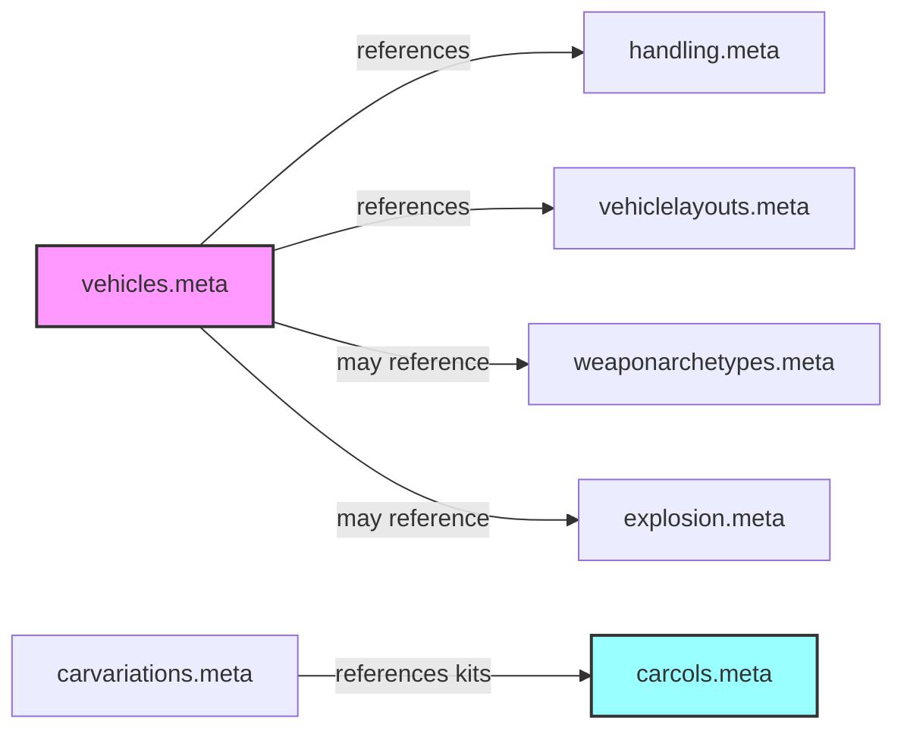
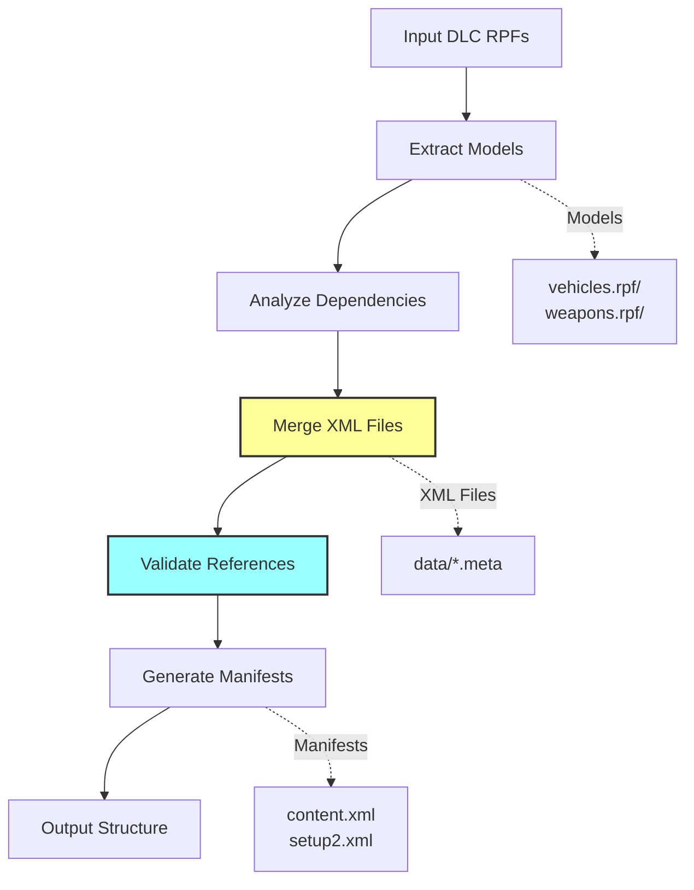

# CodeWalker DLC Merger

A sophisticated command-line tool for merging multiple GTA V DLC RPF files into a single organized directory structure with intelligent XML processing and dependency management.

## Features

- **Merge multiple DLC RPF files** into one organized directory structure
- **Recursive directory scanning** - automatically finds all RPF files in subdirectories
- **Intelligent selective merging** - focuses on vehicle-related content by default
- **Smart XML/meta file merging** - combines metadata from multiple DLCs using template-based validation
- **Cross-reference validation** - ensures consistency between interconnected XML files
- **Flexible input methods** - individual files or entire directories
- **Dry-run mode** - preview merge results without creating files
- **Comprehensive logging** - verbose output with progress tracking
- **Vehicle-focused filtering** - automatically excludes non-vehicle files
- **Error recovery** - handles corrupted or invalid files gracefully

## Why XML Processing is Complex in GTA V

GTA V uses a complex system of interconnected XML files where vehicles, modifications, and game properties reference each other across multiple files. This creates significant challenges when merging DLC packages:

### The XML Reference Web



### Key Challenges

1. **Multiple DLCs with Same Vehicles**: Different DLCs may contain the same vehicle with different properties - the merger must intelligently combine these
2. **Cross-File References**: A kit defined in `carcols.meta` must exist for references in `carvariations.meta` to work
3. **Invalid References Crash the Game**: Missing or broken references can cause GTA V to crash on load
4. **Different Container Structures**: Each XML file type has its own unique structure that must be preserved
5. **Load Order Dependencies**: Files must be loaded in the correct order (e.g., `handling.meta` before `vehicles.meta`)

### How DLCMerger Solves This

The tool uses several advanced techniques to handle XML complexity:

1. **Template-Based Merging**: Each file type has a validated template structure ensuring game compatibility
2. **Container Discovery**: Automatically identifies where items should be placed in the merged XML
3. **Cross-Reference Validation**: Validates all references between files and fixes invalid ones
4. **Intelligent Deduplication**: When the same item exists in multiple DLCs, uses smart logic to choose the right one
5. **Automatic Cleanup**: Removes empty or invalid entries that could cause issues

### Example: Kit Reference Validation

When merging `carcols.meta` and `carvariations.meta`:

```xml
<!-- carvariations.meta references a kit -->
<Item>
    <modelName>adder</modelName>
    <kits>
        <Item>adder_modkit</Item>  <!-- This kit MUST exist in carcols.meta -->
    </kits>
</Item>

<!-- If the kit doesn't exist in carcols.meta, DLCMerger will: -->
<!-- 1. Detect the invalid reference -->
<!-- 2. Replace it with "0_default_modkit" -->
<!-- 3. Log a warning about the fix -->
```

## Usage

```bash
DLCMerger -i input1.rpf -i input2.rpf -o merged_output_directory [options]
```

**Or with directory input (recommended):**

```bash
DLCMerger -i /path/to/dlc/folder -o merged_output_directory [options]
```

### Required Arguments

- `-i, --input` (multiple): Input RPF files or directories to merge. 
  - **Files**: Specify individual RPF files: `-i file1.rpf -i file2.rpf`
  - **Directories**: Specify directories to scan recursively: `-i /path/to/dlc/folder`
  - **Mixed**: Combine both approaches: `-i file1.rpf -i /path/to/folder`
- `-o, --output`: Output directory path for merged DLC files.

### Optional Arguments

- `-s, --show-structure`: Show detailed structure tree of input RPF files (helpful for debugging).
- `-n, --expand-nested`: Expand nested RPF files to show their contents (enabled by default).
- `-m, --merge-meta`: Enable merging of meta/xml files (enabled by default).
- `-v, --verbose`: Enable verbose output for detailed logging.
- `-f, --force`: Force overwrite output directory if it exists.
- `-d, --dry-run`: Perform a dry run without creating the output directory.
- `-a, --merge-all`: Merge all files without selective filtering (default is vehicle-focused).

### Input Directory Behavior

When you specify a directory with `-i`, the tool will:
- **Recursively scan** all subdirectories for `.rpf` files
- **Automatically discover** all RPF files in the directory tree
- **Report** the number of RPF files found in each directory
- **Include** all found RPF files in the merge operation

This is particularly useful for DLC folders that contain multiple RPF files in different subdirectories.

## Nested RPF Handling

The tool can recursively read nested RPF files (RPF files within RPF files) to provide complete visibility:

### What are Nested RPFs?
- DLC RPF files often contain other RPF files like `vehicles.rpf`, `weapons.rpf`, etc.
- These nested RPFs contain the actual game assets (models, textures, etc.)
- Traditional tools only show the outer RPF structure

### Nested Expansion Features:
- **Automatic Detection**: Finds and opens RPF files within RPF files
- **Recursive Reading**: Supports multiple levels of nesting (up to 3 levels deep)
- **Complete Structure**: Shows the full file hierarchy including nested contents
- **Conflict Detection**: Detects conflicts in nested RPF contents
- **Temporary Handling**: Safely extracts and reads nested RPFs without permanent files

### Example Structure:
```
dlc.rpf
├── content.xml
├── setup2.xml
├── common/data/
│   ├── carcols.meta
│   └── vehicles.meta
└── x64/levels/gta5/vehicles/
    └── vehicles.rpf [NESTED]
        ├── vehshare.ytd          <- These files are now visible
        ├── vehicle_models/
        │   ├── model1.yft
        │   └── model2.ytd
        └── vehicle_textures/
            └── textures.ytd
```

### Control Options:
- **`--expand-nested`** (default): Shows nested RPF contents
- **`--no-expand-nested`**: Shows only top-level RPF structure
- **Verbose mode**: Shows nesting depth and extraction process

## Examples

### 1. Merge all RPF files in a directory (recommended):
```bash
# Recursively finds all RPF files in the directory and subdirectories
DLCMerger -i /path/to/dlc/folder -o merged_dlc_directory -v -s
```

### 2. Dry run with structure analysis:
```bash
# Preview the merge with structure analysis
DLCMerger -i /path/to/dlc/folder -o merged_dlc_directory -d -v -s
```

### 3. Mixed input sources:
```bash
# Combine specific files with directory scanning
DLCMerger -i specific.rpf -i /path/to/folder -i another.rpf -o merged_directory -v
```

### 4. Basic merge of two DLC files:
```bash
DLCMerger -i dlc1.rpf -i dlc2.rpf -o merged_dlc_directory
```

### 5. Merge with verbose output and force overwrite:
```bash
DLCMerger -i dlc1.rpf -i dlc2.rpf -o merged_dlc_directory -v -f
```

### 6. Debug merge issues with structure trees:
```bash
# Shows complete file structure of all input RPFs
DLCMerger -i dlc1.rpf -i dlc2.rpf -o merged_dlc_directory -s -v -d
```

### 7. Merge all files (not just vehicles):
```bash
DLCMerger -i dlc1.rpf -i dlc2.rpf -o merged_dlc_directory -a
```

### 8. Complex debugging scenario:
```bash
# Comprehensive analysis with all debug options
DLCMerger -i /complex/dlc/structure -o debug_merged_directory -s -v -d -f
```

## Recursive Directory Scanning

The tool supports recursive directory scanning with the following behavior:

- **Automatic Discovery**: When you specify a directory with `-i`, the tool automatically finds all `.rpf` files in that directory and all subdirectories
- **Flexible Structure**: Works with any directory structure, including nested DLC folders
- **Progress Reporting**: Shows how many RPF files were found in each directory
- **Combines with Files**: You can mix directory scanning with individual file inputs

### Example Directory Structure:
```
dlc_collection/
├── vehicle_pack_1/
│   ├── dlc.rpf
│   └── weapons.rpf
├── vehicle_pack_2/
│   └── addon/
│       └── dlc.rpf
└── standalone_mod.rpf
```

Using `-i dlc_collection/` would automatically include all 4 RPF files.

## Conflict Resolution

The tool provides intelligent conflict detection and resolution:

### Conflict Types:
1. **File Conflicts**: Same file path in multiple RPFs
2. **Directory Conflicts**: Directory structure overlaps (automatically merged)
3. **Meta/XML Conflicts**: Configuration files that could be merged (future feature)

### Resolution Strategy:
1. **Directory Conflicts**: Automatically merged (not treated as conflicts)
2. **File Conflicts**: First occurrence kept (from first input RPF/directory)
3. **Meta/XML Files**: Will be intelligently merged in future versions with `-m` flag

### Conflict Reporting:
- Detailed conflict analysis with file sizes and source RPFs
- Categorized by conflict type (file, directory, meta)
- Suggestions for resolution strategies

## RPF Structure Visualization

The `-s, --show-structure` flag provides detailed tree visualization of RPF contents:

### Features:
- **Hierarchical Tree Display**: Shows complete directory and file structure
- **File Size Information**: Displays file sizes for all files
- **Directory Item Counts**: Shows number of items in each directory
- **Multiple RPF Support**: Shows structure for each input RPF separately

### Example Output:
```
=== INPUT RPF 1 Structure ===
File: dlc1.rpf
Total entries: 39
Encryption: OPEN

dlc1.rpf
├── content.xml (735 bytes)
├── setup2.xml (301 bytes)
├── common (2 items)
│   └── data (5 items)
│       ├── carcols.meta (611 bytes)
│       ├── handling.meta (1080 bytes)
│       └── levels (1 items)
│           └── gta5 (1 items)
│               └── vehicles.meta (1695 bytes)
└── x64 (2 items)
    ├── data (12 items)
    │   └── lang (12 items)
    │       ├── americandlc.rpf (1024 bytes)
    │       └── ... (more files)
    └── levels (1 items)
        └── gta5 (1 items)
            └── vehicles (1 items)
                └── vehicles.rpf (29955072 bytes)
```

This visualization helps identify:
- Which files are being merged
- Where conflicts occur
- Directory structure differences
- File size variations

## Building

The tool is part of the CodeWalker solution. To build:

1. Ensure .NET 8.0 SDK or later is installed
2. Clone the CodeWalker repository
3. Build using one of these methods:

**Using Visual Studio:**
```
1. Open CodeWalker.sln in Visual Studio
2. Build the CodeWalker.DLCMerger project
3. The executable will be in `bin/Debug/net8.0/DLCMerger.exe`
```

**Using Command Line:**
```bash
cd CodeWalker.DLCMerger
dotnet build
# Output: bin/Debug/net8.0/DLCMerger.exe
```

**For Release Build:**
```bash
dotnet build -c Release
# Output: bin/Release/net8.0/DLCMerger.exe
```

## Output and Logging

The tool provides comprehensive logging with multiple verbosity levels:

### Standard Output:
- Discovery phase: Shows RPF files found in directories
- Analysis phase: Reports total entries and conflicts
- Processing phase: Shows progress during file copying
- Completion: Summary of files copied and directories created

### Verbose Output (`-v` flag):
- Individual file processing status
- Detailed conflict information during analysis
- List of all RPF files discovered in each directory
- Progress updates every 50 files processed

### Structure Visualization (`-s` flag):
- Complete tree structure for each input RPF
- File sizes and directory item counts
- Merged structure analysis with file type breakdown
- Conflict categorization and analysis

## Current Limitations

- **RPF Output**: Only outputs directory structure, not RPF files
- **Audio files**: Audio content is not currently processed
- **Resource optimization**: Files are copied as-is without re-compression optimization
- **Performance**: Large RPF files may take significant time to process, especially with nested RPF expansion enabled

## Future Enhancements

- **RPF Output Mode**: Option to create merged RPF files instead of directory output
- **Audio file processing**: Include audio content in merging process
- **Advanced filtering**: More granular control over what gets merged
- **Resource optimization**: Re-compress and optimize resources during merge
- **Performance improvements**: Parallel processing and streaming operations
- **GUI version**: Integrated with CodeWalker's main interface
- **Plugin system**: Support for custom merge logic plugins

## Troubleshooting

### Common Issues:

1. **"No RPF files found"**: Ensure the directory path is correct and contains `.rpf` files
2. **"Output file already exists"**: Use `-f` flag to force overwrite
3. **Large merge takes too long**: Use `-d` flag for dry run testing first
4. **Conflicts not expected**: Use `-s` flag to visualize structure differences
5. **"Invalid kit reference"**: Kit referenced in carvariations but not defined in carcols - automatically fixed
6. **"No template for X.meta"**: Unknown XML file type - will be copied as-is without merging

### Performance Tips:

- Use dry run (`-d`) to test before actual merge
- Enable verbose mode (`-v`) only when debugging
- Structure visualization (`-s`) adds processing time for large RPFs
- Consider merging in smaller batches for very large collections

## Architecture Overview

### Processing Pipeline



### Core Components

1. **SimplifiedRpfMerger**: Main orchestrator that coordinates the merging process
2. **ModelExtractor**: Extracts and categorizes model files (.yft, .ytd, .ycd, .ydr)
3. **SelectiveMerger**: Analyzes dependencies to include only required content
4. **XmlMerger**: Handles complex XML merging with template validation

### XML Merging Process

The XML merger uses a sophisticated template-based approach:

1. **Template Matching**: Each XML file type has a pre-validated template structure
2. **Container Discovery**: Identifies all containers that can hold items
3. **Item Collection**: Gathers items from all source DLCs
4. **Intelligent Merging**: Combines items while handling duplicates
5. **Cross-Reference Validation**: Ensures all references between files are valid
6. **Cleanup**: Removes invalid or empty entries

### Supported XML File Types

| File Type | Container Structure | Validation |
|-----------|-------------------|------------|
| vehicles.meta | InitDatas, txdRelationships | Model references |
| handling.meta | HandlingData | Vehicle IDs |
| carcols.meta | Kits | Kit definitions |
| carvariations.meta | variationData | Kit references |
| vehiclelayouts.meta | Multiple containers | Layout IDs |
| weaponarchetypes.meta | weaponArchetypes | Weapon references |

## Technical Details

### Model File Handling

- **Resource Headers**: Preserved for game compatibility
- **Classification**: Automatic categorization of vehicle vs weapon models
- **Compression**: Maintains proper compression for resource files
- **Nested RPFs**: Handles RPF files within RPF files recursively

### Selective Merging Logic

When not using `--merge-all`, the tool:
1. Analyzes vehicles.meta to identify vehicle models
2. Builds a dependency graph of required files
3. Includes only vehicle-related content
4. Adds weapon files only for weaponized vehicles
5. Excludes ped, scenario, and other non-vehicle content

### Output Structure

```
output_directory/
└── dlc.rpf/
    ├── content.xml              # Generated manifest
    ├── setup2.xml              # Generated setup
    ├── data/                   # Merged XML files
    │   ├── vehicles.meta
    │   ├── handling.meta
    │   ├── carcols.meta
    │   ├── carvariations.meta
    │   ├── vehiclelayouts.meta
    │   └── [other meta files]
    ├── vehicles.rpf/           # Vehicle models
    │   ├── vehicle_name.yft
    │   ├── vehicle_name.ytd
    │   └── [other vehicle files]
    └── weapons.rpf/            # Weapon models
        ├── w_weapon_name.ydr
        └── [other weapon files]
```