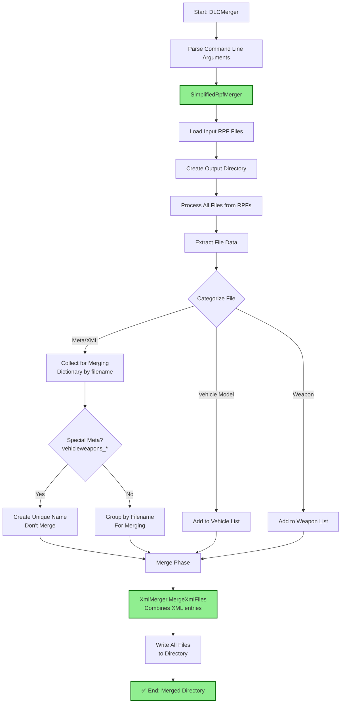

# DLC Merger Technical Guide

Complete architecture and process documentation for the GTA V DLC Merger tool.

## Overview

The DLC Merger is a command-line tool designed to merge multiple GTA V DLC RPF files into a single organized directory structure. The architecture emphasizes selective merging, intelligent conflict resolution, and streamlined operation.

## Process Flow



## Architecture

### Class Structure

```
Program.cs
├── Options.cs (Command line parsing)
├── SimplifiedRpfMerger.cs (Main merger implementation)
├── SelectiveMerger.cs (Intelligent filtering)
├── XmlMerger.cs (XML processing utilities)
└── ModelExtractor.cs (Model extraction utilities)
```

### Key Components

#### 1. Program.cs
- **Purpose**: Entry point and command-line orchestration
- **Function**: Parses arguments and creates SimplifiedRpfMerger instance
- **Architecture**: Simple factory pattern

#### 2. Options.cs
- **Purpose**: Command-line argument definitions
- **Framework**: Uses CommandLineParser library
- **Features**: Validation, help text, default values

#### 3. SimplifiedRpfMerger.cs
- **Purpose**: Main merger implementation
- **Features**:
  - Directory-based output
  - Direct file extraction and merging
  - Selective merging with `SelectiveMerger` integration
  - Smart XML/meta file merging
  - Nested RPF support
- **Architecture**: Template method pattern with strategy injection

#### 4. SelectiveMerger.cs
- **Purpose**: Intelligent file filtering for vehicle-focused merging
- **Features**:
  - Vehicle discovery from `vehicles.meta`
  - Dependency detection (weapons, explosions)
  - File categorization (essential, conditional, skippable)
  - Smart filtering logic
- **Architecture**: Strategy pattern with configurable rules

#### 5. XmlMerger.cs
- **Purpose**: XML/Meta file merging with intelligent conflict resolution
- **Features**:
  - XML parsing and manipulation
  - Vehicle-specific merging rules
  - Special handling for weapon definitions
  - Validation and error handling
- **Architecture**: Visitor pattern for XML processing

#### 6. ModelExtractor.cs
- **Purpose**: Vehicle model file extraction and organization
- **Features**:
  - Model file identification (.yft, .ytd, .ycd)
  - Vehicle-specific model handling
  - File organization and categorization
- **Architecture**: Utility class with specialized methods

## Processing Pipeline

### Phase 1: Initialization
1. **Command Line Parsing**: Options validation and configuration
2. **Input Validation**: RPF file existence and readability checks
3. **Output Directory Setup**: Create output directory structure

### Phase 2: Analysis
1. **RPF Loading**: Load and analyze all input RPF files
2. **Content Analysis**: Parse `content.xml` from each DLC
3. **Vehicle Discovery**: Find and catalog all vehicle definitions
4. **Dependency Analysis**: Identify weapon, explosion, and other dependencies

### Phase 3: Filtering (Selective Mode)
1. **File Categorization**: Classify files as essential, conditional, or skippable
2. **Dependency Resolution**: Include required files based on vehicle dependencies
3. **Conflict Identification**: Detect files that exist in multiple DLCs
4. **Filter Application**: Apply selective filtering rules

### Phase 4: Conflict Resolution
1. **Meta File Merging**: Combine XML entries from conflicting meta files
2. **Asset Prioritization**: Handle conflicting assets (first-wins or merge)
3. **Validation**: Ensure merged content maintains integrity

### Phase 5: Output Generation
1. **Structure Creation**: Build output directory structure
2. **File Writing**: Write merged files to output location
3. **Manifest Generation**: Create `content.xml` and `setup2.xml`
4. **Validation**: Verify output integrity

## Key Features

### 1. Simplified Architecture
- **Single Mode**: Uses only `SimplifiedRpfMerger` (working implementation)
- **Reliable Processing**: Removed broken RPF mode that skipped conflicts
- **Directory Output**: Creates organized directory structure instead of RPF files

### 2. Selective Merging (SelectiveMerger)
- **Location**: `SelectiveMerger.cs` class
- **Function**: Intelligently filters files to include only vehicle-related content
- **Features**:
  - Analyzes `vehicles.meta` to identify vehicle models
  - Maintains lists of essential vehicle meta files
  - Skips unnecessary files (ped-related, unrelated weapons, etc.)
  - Detects vehicle weapon dependencies

### 3. Smart XML Merging
- **Location**: `XmlMerger.cs` class
- **Function**: Intelligent XML merging for vehicle-related meta files
- **Features**:
  - Combines vehicle entries from multiple DLCs
  - Handles special files like `vehicleweapons_*.meta`
  - Maintains proper XML structure
  - Resolves conflicts intelligently

### 4. Vehicle Model Extraction
- **Location**: `ModelExtractor.cs` class
- **Function**: Extracts and organizes vehicle model files
- **Features**:
  - Identifies vehicle models (.yft, .ytd, .ycd)
  - Organizes files in proper directory structure
  - Handles vehicle-specific assets

## File Categories and Processing

### Essential Vehicle Meta Files (Always Included)
- `vehicles.meta` - Vehicle definitions
- `handling.meta` - Vehicle physics
- `carcols.meta` - Vehicle colors
- `carvariations.meta` - Vehicle variants

### Conditional Files (Included When Needed)
- `weaponarchetypes.meta` - Only if vehicles use weapons
- `explosion.meta` - Only if custom explosions are detected
- `vehicleweapons_*.meta` - Vehicle-specific weapon definitions

### Vehicle Assets
- `.yft` files - Vehicle models
- `.ytd` files - Vehicle textures  
- `.ycd` files - Vehicle animations

### Skipped Files (Unless --merge-all)
- Ped-related files
- Unrelated weapon files
- Audio files (future enhancement)
- Unused language files

## Usage Modes

### Default (Selective Merging)
```bash
DLCMerger -i dlc1.rpf -i dlc2.rpf -o merged_directory
```
- Merges only vehicle-related content
- Smaller output directories
- Faster processing

### Merge All Content
```bash
DLCMerger -i dlc1.rpf -i dlc2.rpf -o merged_directory --merge-all
```
- Merges all content from input DLCs
- Larger output but complete content

### Dry Run Mode
```bash
DLCMerger -i dlc1.rpf -i dlc2.rpf -o merged_directory --dry-run
```
- Preview merge results without creating files
- Useful for testing and validation

## Design Patterns

### 1. Strategy Pattern
- **Usage**: `SelectiveMerger` for filtering strategies
- **Benefit**: Pluggable filtering logic, easy to extend
- **Implementation**: Interface-based with concrete strategies

### 2. Template Method Pattern
- **Usage**: `SimplifiedRpfMerger` processing pipeline
- **Benefit**: Consistent processing steps with customizable behavior
- **Implementation**: Template method with strategy injection

### 3. Factory Pattern
- **Usage**: `Program.cs` merger selection
- **Benefit**: Centralized object creation
- **Implementation**: Simple factory with conditional logic

### 4. Visitor Pattern
- **Usage**: `XmlMerger` XML processing
- **Benefit**: Extensible XML manipulation without modifying core classes
- **Implementation**: Visitor interface with concrete implementations

## Data Flow

### Input Processing
```
RPF Files → File Entries → SelectiveMerger → Filtered Entries
```

### Conflict Resolution
```
Conflicting Files → XmlMerger → Merged XML → Validated Output
```

### Output Generation
```
Merged Data → Categorized Files → Output Writer → Final Directory
```

## Key Architectural Decisions

### 1. Simplified Single-Mode Architecture
- **Decision**: Use only directory output mode (removed broken RPF mode)
- **Rationale**: Directory mode works correctly and is more debuggable
- **Trade-off**: No direct RPF output vs. reliable functionality

### 2. Selective Merging by Default
- **Decision**: Vehicle-focused filtering as default behavior
- **Rationale**: Most use cases involve vehicle DLCs, reduces output size
- **Trade-off**: Added complexity vs. better user experience

### 3. XML-First Meta Handling
- **Decision**: Parse and manipulate XML rather than binary meta files
- **Rationale**: Easier to implement intelligent merging logic
- **Trade-off**: Performance vs. maintainability

### 4. Direct File Processing
- **Decision**: Process files directly without complex analysis phases
- **Rationale**: Simpler, more reliable processing pipeline
- **Trade-off**: Less optimization vs. better reliability

## Benefits of Current Implementation

1. **Reliable Processing**: Removed broken RPF mode, uses only working implementation
2. **Smart Filtering**: Only includes relevant files for cleaner output
3. **Proper Conflict Resolution**: Meta files are merged instead of skipped
4. **Smaller Output**: Selective mode produces much smaller directories
5. **Better Compatibility**: Cleaner DLCs with less chance of conflicts
6. **Maintainable Code**: Simplified architecture with clear separation of concerns
7. **Debuggable Output**: Directory structure allows easy inspection and modification

## Extension Points

### 1. Custom Filtering Rules
- **Location**: `SelectiveMerger.cs`
- **Method**: Implement `IFilteringStrategy` interface
- **Use Case**: Custom DLC types, specific game versions

### 2. Additional Output Formats
- **Location**: `Program.cs` factory method
- **Method**: Create new merger class implementing similar interface
- **Use Case**: RPF output mode, custom output structures

### 3. Enhanced Meta Merging
- **Location**: `XmlMerger.cs`
- **Method**: Extend XML processing visitors
- **Use Case**: New meta file types, complex merging rules

### 4. Performance Optimizations
- **Location**: File processing pipeline
- **Method**: Implement caching, parallel processing
- **Use Case**: Large DLC collections, performance-critical environments

## Dependencies

### External Libraries
- **CommandLineParser**: Command-line argument parsing
- **CodeWalker.Core**: RPF file handling, XML parsing
- **System.Xml**: XML manipulation and validation

### Internal Dependencies
- **CodeWalker.Core.GameFiles**: RPF file structures
- **CodeWalker.Core.Utils**: Utility functions
- **System.IO**: File system operations

## Error Handling Strategy

### 1. Validation-First Approach
- Validate all inputs before processing
- Fail fast on invalid configurations
- Provide clear error messages

### 2. Graceful Degradation
- Continue processing when non-critical errors occur
- Log warnings for recoverable issues
- Provide partial results when possible

### 3. Structured Error Reporting
- Categorize errors by severity and type
- Include context information (file names, line numbers)
- Suggest corrective actions when possible

## Performance Considerations

### 1. Memory Management
- **Challenge**: Large RPF files can consume significant memory
- **Solution**: Stream processing, temporary file cleanup
- **Monitoring**: Track memory usage during processing

### 2. I/O Optimization
- **Challenge**: Multiple RPF file reads can be slow
- **Solution**: Parallel processing, efficient file handling
- **Monitoring**: Track file operation times

### 3. Processing Efficiency
- **Challenge**: Complex filtering and merging logic
- **Solution**: Early filtering, efficient data structures
- **Monitoring**: Profile critical code paths

## Testing Strategy

### 1. Unit Tests
- **Focus**: Individual component functionality
- **Coverage**: Core logic, edge cases, error conditions
- **Framework**: Standard .NET testing framework

### 2. Integration Tests
- **Focus**: Component interaction, end-to-end scenarios
- **Coverage**: File processing, merging workflows
- **Data**: Sample DLC files, known good outputs

### 3. Performance Tests
- **Focus**: Processing time, memory usage
- **Coverage**: Large file handling, concurrent operations
- **Metrics**: Throughput, resource consumption

## Future Enhancements

### 1. Plugin Architecture
- **Goal**: Allow custom filtering and merging logic
- **Implementation**: Plugin interface, dynamic loading
- **Benefit**: Extensibility without core modifications

### 2. GUI Interface
- **Goal**: User-friendly graphical interface
- **Implementation**: Integration with CodeWalker main application
- **Benefit**: Improved usability, visual feedback

### 3. Advanced Merging Rules
- **Goal**: More sophisticated conflict resolution
- **Implementation**: Rule-based system, user preferences
- **Benefit**: Better handling of complex scenarios

### 4. Performance Optimization
- **Goal**: Faster processing of large DLC collections
- **Implementation**: Parallel processing, caching, streaming
- **Benefit**: Better user experience, scalability