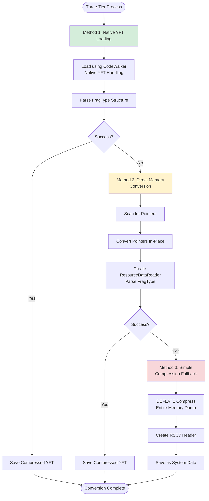
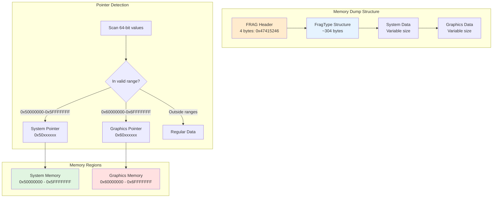
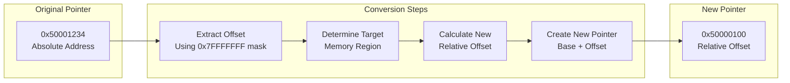
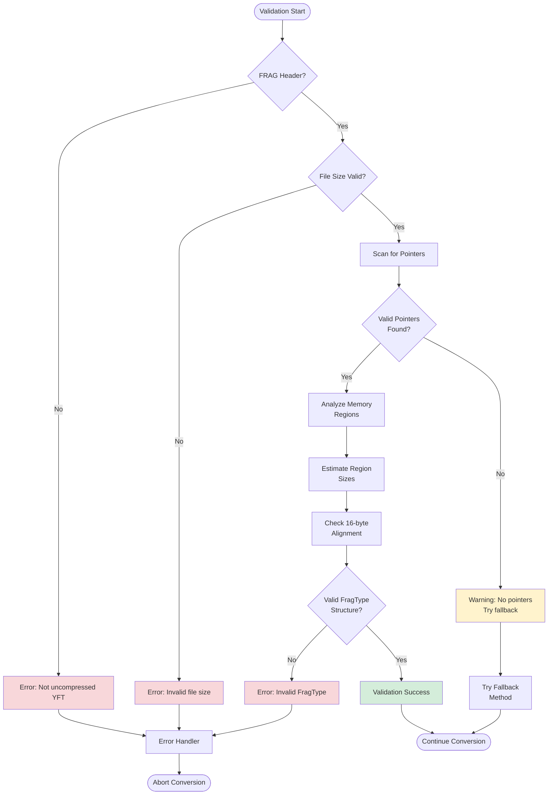
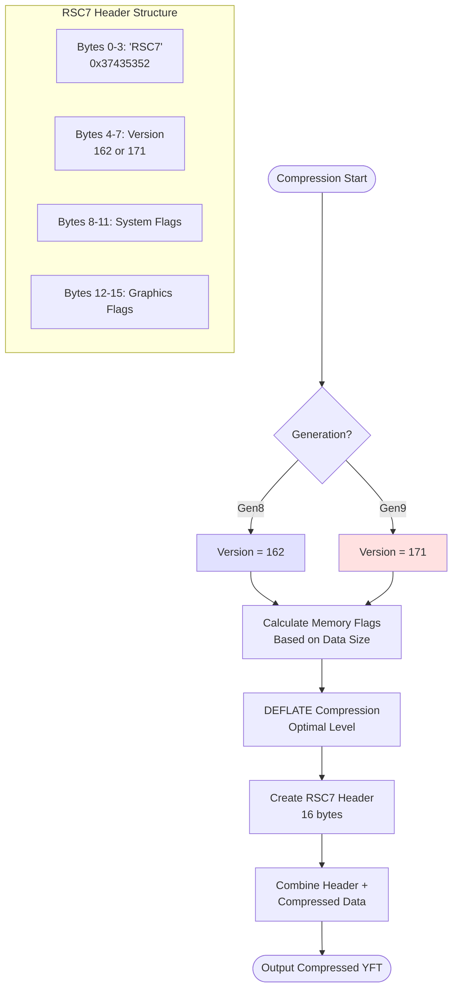
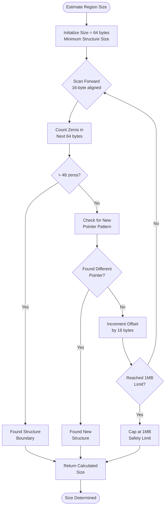

# YFT Converter Flow Diagram

## Overview
This document contains Mermaid diagrams that visualize the YFT converter's operation, making it easier to understand the conversion process, memory layout, and validation logic.

## 1. High-Level Conversion Flow

```mermaid
flowchart TD
    Start([YFT Converter Start]) --> Input{Input File}
    Input --> CheckFormat{Check Format}
    
    CheckFormat -->|Starts with 'FRAG'| Uncompressed[Uncompressed YFT<br/>Memory Dump]
    CheckFormat -->|Starts with 'RSC7'| AlreadyCompressed[Already Compressed]
    CheckFormat -->|No header| CheckPatterns{Check String<br/>Patterns}
    
    CheckPatterns -->|Found patterns| Uncompressed
    CheckPatterns -->|No patterns| InvalidFile[Invalid File]
    
    AlreadyCompressed --> End([End - No Conversion Needed])
    InvalidFile --> End
    
    Uncompressed --> OutputFormat{Output Format?}
    
    OutputFormat -->|YFT| CompressedConversion[Compressed YFT<br/>Conversion]
    OutputFormat -->|XML| XMLConversion[XML Conversion]
    
    CompressedConversion --> ThreeTier[Three-Tier<br/>Conversion Process]
    XMLConversion --> LoadForXML[Load YFT Structure<br/>for XML]
    
    ThreeTier --> Success{Success?}
    Success -->|Yes| WriteCompressed[Write Compressed<br/>YFT File]
    Success -->|No| NextMethod[Try Next Method]
    
    LoadForXML --> GenerateXML[Generate XML<br/>with YftXml.GetXml()]
    GenerateXML --> WriteXML[Write XML File]
    
    WriteCompressed --> End
    WriteXML --> End
    NextMethod --> End
    
    style Uncompressed fill:#e1f5e1
    style CompressedConversion fill:#ffe1e1
    style XMLConversion fill:#e1e1ff
```

## 2. Three-Tier Conversion Process



## 3. Memory Layout and Pointer System



## 4. Pointer Conversion Process



## 5. Validation and Error Handling



## 6. Compression Process



## 7. Region Size Estimation Algorithm



## Understanding the Diagrams

### Key Concepts:

1. **Input Validation**: The converter strictly validates that input files are uncompressed YFT memory dumps starting with "FRAG"

2. **Three-Tier Approach**: The converter tries three different methods in order of preference:
   - Native loading (most reliable)
   - Direct conversion (handles edge cases)
   - Simple compression (last resort)

3. **Memory System**: YFT files use a two-region memory system:
   - System memory (0x50000000 range) for game logic data
   - Graphics memory (0x60000000 range) for rendering data

4. **Pointer Conversion**: The core challenge is converting absolute memory addresses to relative offsets that work in the compressed format

5. **Validation**: Multiple validation steps ensure data integrity throughout the conversion process

6. **Compression**: Final output uses DEFLATE compression with RSC7 header for game compatibility

These diagrams should help visualize the complex conversion process and make it easier to understand how the YFT converter handles different scenarios and edge cases.