# RPF File Extraction Guide

This guide explains how to read and extract content from RPF (Rage Package File) archives, specifically for extracting .meta, .yft, and .ytd files.

## Overview

RPF files are archive containers used in GTA V to store game assets. They can contain various file types including:
- `.meta` - XML metadata files
- `.yft` - Fragment files (vehicle models, props)
- `.ytd` - Texture Dictionary files
- And many other file types

## RPF File Structure

```mermaid
graph TD
    A[RPF File] --> B[Header]
    A --> C[Entries Table]
    A --> D[Names Table]
    A --> E[Data Section]
    
    B --> B1[Version: RPF7]
    B --> B2[Entry Count]
    B --> B3[Names Length]
    B --> B4[Encryption Type]
    
    C --> F[Directory Entries]
    C --> G[File Entries]
    
    G --> H[Binary Files]
    G --> I[Resource Files]
    
    H --> H1[.meta files]
    H --> H2[.xml files]
    H --> H3[Other binary data]
    
    I --> I1[.yft files]
    I --> I2[.ytd files]
    I --> I3[.ydr files]
    I --> I4[.ymap files]
```



## RPF Entry Types

### Entry Type Hierarchy


### Entry Types Explained

1. **RpfDirectoryEntry**: Represents folders within the RPF archive
2. **RpfBinaryFileEntry**: Regular files (.meta, .xml, .dat, etc.)
3. **RpfResourceFileEntry**: Resource files (.yft, .ytd, .ydr, .ymap, etc.)

## RPF Encryption Types

```csharp
public enum RpfEncryption : uint
{
    NONE = 0,              // No encryption (some modded RPFs)
    OPEN = 0x4E45504F,     // "OPEN" - no encryption  
    AES = 0x0FFFFFF9,      // AES encryption
    NG = 0x0FEFFFFF        // NG encryption
}
```

## RPF to Folder Conversion

### Conversion Process Flow


### Converting RPF to Folder Structure

#### Method 1: Extract All Files (Preserving Structure)

```csharp
public class RpfToFolderConverter
{
    public void ConvertRpfToFolder(string rpfPath, string outputFolder)
    {
        // Load the RPF file
        RpfFile rpf = new RpfFile(rpfPath, rpfPath);
        
        using (var fs = File.OpenRead(rpfPath))
        using (var br = new BinaryReader(fs))
        {
            // Scan the RPF structure
            rpf.ScanStructure(br, null, null);
            
            // Extract all contents
            ExtractDirectory(rpf.Root, outputFolder, rpf, br);
        }
    }
    
    private void ExtractDirectory(RpfDirectoryEntry dir, string outputPath, 
                                  RpfFile rpf, BinaryReader br)
    {
        // Create the directory
        if (!Directory.Exists(outputPath))
        {
            Directory.CreateDirectory(outputPath);
        }
        
        // Extract all files in this directory
        foreach (var file in dir.Files)
        {
            ExtractFile(file, outputPath, rpf, br);
        }
        
        // Recursively extract subdirectories
        foreach (var subdir in dir.Directories)
        {
            string subdirPath = Path.Combine(outputPath, subdir.Name);
            ExtractDirectory(subdir, subdirPath, rpf, br);
        }
    }
    
    private void ExtractFile(RpfFileEntry entry, string outputPath, 
                             RpfFile rpf, BinaryReader br)
    {
        try
        {
            // Extract the file data
            byte[] data = rpf.ExtractFile(entry);
            
            if (data != null)
            {
                string filePath = Path.Combine(outputPath, entry.Name);
                File.WriteAllBytes(filePath, data);
                Console.WriteLine($"Extracted: {entry.Name}");
            }
        }
        catch (Exception ex)
        {
            Console.WriteLine($"Failed to extract {entry.Name}: {ex.Message}");
        }
    }
}
```

#### Method 2: Using CodeWalker's Built-in Extraction

```csharp
public void ExtractAllFromRpf(RpfFile rpf, string outputFolder)
{
    // This method extracts all files while maintaining directory structure
    var errors = new List<string>();
    
    foreach (var entry in rpf.AllEntries)
    {
        if (entry is RpfFileEntry fileEntry)
        {
            try
            {
                // Build the output path maintaining RPF structure
                string relativePath = fileEntry.Path.Replace('/', Path.DirectorySeparatorChar);
                string fullOutputPath = Path.Combine(outputFolder, relativePath);
                string directory = Path.GetDirectoryName(fullOutputPath);
                
                // Create directory if it doesn't exist
                if (!Directory.Exists(directory))
                {
                    Directory.CreateDirectory(directory);
                }
                
                // Extract the file
                byte[] data = fileEntry.File.ExtractFile(fileEntry);
                if (data != null)
                {
                    File.WriteAllBytes(fullOutputPath, data);
                }
            }
            catch (Exception ex)
            {
                errors.Add($"{fileEntry.Path}: {ex.Message}");
            }
        }
    }
    
    if (errors.Count > 0)
    {
        Console.WriteLine("Extraction errors:");
        errors.ForEach(Console.WriteLine);
    }
}
```

### Selective Extraction by File Type

```csharp
public class SelectiveRpfExtractor
{
    public void ExtractSpecificTypes(string rpfPath, string outputFolder, 
                                    params string[] extensions)
    {
        var rpfMan = new RpfManager();
        rpfMan.Init(Path.GetDirectoryName(rpfPath), null, null);
        
        var rpf = rpfMan.AllRpfs.FirstOrDefault(r => 
            r.Path.Equals(rpfPath, StringComparison.OrdinalIgnoreCase));
            
        if (rpf == null) return;
        
        foreach (var entry in rpf.AllEntries)
        {
            if (entry is RpfFileEntry fileEntry)
            {
                string ext = Path.GetExtension(fileEntry.Name).ToLower();
                
                if (extensions.Contains(ext))
                {
                    ExtractFileWithPath(fileEntry, outputFolder, rpf.Path);
                }
            }
        }
    }
    
    private void ExtractFileWithPath(RpfFileEntry entry, string baseOutput, 
                                    string rpfPath)
    {
        // Create relative path structure
        string relativePath = entry.Path.Substring(rpfPath.Length + 1);
        string fullPath = Path.Combine(baseOutput, relativePath);
        string directory = Path.GetDirectoryName(fullPath);
        
        if (!Directory.Exists(directory))
        {
            Directory.CreateDirectory(directory);
        }
        
        byte[] data = entry.File.ExtractFile(entry);
        if (data != null)
        {
            File.WriteAllBytes(fullPath, data);
        }
    }
}

// Usage example
var extractor = new SelectiveRpfExtractor();
extractor.ExtractSpecificTypes("example_dlc/dlc.rpf", "C:\\Output", 
                              ".meta", ".yft", ".ytd");
```

### Handling Nested RPF Files


```csharp
public void ExtractNestedRpfs(RpfFile parentRpf, string outputFolder, 
                             bool extractRpfContents = true)
{
    foreach (var entry in parentRpf.AllEntries)
    {
        if (entry is RpfFileEntry fileEntry)
        {
            if (fileEntry.Name.EndsWith(".rpf", StringComparison.OrdinalIgnoreCase))
            {
                if (extractRpfContents)
                {
                    // Extract RPF to temp location and process
                    byte[] rpfData = fileEntry.File.ExtractFile(fileEntry);
                    string tempRpf = Path.GetTempFileName();
                    
                    try
                    {
                        File.WriteAllBytes(tempRpf, rpfData);
                        
                        // Load and extract the child RPF
                        var childRpf = new RpfFile(tempRpf, fileEntry.Path);
                        using (var fs = File.OpenRead(tempRpf))
                        using (var br = new BinaryReader(fs))
                        {
                            childRpf.ScanStructure(br, null, null);
                            
                            // Extract to subdirectory
                            string childOutput = Path.Combine(outputFolder, 
                                Path.GetFileNameWithoutExtension(fileEntry.Name));
                            ConvertRpfToFolder(tempRpf, childOutput);
                        }
                    }
                    finally
                    {
                        if (File.Exists(tempRpf))
                            File.Delete(tempRpf);
                    }
                }
                else
                {
                    // Just extract the RPF file itself
                    ExtractFile(fileEntry, outputFolder, parentRpf);
                }
            }
            else
            {
                ExtractFile(fileEntry, outputFolder, parentRpf);
            }
        }
    }
}
```

## Core Classes

### RpfFile
Main class for handling RPF archives located at `CodeWalker.Core/GameFiles/RpfFile.cs`.

### RpfManager
Manager class for loading and accessing RPF files located at `CodeWalker.Core/GameFiles/RpfManager.cs`.

## Basic RPF Extraction Process

### 1. Loading an RPF File

```csharp
using CodeWalker.GameFiles;

// Load a single RPF file
string rpfPath = "example_dlc/dlc.rpf";
RpfFile rpf = new RpfFile(rpfPath, rpfPath);

// Open and scan the RPF
using (var fs = File.OpenRead(rpfPath))
using (var br = new BinaryReader(fs))
{
    rpf.ScanStructure(br, null, null);
}
```

### 2. Using RpfManager for Multiple RPFs

```csharp
// Initialize RpfManager with game folder
RpfManager rpfMan = new RpfManager();
rpfMan.Init("path/to/game/folder", null, null);

// Access files through the manager
byte[] fileData = rpfMan.GetFileData("example_dlc/dlc.rpf/common/data/handling.meta");
```

## Extracting Specific File Types

### Extracting .meta Files

```csharp
// Method 1: Direct extraction from RPF
public byte[] ExtractMetaFile(RpfFile rpf, string fileName)
{
    // Find the file entry
    RpfFileEntry entry = rpf.GetEntry(fileName) as RpfFileEntry;
    if (entry == null) return null;
    
    // Extract the file data
    byte[] data = rpf.ExtractFile(entry);
    return data;
}

// Method 2: Using RpfManager
public string ExtractMetaAsXml(RpfManager rpfMan, string path)
{
    // Get file as UTF-8 text
    string xmlContent = rpfMan.GetFileUTF8Text(path);
    return xmlContent;
}
```

### Extracting .yft Files (Fragment Files)

```csharp
// Extract and load a YFT file
public YftFile ExtractYftFile(RpfManager rpfMan, string path)
{
    // Get the file using RpfManager's generic GetFile method
    YftFile yft = rpfMan.GetFile<YftFile>(path);
    
    // Or extract raw data and load manually
    byte[] data = rpfMan.GetFileData(path);
    if (data != null)
    {
        YftFile yftFile = new YftFile();
        RpfFileEntry entry = rpfMan.GetEntry(path) as RpfFileEntry;
        yftFile.Load(data, entry);
        return yftFile;
    }
    
    return null;
}
```

### Extracting .ytd Files (Texture Dictionary Files)

```csharp
// Extract and load a YTD file
public YtdFile ExtractYtdFile(RpfManager rpfMan, string path)
{
    // Get the file using RpfManager's generic GetFile method
    YtdFile ytd = rpfMan.GetFile<YtdFile>(path);
    
    // Or extract raw data and load manually
    byte[] data = rpfMan.GetFileData(path);
    if (data != null)
    {
        YtdFile ytdFile = new YtdFile();
        RpfFileEntry entry = rpfMan.GetEntry(path) as RpfFileEntry;
        ytdFile.Load(data, entry);
        return ytdFile;
    }
    
    return null;
}
```

## Complete Example: Extracting Files from dlc.rpf

```csharp
using System;
using System.IO;
using CodeWalker.GameFiles;

public class RpfExtractor
{
    private RpfManager rpfManager;
    
    public void Initialize(string gameFolder)
    {
        rpfManager = new RpfManager();
        rpfManager.Init(gameFolder, null, null);
    }
    
    public void ExtractFilesFromDlc(string outputFolder)
    {
        string dlcPath = "example_dlc/dlc.rpf";
        
        // Get the RPF file
        RpfFile dlcRpf = rpfManager.AllRpfs.FirstOrDefault(r => 
            r.Path.Equals(dlcPath, StringComparison.OrdinalIgnoreCase));
            
        if (dlcRpf == null)
        {
            Console.WriteLine($"Could not find {dlcPath}");
            return;
        }
        
        // Extract all files from the RPF
        ExtractAllFiles(dlcRpf, outputFolder);
    }
    
    private void ExtractAllFiles(RpfFile rpf, string outputFolder)
    {
        foreach (var entry in rpf.AllEntries)
        {
            if (entry is RpfFileEntry fileEntry)
            {
                string fileName = fileEntry.Name.ToLower();
                
                // Check file type and extract accordingly
                if (fileName.EndsWith(".meta"))
                {
                    ExtractMetaFile(fileEntry, outputFolder);
                }
                else if (fileName.EndsWith(".yft"))
                {
                    ExtractYftFile(fileEntry, outputFolder);
                }
                else if (fileName.EndsWith(".ytd"))
                {
                    ExtractYtdFile(fileEntry, outputFolder);
                }
            }
        }
    }
    
    private void ExtractMetaFile(RpfFileEntry entry, string outputFolder)
    {
        try
        {
            byte[] data = entry.File.ExtractFile(entry);
            if (data != null)
            {
                string outputPath = Path.Combine(outputFolder, entry.Name);
                File.WriteAllBytes(outputPath, data);
                Console.WriteLine($"Extracted: {entry.Name}");
            }
        }
        catch (Exception ex)
        {
            Console.WriteLine($"Error extracting {entry.Name}: {ex.Message}");
        }
    }
    
    private void ExtractYftFile(RpfFileEntry entry, string outputFolder)
    {
        try
        {
            // Extract raw data
            byte[] data = entry.File.ExtractFile(entry);
            if (data != null)
            {
                // Option 1: Save raw YFT file
                string outputPath = Path.Combine(outputFolder, entry.Name);
                File.WriteAllBytes(outputPath, data);
                
                // Option 2: Load and process YFT file
                YftFile yft = new YftFile();
                yft.Load(data, entry);
                
                // Access fragment data
                if (yft.Fragment != null)
                {
                    Console.WriteLine($"Extracted YFT: {entry.Name}");
                    Console.WriteLine($"  Fragment type: {yft.Fragment.Name}");
                }
            }
        }
        catch (Exception ex)
        {
            Console.WriteLine($"Error extracting {entry.Name}: {ex.Message}");
        }
    }
    
    private void ExtractYtdFile(RpfFileEntry entry, string outputFolder)
    {
        try
        {
            // Extract raw data
            byte[] data = entry.File.ExtractFile(entry);
            if (data != null)
            {
                // Option 1: Save raw YTD file
                string outputPath = Path.Combine(outputFolder, entry.Name);
                File.WriteAllBytes(outputPath, data);
                
                // Option 2: Load and process YTD file
                YtdFile ytd = new YtdFile();
                ytd.Load(data, entry);
                
                // Access texture data
                if (ytd.TextureDict != null && ytd.TextureDict.Textures != null)
                {
                    Console.WriteLine($"Extracted YTD: {entry.Name}");
                    Console.WriteLine($"  Texture count: {ytd.TextureDict.Textures.Count}");
                }
            }
        }
        catch (Exception ex)
        {
            Console.WriteLine($"Error extracting {entry.Name}: {ex.Message}");
        }
    }
}

// Usage example
class Program
{
    static void Main()
    {
        var extractor = new RpfExtractor();
        extractor.Initialize(@"C:\Program Files\Grand Theft Auto V");
        extractor.ExtractFilesFromDlc(@"C:\ExtractedFiles");
    }
}
```

## Key Methods

### RpfFile Methods
- `ScanStructure()` - Scans and loads the RPF file structure
- `ExtractFile(RpfFileEntry)` - Extracts a file entry and returns byte data
- `ExtractFileBinary()` - Extracts binary file entries
- `ExtractFileResource()` - Extracts resource file entries (like YFT, YTD)

### RpfManager Methods
- `Init()` - Initializes the manager and loads all RPF files
- `GetFileData(path)` - Gets raw byte data for a file
- `GetFile<T>(path)` - Gets and loads a typed file (YFT, YTD, etc.)
- `GetFileUTF8Text(path)` - Gets file content as UTF-8 text (for .meta files)

## File Entry Types

RPF files contain two main types of entries:
1. **RpfBinaryFileEntry** - Regular files like .meta, .xml, etc.
2. **RpfResourceFileEntry** - Resource files like .yft, .ytd, .ydr, etc.

Each type requires different extraction methods internally, but the `ExtractFile()` method handles this automatically.

## Complete Extraction Workflow


## File Type Detection and Handling

```csharp
public class FileTypeHandler
{
    public static void ProcessExtractedFile(RpfFileEntry entry, byte[] data, 
                                           string outputPath)
    {
        string extension = Path.GetExtension(entry.Name).ToLower();
        string filePath = Path.Combine(outputPath, entry.Name);
        
        switch (extension)
        {
            case ".meta":
            case ".xml":
                // These are text-based files, optionally convert to readable format
                string xmlContent = Encoding.UTF8.GetString(data);
                File.WriteAllText(filePath, xmlContent);
                break;
                
            case ".yft":
                // Fragment file - can be loaded for processing
                var yft = new YftFile();
                yft.Load(data, entry);
                // Save raw or process further
                File.WriteAllBytes(filePath, data);
                break;
                
            case ".ytd":
                // Texture dictionary - can extract individual textures
                var ytd = new YtdFile();
                ytd.Load(data, entry);
                // Save raw or extract textures
                File.WriteAllBytes(filePath, data);
                break;
                
            case ".ydr":
            case ".ydd":
                // Drawable files
                File.WriteAllBytes(filePath, data);
                break;
                
            default:
                // Unknown type - save as-is
                File.WriteAllBytes(filePath, data);
                break;
        }
    }
}
```

## Important Notes

1. **File Paths**: When using RpfManager, file paths include the RPF file name, e.g., `"example_dlc/dlc.rpf/common/data/handling.meta"`

2. **Memory Usage**: Large files (especially texture dictionaries) can consume significant memory. Consider streaming or processing files in batches.

3. **File Compression**: RPF files use compression. The extraction methods automatically handle decompression.

4. **Resource Files**: Resource files (.yft, .ytd, etc.) have additional headers and structures that are handled by their respective loader classes.

5. **Error Handling**: Always include error handling as file extraction can fail due to encryption, corruption, or invalid paths.

6. **Encryption**: Some RPF files may be encrypted (AES or NG). CodeWalker handles decryption automatically when the proper keys are available.

7. **Performance**: When extracting large RPF archives, consider using parallel processing for better performance:

```csharp
Parallel.ForEach(rpf.AllEntries.OfType<RpfFileEntry>(), 
    new ParallelOptions { MaxDegreeOfParallelism = 4 },
    entry => {
        ExtractFile(entry, outputFolder);
    });
```