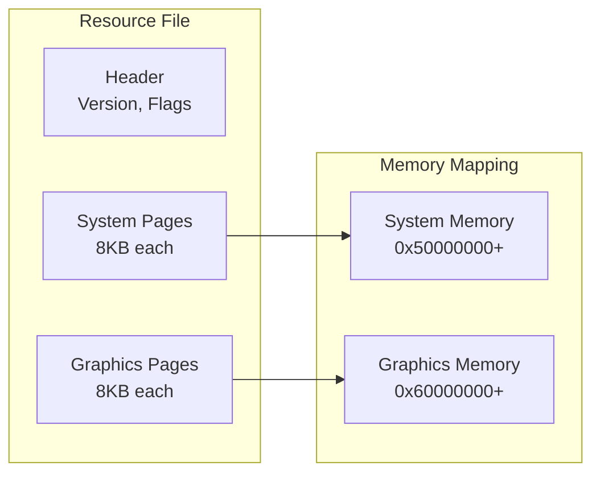
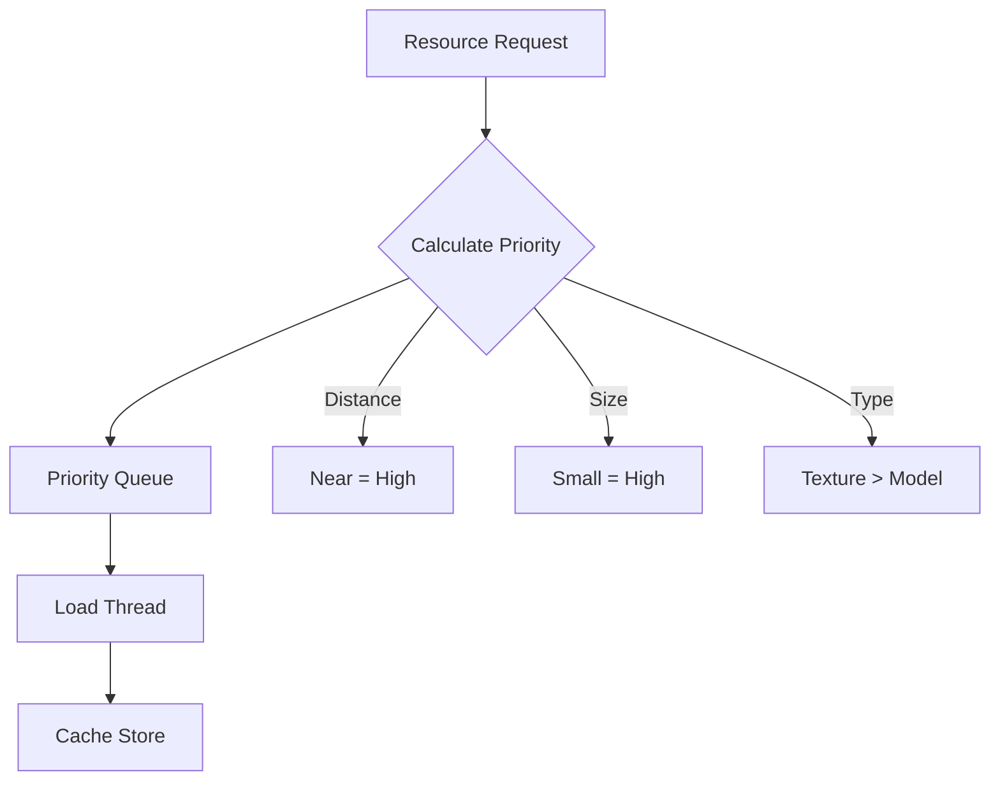

# CodeWalker Algorithms and Data Structures

## Overview

This document details the key algorithms and data structures used throughout the CodeWalker project. Understanding these implementations is crucial for maintaining and extending the codebase.

## Core Data Structures

### 1. Resource Memory Management

#### Virtual Memory Mapping
```csharp
// GTA V uses virtual addresses for resource data
public const uint SYSTEM_BASE = 0x50000000;   // System memory segment
public const uint GRAPHICS_BASE = 0x60000000; // Graphics memory segment

// Convert virtual to physical addresses
physicalAddress = (virtualAddress & 0x7FFFFFFF);
```

#### Resource Page System


### 2. Hash-Based Lookups

#### Jenkins Hash Algorithm
```csharp
public static uint GenHash(string text)
{
    uint h = 0;
    for (int i = 0; i < text.Length; i++)
    {
        h += (byte)text[i];
        h += (h << 10);
        h ^= (h >> 6);
    }
    h += (h << 3);
    h ^= (h >> 11);
    h += (h << 15);
    return h;
}
```

Used for:
- Archetype names
- Texture names
- Audio identifiers
- String lookups in game data

### 3. Spatial Data Structures

#### Grid-Based Spatial Partitioning (YND Files)
```csharp
// 32x32 grid system for path nodes
public static int GetAreaID(int x, int y)
{
    return (y * 32) + x;
}

// World position to grid cell
int cellX = (int)(worldPos.X / CELL_SIZE);
int cellY = (int)(worldPos.Y / CELL_SIZE);
```

#### Bounding Volume Hierarchy (Collision)
```
BVH Node Structure:
├── Bounding Box
├── Left Child
├── Right Child
└── Primitives (if leaf)
```

### 4. Cache Implementation

#### LRU Cache with Time-Based Eviction
```csharp
public class Cache<TKey, TVal>
{
    private LinkedList<CacheEntry> lruList;
    private Dictionary<TKey, LinkedListNode<CacheEntry>> lookup;
    
    class CacheEntry
    {
        public TKey Key;
        public TVal Value;
        public DateTime LastAccess;
        public long Size;
    }
    
    // Eviction based on:
    // 1. Memory limit exceeded
    // 2. Time since last access
    // 3. LRU when at capacity
}
```

## Key Algorithms

### 1. RPF Archive Navigation

#### Binary Search in RPF Entries
```csharp
// RPF entries are sorted by name hash
public RpfEntry FindEntry(uint nameHash)
{
    int left = 0, right = entries.Count - 1;
    
    while (left <= right)
    {
        int mid = (left + right) / 2;
        uint midHash = entries[mid].NameHash;
        
        if (midHash == nameHash)
            return entries[mid];
        else if (midHash < nameHash)
            left = mid + 1;
        else
            right = mid - 1;
    }
    return null;
}
```

#### RPF Extraction Algorithm
```csharp
public byte[] ExtractFileBinary(RpfBinaryFileEntry entry, BinaryReader br)
{
    // Step 1: Calculate file position in archive
    // Files are stored in 512-byte blocks
    long offset = StartPos + ((long)entry.FileOffset * 512);
    
    // Step 2: Determine data size
    // If FileSize > 0: file is compressed, FileSize = compressed size
    // If FileSize == 0: file is uncompressed, use FileUncompressedSize
    uint totlen = entry.FileSize + entry.FileUncompressedSize;
    
    // Step 3: Read raw data
    byte[] rawData = new byte[totlen];
    br.BaseStream.Position = offset;
    br.Read(rawData, 0, (int)totlen);
    
    // Step 4: Decrypt if encrypted
    byte[] decrypted = rawData;
    if (entry.IsEncrypted)
    {
        if (IsAESEncrypted)
        {
            // AES encryption (newer files)
            decrypted = GTACrypto.DecryptAES(rawData);
        }
        else
        {
            // NG encryption (legacy)
            // Uses filename and file size as part of key
            decrypted = GTACrypto.DecryptNG(rawData, entry.Name, entry.FileUncompressedSize);
        }
    }
    
    // Step 5: Decompress if compressed
    byte[] final = decrypted;
    if (entry.FileSize > 0)
    {
        // ZLIB decompression
        using (var ms = new MemoryStream(decrypted))
        using (var ds = new DeflateStream(ms, CompressionMode.Decompress))
        using (var output = new MemoryStream())
        {
            ds.CopyTo(output);
            final = output.ToArray();
        }
    }
    
    return final;
}
```

### 2. Level of Detail (LOD) Selection

#### Distance-Based LOD Algorithm
```csharp
public int SelectLOD(float distance, float[] lodDistances)
{
    // LOD levels: High, Medium, Low, Very Low
    for (int i = 0; i < lodDistances.Length; i++)
    {
        if (distance < lodDistances[i])
            return i;
    }
    return lodDistances.Length; // Lowest LOD
}

// Typical distances:
// High: 0-50m
// Medium: 50-150m
// Low: 150-300m
// Very Low: 300m+
```

### 3. Frustum Culling

#### Plane-Based Frustum Testing
```csharp
public bool IsInFrustum(BoundingBox bbox, Plane[] frustumPlanes)
{
    foreach (var plane in frustumPlanes)
    {
        // Find the positive vertex (furthest in plane direction)
        Vector3 positive = bbox.Min;
        if (plane.Normal.X >= 0) positive.X = bbox.Max.X;
        if (plane.Normal.Y >= 0) positive.Y = bbox.Max.Y;
        if (plane.Normal.Z >= 0) positive.Z = bbox.Max.Z;
        
        // Test against plane
        if (Vector3.Dot(positive, plane.Normal) + plane.D < 0)
            return false; // Outside frustum
    }
    return true; // Inside or intersecting
}
```

### 4. Streaming System

#### Priority-Based Resource Loading


### 5. Resource Compression (RCS7 Format)

#### RCS7 Header Processing
```csharp
// RCS7 files use a specific header format for compressed resources
public static RpfResourceFileEntry CreateResourceFileEntry(ref byte[] data, uint ver)
{
    uint magic = BitConverter.ToUInt32(data, 0);
    if (magic == 0x37435352) // 'RSC7'
    {
        // Extract header information
        int version = BitConverter.ToInt32(data, 4);
        uint systemFlags = BitConverter.ToUInt32(data, 8);
        uint graphicsFlags = BitConverter.ToUInt32(data, 12);
        
        // Strip header from data
        byte[] content = new byte[data.Length - 16];
        Buffer.BlockCopy(data, 16, content, 0, content.Length);
        data = content;
        
        return new RpfResourceFileEntry
        {
            SystemFlags = systemFlags,
            GraphicsFlags = graphicsFlags,
            Version = version
        };
    }
}
```

#### Resource Building Algorithm
```csharp
public static byte[] Build(ResourceFileBase fileBase, int version, bool compress)
{
    // Step 1: Separate blocks into system and graphics
    GetBlocks(fileBase, out systemBlocks, out graphicBlocks);
    
    // Step 2: Assign memory positions with page allocation
    // System blocks at 0x50000000, Graphics at 0x60000000
    AssignPositions(systemBlocks, 0x50000000, out systemPageFlags);
    AssignPositions(graphicBlocks, 0x60000000, out graphicsPageFlags);
    
    // Step 3: Write blocks to streams
    foreach (var block in systemBlocks)
    {
        writer.Position = block.FilePosition;
        block.Write(writer);
    }
    
    // Step 4: Combine and compress
    byte[] combined = CombineStreams(systemStream, graphicsStream);
    byte[] compressed = compress ? Compress(combined) : combined;
    
    // Step 5: Add RCS7 header
    return AddHeader(compressed, version, systemPageFlags, graphicsPageFlags);
}
```

### 6. XML Merging Algorithm (DLCMerger)

#### Template-Based Container Merging
```csharp
public XElement MergeXmlFiles(List<XElement> sources, XmlTemplate template)
{
    var result = XElement.Parse(template.Structure);
    var containers = FindContainers(result);
    
    foreach (var source in sources)
    {
        var items = ExtractItems(source);
        foreach (var item in items)
        {
            var container = SelectContainer(item, containers);
            container.Add(item);
        }
    }
    
    RemoveEmptyContainers(result);
    return result;
}
```

### 6. Navigation Mesh Pathfinding

#### A* Algorithm for Nav Mesh
```csharp
public List<NavPoly> FindPath(NavPoly start, NavPoly goal)
{
    var openSet = new PriorityQueue<NavPoly>();
    var cameFrom = new Dictionary<NavPoly, NavPoly>();
    var gScore = new Dictionary<NavPoly, float>();
    var fScore = new Dictionary<NavPoly, float>();
    
    openSet.Enqueue(start, 0);
    gScore[start] = 0;
    fScore[start] = HeuristicDistance(start, goal);
    
    while (openSet.Count > 0)
    {
        var current = openSet.Dequeue();
        
        if (current == goal)
            return ReconstructPath(cameFrom, current);
            
        foreach (var neighbor in current.GetNeighbors())
        {
            float tentativeGScore = gScore[current] + 
                Distance(current, neighbor);
                
            if (tentativeGScore < gScore.GetValueOrDefault(neighbor, float.MaxValue))
            {
                cameFrom[neighbor] = current;
                gScore[neighbor] = tentativeGScore;
                fScore[neighbor] = tentativeGScore + 
                    HeuristicDistance(neighbor, goal);
                openSet.Enqueue(neighbor, fScore[neighbor]);
            }
        }
    }
    
    return null; // No path found
}
```

## Rendering Pipeline

### 1. Draw Call Batching

#### Instance Buffer Management
```csharp
public class InstanceBatch
{
    struct InstanceData
    {
        public Matrix World;
        public Vector4 TintColor;
    }
    
    private InstanceData[] instances;
    private int instanceCount;
    
    public void AddInstance(Matrix world, Vector4 tint)
    {
        if (instanceCount >= MAX_INSTANCES)
            Flush();
            
        instances[instanceCount++] = new InstanceData 
        { 
            World = world, 
            TintColor = tint 
        };
    }
    
    public void Flush()
    {
        if (instanceCount > 0)
        {
            // Update instance buffer
            // Draw all instances in one call
            instanceCount = 0;
        }
    }
}
```

### 2. Texture Streaming

#### Mipmap Level Selection
```csharp
public int CalculateMipLevel(float screenSize, float textureSize)
{
    // Calculate texels per pixel
    float texelsPerPixel = textureSize / screenSize;
    
    // Select mip level where 1 texel ≈ 1 pixel
    int mipLevel = (int)Math.Log2(texelsPerPixel);
    
    return Math.Max(0, mipLevel);
}
```

## Optimization Techniques

### 1. Memory Pool Allocation

```csharp
public class ObjectPool<T> where T : new()
{
    private Stack<T> pool = new Stack<T>();
    
    public T Rent()
    {
        return pool.Count > 0 ? pool.Pop() : new T();
    }
    
    public void Return(T obj)
    {
        // Reset object state
        pool.Push(obj);
    }
}
```

### 2. Spatial Query Optimization

#### Octree for 3D Queries
```csharp
public class Octree<T>
{
    private OctreeNode root;
    private int maxDepth;
    
    public List<T> Query(BoundingBox region)
    {
        var results = new List<T>();
        QueryNode(root, region, results);
        return results;
    }
    
    private void QueryNode(OctreeNode node, BoundingBox region, List<T> results)
    {
        if (!node.Bounds.Intersects(region))
            return;
            
        if (node.IsLeaf)
        {
            results.AddRange(node.Items.Where(i => 
                region.Contains(i.Position)));
        }
        else
        {
            foreach (var child in node.Children)
                QueryNode(child, region, results);
        }
    }
}
```

### 3. String Interning for Hashes

```csharp
public class HashManager
{
    private Dictionary<string, uint> stringToHash = new();
    private Dictionary<uint, string> hashToString = new();
    
    public uint GetHash(string text)
    {
        if (stringToHash.TryGetValue(text, out uint hash))
            return hash;
            
        hash = JenkHash.GenHash(text);
        stringToHash[text] = hash;
        hashToString[hash] = text;
        return hash;
    }
}
```

## Thread Safety

### Resource Loading Pipeline
```csharp
public class ThreadSafeLoader
{
    private ConcurrentQueue<LoadRequest> requests = new();
    private SemaphoreSlim loadSemaphore = new(MAX_CONCURRENT_LOADS);
    
    public async Task<T> LoadAsync<T>(string path)
    {
        await loadSemaphore.WaitAsync();
        try
        {
            return await Task.Run(() => LoadResource<T>(path));
        }
        finally
        {
            loadSemaphore.Release();
        }
    }
}
```

## Performance Metrics

### Typical Performance Targets
- **Frame Time**: <16.67ms (60 FPS)
- **Load Time**: <100ms for typical model
- **Cache Hit Rate**: >80% during gameplay
- **Memory Usage**: <2GB for typical session
- **Draw Calls**: <1000 per frame

### Bottleneck Areas
1. **RPF Decompression**: CPU-intensive
2. **Texture Loading**: I/O bound
3. **Collision Testing**: O(n²) without spatial partitioning
4. **XML Parsing**: Memory allocations

## Summary

CodeWalker employs sophisticated algorithms and data structures to handle the complexity of GTA V's game files efficiently. The combination of spatial partitioning, intelligent caching, and optimized rendering pipelines enables smooth performance even when dealing with massive game worlds and thousands of assets.