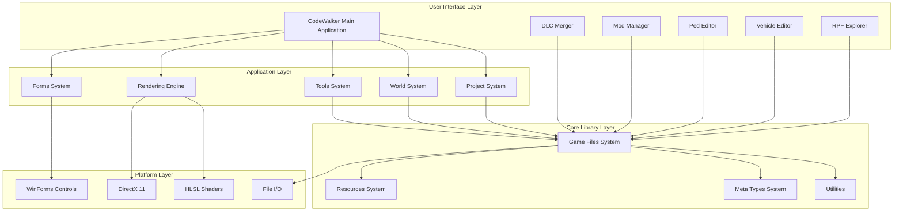
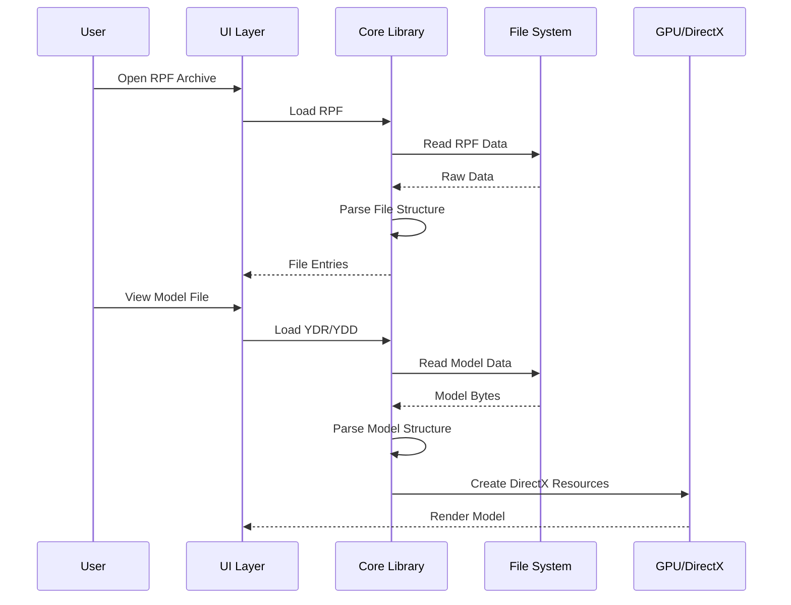
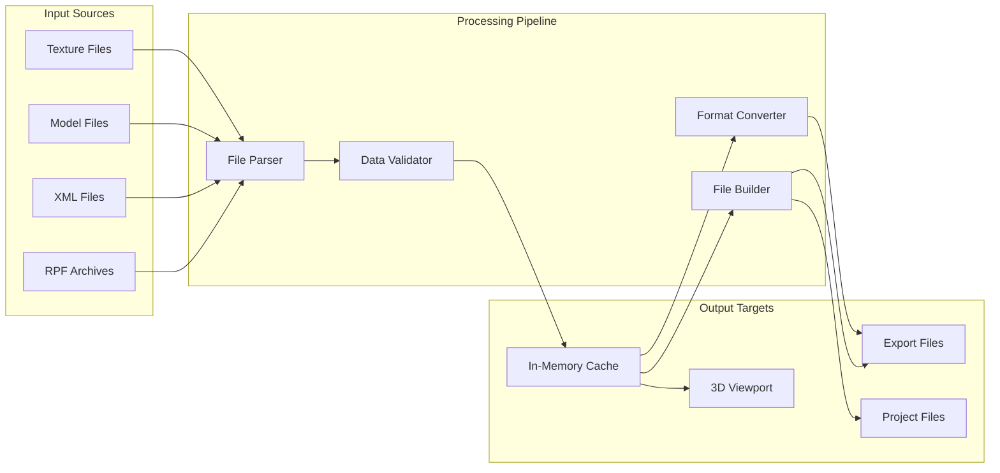
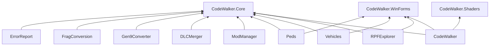

# CodeWalker Architecture Overview

## System Architecture

## Component Interactions

## Data Flow Architecture

## Module Dependencies

## Key Design Patterns

### 1. **Resource Management Pattern**
- Base classes for all game resources
- Lazy loading and caching
- Reference counting for memory management

### 2. **File Type Registry**
- Factory pattern for file type handlers
- Extension-based routing
- Pluggable file format support

### 3. **Rendering Pipeline**
- Command pattern for render operations
- State management for DirectX
- Shader resource binding

### 4. **Project System**
- Observer pattern for project changes
- Command pattern for undo/redo
- Visitor pattern for project traversal

### 5. **Data Conversion**
- Strategy pattern for format converters
- Builder pattern for file construction
- Chain of responsibility for validation

## Technology Stack Details

### Core Technologies
- **Language**: C# 12.0 / .NET Framework 4.8 & .NET 8.0
- **UI Framework**: Windows Forms
- **Graphics API**: DirectX 11
- **Shader Language**: HLSL 5.0
- **Build System**: MSBuild / Visual Studio 2022

### Key Libraries
- **System.Numerics**: Vector/Matrix math
- **System.Drawing**: Image processing
- **System.IO.Compression**: Archive handling
- **DirectX Tool Kit**: DirectX helpers

### File Format Support
- **Archives**: RPF (RAGE Package Format)
- **Models**: YDR, YDD, YFT (Drawable/Fragment)
- **Textures**: YTD (Texture Dictionary), DDS
- **Maps**: YMAP, YTYP, YBN, YND, YNV
- **Audio**: AWC, REL
- **Data**: META, PSO, XML, GXT2