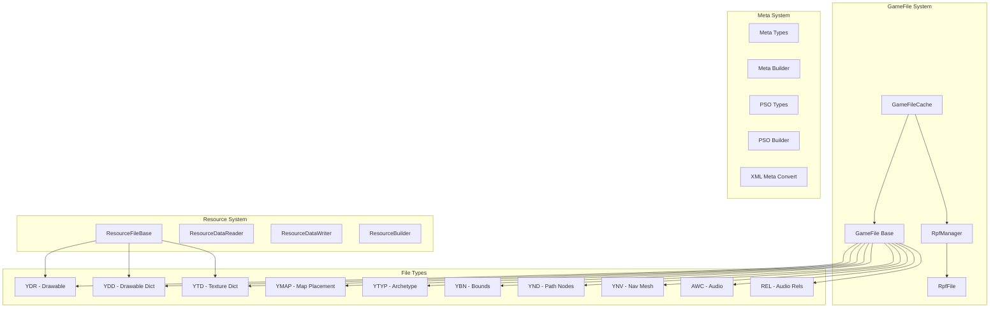
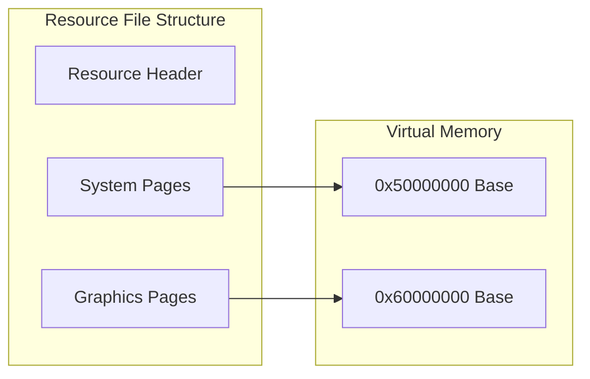
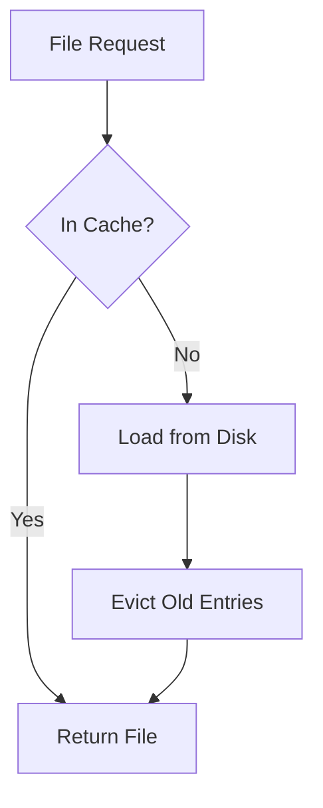

# CodeWalker.Core Library Documentation

## Overview

CodeWalker.Core is the foundational library that handles all game file operations, resource management, and data structures for GTA V file formats. It provides the core functionality for reading, writing, and manipulating various game assets.

## Architecture

### Core Components



## Key Systems

### 1. GameFile System

The GameFile system provides the base infrastructure for all game file types.

#### Base Classes

**GameFile**
```csharp
public abstract class GameFile : Cacheable<GameFileCacheKey>
{
    public GameFileType Type { get; set; }
    public RpfFileEntry RpfFileEntry { get; set; }
    public string Name { get; set; }
    public string FilePath { get; set; }
    public bool Loaded { get; set; }
    public bool LoadQueued { get; set; }
    public long MemoryUsage { get; }
}
```

**Key Interfaces**
- `PackedFile`: For files that can be loaded from packed data
- `Cacheable<T>`: For objects that can be cached

#### File Type Categories

1. **Resource Files** (Binary format with system/graphics streams)
   - YDR (Drawable) - 3D models
   - YDD (Drawable Dictionary) - Collection of models
   - YTD (Texture Dictionary) - Texture collections
   - YFT (Fragment) - Breakable objects
   - YCD (Clip Dictionary) - Animations

2. **Map/World Files** (Structure and placement data)
   - YMAP - Entity placements
   - YTYP - Archetype definitions
   - YBN - Collision bounds
   - YND - Path nodes
   - YNV - Navigation mesh

3. **Data Files** (Configuration and metadata)
   - META - Metadata files
   - PSO - PSO format data
   - XML - XML data files
   - GXT2 - Text/localization

4. **Audio Files**
   - AWC - Audio wave containers
   - REL - Audio relationships

### 2. Resource System

The resource system handles GTA V's custom binary format with separate system and graphics memory streams.

#### Memory Architecture



#### Key Classes

**ResourceFileBase**
- Base class for all resource files
- Handles version info and data pointers

**ResourceDataReader**
- Reads data from system/graphics streams
- Handles endianness and data alignment
- Supports position tracking and block reading

**ResourceDataWriter**
- Writes data to resource streams
- Manages block allocation
- Handles reference resolution

**ResourceBuilder**
- Compiles resource data into final format
- Manages page allocation
- Compresses data blocks

### 3. Meta/PSO System

Handles structured metadata used throughout the game.

#### Meta System
- Strongly-typed metadata structures
- XML serialization support
- Hash-based field lookup

#### PSO System
- Platform-specific object format
- Compact binary representation
- Schema-based validation

### 4. Caching System

Efficient memory management for large game worlds.



**Features:**
- Time-based eviction
- Memory limit enforcement
- Reference counting
- Async loading support

## File Format Details

### YDR (Drawable) Files

3D model files containing geometry, materials, and shaders.

**Structure:**
```
YDR File
├── Drawable
│   ├── ShaderGroup
│   │   ├── Shaders[]
│   │   └── TextureDict
│   ├── Skeleton
│   │   └── Bones[]
│   └── DrawableModels
│       ├── High Detail
│       ├── Medium Detail
│       ├── Low Detail
│       └── Very Low Detail
```

### YMAP (Map) Files

Entity placement and streaming information.

**Structure:**
```
YMAP File
├── CMapData
│   ├── Entities[]
│   ├── MloInstances[]
│   ├── CarGenerators[]
│   └── StreamingExtents
```

### YTD (Texture Dictionary) Files

Texture collections used by models.

**Structure:**
```
YTD File
├── TextureDictionary
│   └── Textures[]
│       ├── Name
│       ├── Format
│       ├── MipMaps[]
│       └── Usage Flags
```

## Usage Patterns

### Loading a File
```csharp
// Via GameFileCache
var cache = new GameFileCache();
var ydr = cache.GetYdr("model.ydr");

// Direct loading
var file = new YdrFile();
file.Load(data, rpfEntry);
```

### Creating/Modifying Files
```csharp
// Create new YDR
var ydr = new YdrFile();
ydr.Drawable = new Drawable();
// ... setup drawable data ...

// Save to bytes
var data = ydr.Save();
```

### XML Import/Export
```csharp
// Export to XML
var xml = YmapXml.GetXml(ymap);

// Import from XML
var ymap = XmlYmap.GetYmap(xmlDoc);
```

## Extension Points

1. **Custom File Types**: Implement `GameFile` and register in `GameFileType`
2. **Resource Blocks**: Implement `IResourceBlock` for custom data
3. **Meta Structures**: Define in MetaTypes.cs
4. **XML Converters**: Add to respective Xml classes