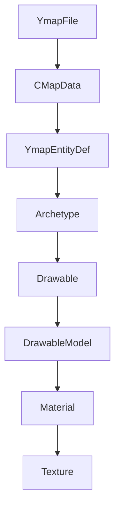
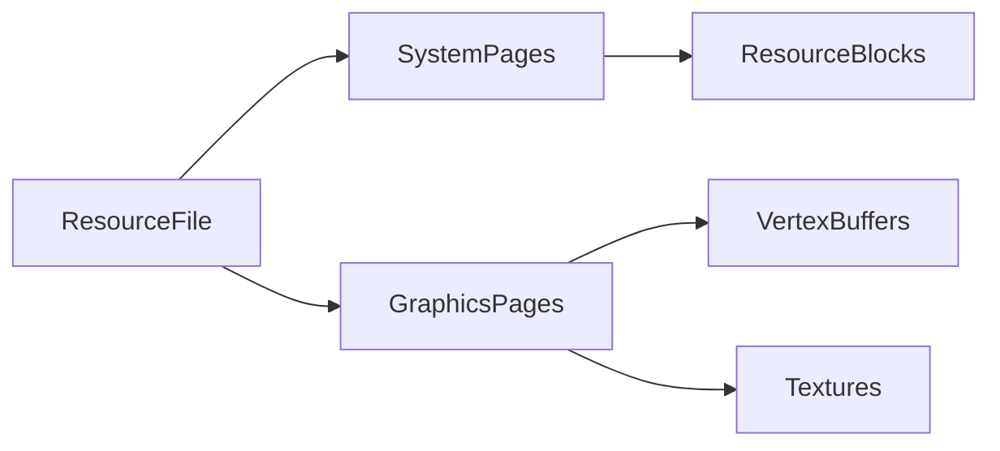
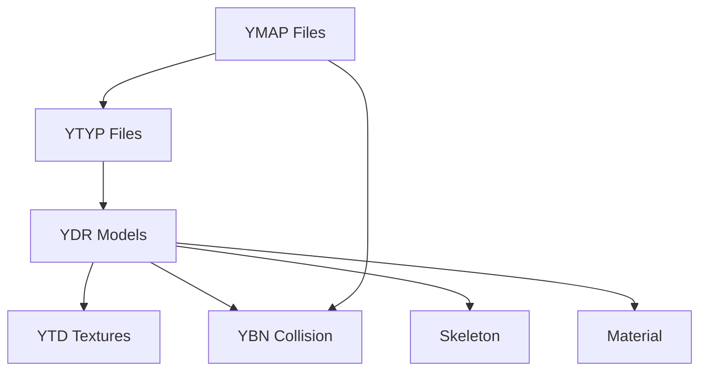

# CodeWalker Data Structures Reference

## Overview

This document provides a comprehensive reference for all major data structures used in CodeWalker. Understanding these structures is essential for working with GTA V file formats and developing extensions.

## Table of Contents

1. [Core File Types](#core-file-types)
2. [Entity and Archetype System](#entity-and-archetype-system)
3. [Rendering Data Structures](#rendering-data-structures)
4. [Resource System Types](#resource-system-types)
5. [World and Map Structures](#world-and-map-structures)
6. [Audio and Animation Types](#audio-and-animation-types)
7. [Utility Data Types](#utility-data-types)

---

## Core File Types

### GameFile Base Class
**Location**: `CodeWalker.Core/GameFiles/GameFile.cs`

```csharp
public abstract class GameFile : Cacheable<GameFileCacheKey>
{
    public GameFileType Type { get; set; }      // File type identifier
    public RpfFileEntry RpfFileEntry { get; set; } // RPF source
    public string Name { get; set; }            // File name
    public string FilePath { get; set; }        // Full path
    public bool Loaded { get; set; }            // Load status
    public DateTime LastLoadTime { get; }       // Cache timing
    public long MemoryUsage { get; }            // Memory footprint
}
```

### GameFileType Enumeration
```csharp
public enum GameFileType
{
    None = 0,
    // Resource files
    Ydr = 1,        // Drawable
    Ydd = 2,        // Drawable Dictionary
    Ytd = 3,        // Texture Dictionary
    Yft = 4,        // Fragment
    Ycd = 5,        // Clip Dictionary
    
    // Map files
    Ymap = 10,      // Map placement
    Ytyp = 11,      // Archetype definitions
    Ybn = 12,       // Collision bounds
    Ynd = 13,       // Path nodes
    Ynv = 14,       // Navigation mesh
    
    // Data files
    Meta = 20,      // Metadata
    Pso = 21,       // PSO format
    Xml = 22,       // XML data
    Gxt2 = 23,      // Game text
    
    // Audio files
    Awc = 30,       // Audio container
    Rel = 31        // Audio relationships
}
```

---

## Entity and Archetype System

### YmapEntityDef - Entity Instance
**Location**: `CodeWalker.Core/GameFiles/FileTypes/YmapFile.cs`

```csharp
public class YmapEntityDef
{
    // Transform
    public Vector3 position { get; set; }       // World position
    public Quaternion rotation { get; set; }    // Rotation quaternion
    public Vector3 scale { get; set; }          // Scale factors
    
    // Identity
    public uint archetypeName { get; set; }     // Archetype hash
    public uint guid { get; set; }              // Unique identifier
    public int parentIndex { get; set; }        // Parent entity index
    
    // Properties
    public uint flags { get; set; }             // Entity flags
    public float lodDist { get; set; }          // LOD distance
    public float childLodDist { get; set; }     // Child LOD distance
    public ELodLevel lodLevel { get; set; }     // Current LOD level
    public int numChildren { get; set; }        // Child count
    public int priorityLevel { get; set; }      // Priority level
    
    // Rendering
    public BoundingBox BoundingBox { get; set; } // Bounds
    public Matrix WorldMatrix { get; }          // Transform matrix
    public bool Visible { get; set; }           // Visibility
    
    // Methods
    public void SetPosition(Vector3 pos);
    public void SetOrientation(Quaternion q);
    public void SetScale(Vector3 s);
    public void UpdateBB();
    public Archetype GetArchetype();
}
```

### Archetype - Object Definition
**Location**: `CodeWalker.Core/GameFiles/FileTypes/YtypFile.cs`

```csharp
public class Archetype
{
    // Identity
    public uint hash { get; set; }              // Name hash
    public string Name { get; set; }            // Display name
    public string AssetName { get; set; }       // Asset file name
    
    // Properties
    public Vector3 bbMin { get; set; }          // Bounding box min
    public Vector3 bbMax { get; set; }          // Bounding box max
    public Vector3 bsCentre { get; set; }       // Bounding sphere center
    public float bsRadius { get; set; }         // Bounding sphere radius
    public float hdTextureDist { get; set; }    // HD texture distance
    public uint flags { get; set; }             // Archetype flags
    public uint specialAttribute { get; set; }  // Special attributes
    
    // Type-specific data
    public CTimeArchetypeDef TimeArchetype { get; set; }
    public CMloArchetypeDef MloArchetype { get; set; }
    
    // Methods
    public bool IsActive(float currentTime);
    public BoundingBox GetBoundingBox();
    public BoundingSphere GetBoundingSphere();
}
```

---

## Rendering Data Structures

### Drawable - 3D Model
**Location**: `CodeWalker.Core/GameFiles/Resources/Drawable.cs`

```csharp
public class Drawable : DrawableBase
{
    // Models
    public ResourcePointerArray64<DrawableModel> DrawableModels { get; set; }
    
    // Materials and textures
    public ResourcePointerArray64<Material> Materials { get; set; }
    public ResourcePointerArray64<Texture> Textures { get; set; }
    
    // Lighting and shaders
    public ResourcePointerArray64<Light> Lights { get; set; }
    public ResourcePointerArray64<Shader> Shaders { get; set; }
    
    // Skeleton and bones
    public ResourcePointer64<Skeleton> Skeleton { get; set; }
    public ResourcePointerArray64<Bone> Bones { get; set; }
    
    // Bounds and collision
    public ResourcePointer64<Bounds> Bounds { get; set; }
    
    // LOD management
    public float LodDistHigh { get; set; }
    public float LodDistMed { get; set; }
    public float LodDistLow { get; set; }
    public float LodDistVlow { get; set; }
}
```

### DrawableModel - Geometry Data
```csharp
public class DrawableModel : IResourceBlock
{
    // Geometry
    public ResourcePointerArray64<DrawableGeometry> Geometries { get; set; }
    
    // Bounds
    public Vector4 BoundingBoxMin { get; set; }
    public Vector4 BoundingBoxMax { get; set; }
    public Vector4 BoundingSphereCenter { get; set; }
    public float BoundingSphereRadius { get; set; }
    
    // Material references
    public ResourceSimpleArray<ushort> MaterialIndices { get; set; }
    
    // Bone mapping
    public ResourceSimpleArray<Matrix> BoneTransforms { get; set; }
}
```

### Material - Surface Properties
```csharp
public class Material : IResourceBlock
{
    // Shader
    public ResourcePointer64<Shader> Shader { get; set; }
    
    // Textures
    public ResourcePointerArray64<Texture> Textures { get; set; }
    
    // Parameters
    public ResourcePointerArray64<MaterialParameter> Parameters { get; set; }
    
    // Properties
    public MaterialType Type { get; set; }
    public uint RenderBucket { get; set; }
    public MaterialFlags Flags { get; set; }
}
```

---

## Resource System Types

### ResourceFileBase - Base Resource Class
**Location**: `CodeWalker.Core/GameFiles/Resources/ResourceFileBase.cs`

```csharp
public abstract class ResourceFileBase : IResourceBlock
{
    // File header
    public uint FileVFT { get; set; }           // Virtual function table
    public uint FileUnknown { get; set; }       // Unknown field
    public uint FileSize { get; set; }          // File size
    
    // Version info
    public uint ResourceVersion { get; set; }   // Resource version
    public uint SystemFlags { get; set; }       // System memory flags
    public uint GraphicsFlags { get; set; }     // Graphics memory flags
    
    // Memory layout
    public long FilePosition { get; set; }      // File position
    public uint BlockLength { get; }            // Block size
}
```

### ResourcePointer64<T> - Memory Reference
```csharp
public class ResourcePointer64<T> : IResourceBlock where T : IResourceBlock, new()
{
    public ulong Position { get; set; }         // Memory address
    public T Data { get; set; }                 // Referenced data
    
    // Memory management
    public bool IsInSystemMemory { get; }
    public bool IsInGraphicsMemory { get; }
    public uint BlockIndex { get; }
    public uint Offset { get; }
}
```

### ResourceSimpleArray<T> - Array Type
```csharp
public class ResourceSimpleArray<T> : IResourceBlock where T : struct
{
    public uint Count { get; set; }             // Element count
    public T[] data_items { get; set; }         // Array data
    
    // Access methods
    public T this[int index] { get; set; }
    public void Add(T item);
    public void Remove(T item);
    public void Clear();
}
```

---

## World and Map Structures

### YmapFile - Map Container
**Location**: `CodeWalker.Core/GameFiles/FileTypes/YmapFile.cs`

```csharp
public class YmapFile : GameFile, PackedFile
{
    // Core data
    public CMapData CMapData { get; set; }      // Map data container
    
    // Entities
    public YmapEntityDef[] AllEntities { get; set; }
    public YmapEntityDef[] RootEntities { get; set; }
    public YmapEntityDef[] ChildEntities { get; set; }
    
    // Additional objects
    public YmapCarGen[] CarGenerators { get; set; }
    public YmapBox[] Boxes { get; set; }
    public YmapOccludeModel[] OccludeModels { get; set; }
    
    // Spatial data
    public Vector3 BBMin { get; set; }          // Bounding box minimum
    public Vector3 BBMax { get; set; }          // Bounding box maximum
    public Vector3 BBCenter { get; }            // Bounding box center
    public Vector3 BBSize { get; }              // Bounding box size
    
    // Content flags
    public EMapDataContentFlags ContentFlags { get; set; }
    public uint StreamingExtentsMin { get; set; }
    public uint StreamingExtentsMax { get; set; }
    
    // Entity management methods
    public YmapEntityDef CreateEntity();
    public void RemoveEntity(YmapEntityDef entity);
    public YmapEntityDef[] GetEntities(BoundingBox box);
    public YmapEntityDef GetEntity(uint hash);
}
```

### CMapData - Internal Map Structure
```csharp
public class CMapData : ResourceFileBase
{
    // Entity containers
    public ResourcePointer64<CEntityContainer> Entities { get; set; }
    public ResourcePointer64<CCarGenContainer> CarGenerators { get; set; }
    public ResourcePointer64<CInstancedMapData> InstancedData { get; set; }
    
    // Spatial organization
    public ResourcePointer64<CMapDataGroup> Groups { get; set; }
    public ResourcePointer64<CMapDataBox> Boxes { get; set; }
    
    // Streaming info
    public Vector4 StreamingExtentsMin { get; set; }
    public Vector4 StreamingExtentsMax { get; set; }
    public uint ContentFlags { get; set; }
}
```

---

## Audio and Animation Types

### AwcFile - Audio Container
**Location**: `CodeWalker.Core/GameFiles/FileTypes/AwcFile.cs`

```csharp
public class AwcFile : GameFile, PackedFile
{
    // Audio data
    public AwcData Data { get; set; }           // Audio container data
    public AwcChannel[] Channels { get; set; }  // Audio channels
    public AwcStream[] Streams { get; set; }    // Audio streams
    
    // Format info
    public uint SampleRate { get; set; }        // Sample rate (Hz)
    public ushort Channels { get; set; }        // Channel count
    public ushort BitsPerSample { get; set; }   // Bit depth
    public AudioCodec Codec { get; set; }       // Compression codec
    
    // Playback
    public float Duration { get; }              // Length in seconds
    public byte[] GetWaveData();                // Extract PCM data
    public void ExportWav(string path);         // Export as WAV
}
```

### YcdFile - Animation Clips
**Location**: `CodeWalker.Core/GameFiles/FileTypes/YcdFile.cs`

```csharp
public class YcdFile : GameFile, PackedFile
{
    // Clip data
    public ClipDictionary ClipDictionary { get; set; }
    public ClipMapEntry[] ClipMapEntries { get; set; }
    public ClipBase[] Clips { get; set; }
    
    // Animation info
    public string Name { get; set; }            // Dictionary name
    public uint Hash { get; set; }              // Name hash
    public float Duration { get; set; }         // Total duration
    public uint FrameCount { get; set; }        // Frame count
    
    // Playback methods
    public ClipBase GetClip(uint hash);
    public ClipBase GetClip(string name);
    public float GetClipDuration(uint hash);
}
```

---

## Utility Data Types

### Vector3 Extensions
**Location**: `CodeWalker.Core/Utils/Vectors.cs`

```csharp
public static class Vector3Extensions
{
    public static Vector3 Round(this Vector3 v, int decimals);
    public static float Length(this Vector3 v);
    public static Vector3 Normalized(this Vector3 v);
    public static Vector3 Cross(this Vector3 a, Vector3 b);
    public static float Dot(this Vector3 a, Vector3 b);
    public static Vector3 Transform(this Vector3 v, Matrix m);
}
```

### Quaternion Extensions
```csharp
public static class QuaternionExtensions
{
    public static Vector3 ToEuler(this Quaternion q);
    public static Quaternion FromEuler(Vector3 euler);
    public static Vector3 Multiply(this Quaternion q, Vector3 v);
    public static Quaternion Inverse(this Quaternion q);
    public static Quaternion Normalized(this Quaternion q);
}
```

### BoundingBox and BoundingSphere
```csharp
public struct BoundingBox
{
    public Vector3 Minimum { get; set; }        // Min corner
    public Vector3 Maximum { get; set; }        // Max corner
    public Vector3 Center { get; }              // Center point
    public Vector3 Size { get; }                // Dimensions
    
    // Methods
    public bool Contains(Vector3 point);
    public bool Intersects(BoundingBox box);
    public bool Intersects(Ray ray);
    public BoundingBox Transform(Matrix matrix);
    public BoundingBox Merge(BoundingBox other);
}

public struct BoundingSphere
{
    public Vector3 Center { get; set; }         // Center point
    public float Radius { get; set; }           // Radius
    
    // Methods
    public bool Contains(Vector3 point);
    public bool Intersects(BoundingSphere sphere);
    public bool Intersects(Ray ray);
    public BoundingSphere Transform(Matrix matrix);
}
```

---

## Memory Management Types

### Cacheable<T> - Cache Interface
**Location**: `CodeWalker.Core/GameFiles/Cache/Cacheable.cs`

```csharp
public abstract class Cacheable<T> : IDisposable where T : struct
{
    // Cache key
    public T Key { get; set; }                  // Unique identifier
    
    // Lifecycle
    public DateTime CreateTime { get; }         // Creation timestamp
    public DateTime LastAccessTime { get; set; } // Last access time
    public bool IsDisposed { get; }             // Disposal state
    
    // Memory tracking
    public abstract long MemoryUsage { get; }   // Memory footprint
    
    // Cache management
    public virtual void OnCacheHit();           // Access callback
    public virtual void OnCacheEvict();         // Eviction callback
    public virtual void Dispose();              // Cleanup
}
```

### GameFileCacheKey - Cache Identifier
```csharp
public struct GameFileCacheKey
{
    public uint Hash { get; set; }              // File name hash
    public GameFileType Type { get; set; }      // File type
    public uint SecondaryHash { get; set; }     // Additional identifier
    
    // Comparison
    public bool Equals(GameFileCacheKey other);
    public override int GetHashCode();
    public override string ToString();
}
```

---

## Data Structure Relationships

### Entity Hierarchy


### Resource Memory Layout


### File Type Dependencies


---

## Common Data Patterns

### Factory Pattern Usage
```csharp
// Create file based on type
public static GameFile CreateGameFile(GameFileType type)
{
    return type switch
    {
        GameFileType.Ymap => new YmapFile(),
        GameFileType.Ytyp => new YtypFile(),
        GameFileType.Ydr => new YdrFile(),
        _ => throw new NotSupportedException($"Type {type} not supported")
    };
}
```

### Resource Pointer Dereferencing
```csharp
// Safe pointer access
if (drawable.DrawableModels?.data_items != null)
{
    foreach (var model in drawable.DrawableModels.data_items)
    {
        if (model?.Geometries?.data_items != null)
        {
            // Process geometries
        }
    }
}
```

### Spatial Query Pattern
```csharp
// Find entities in area
var boundingBox = new BoundingBox(min, max);
var entities = ymap.GetEntities(boundingBox);
foreach (var entity in entities)
{
    if (entity.Visible && entity.GetArchetype() != null)
    {
        // Process visible entity
    }
}
```

---

## See Also

- [Function Index](function_index.md) - Complete function reference
- [API Reference](api_reference.md) - Detailed API documentation
- [File Types Documentation](file_types_documentation.md) - File format details
- [Architecture Overview](architecture_overview.md) - System design