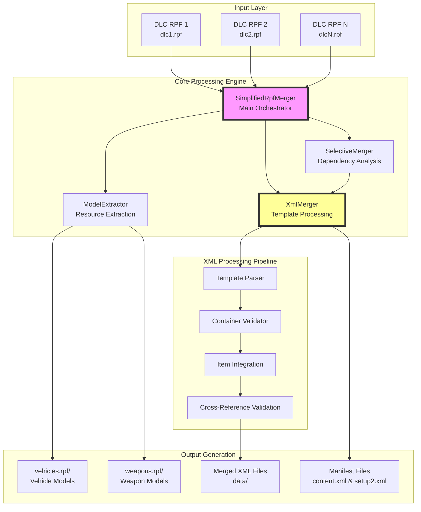
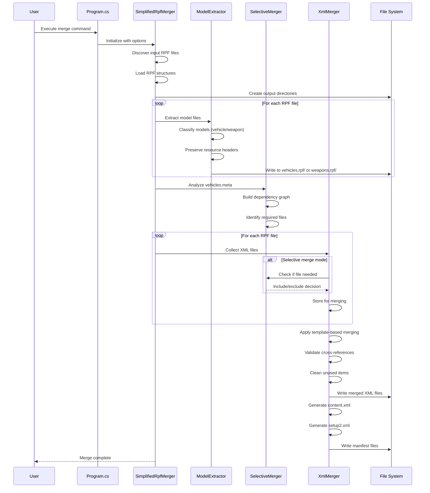
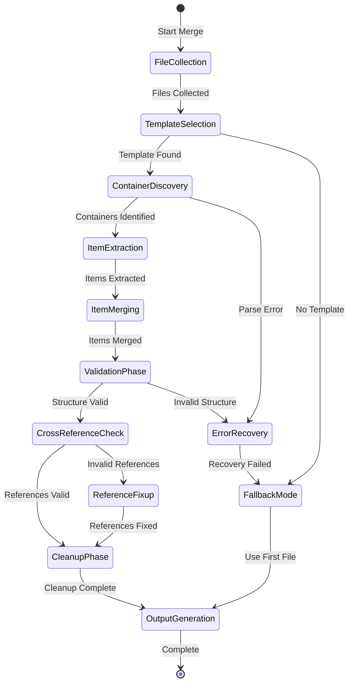
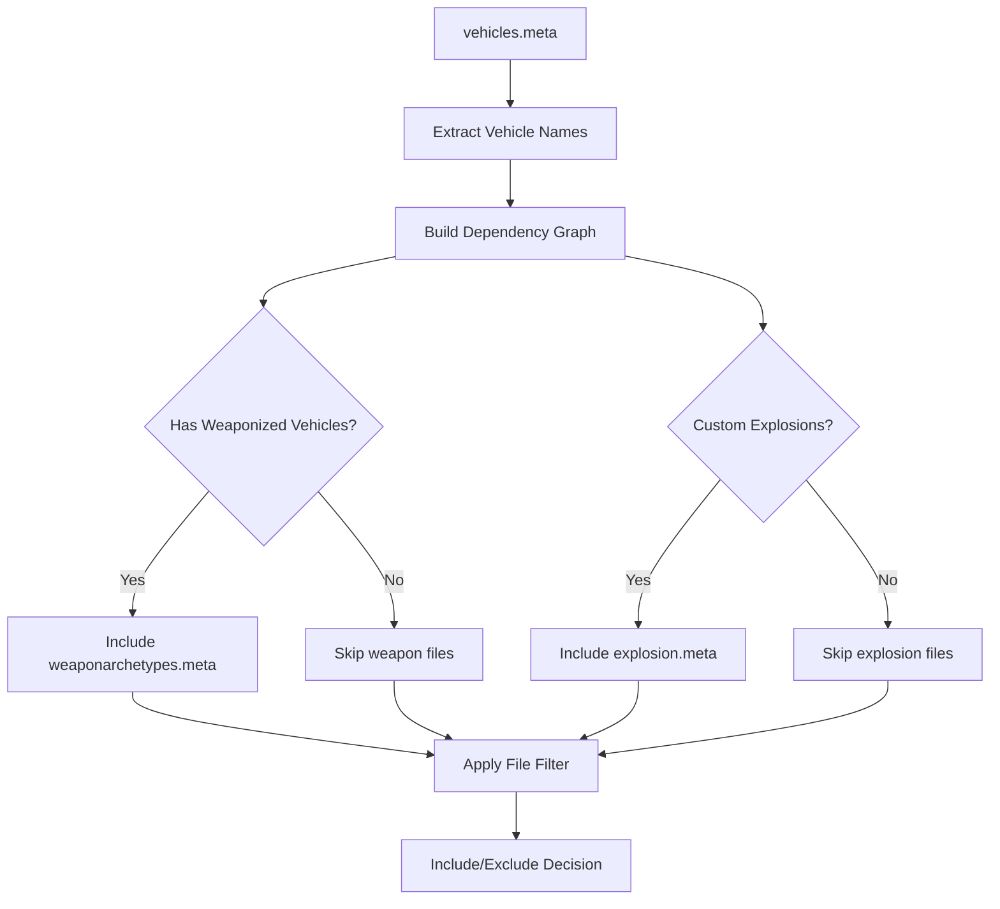
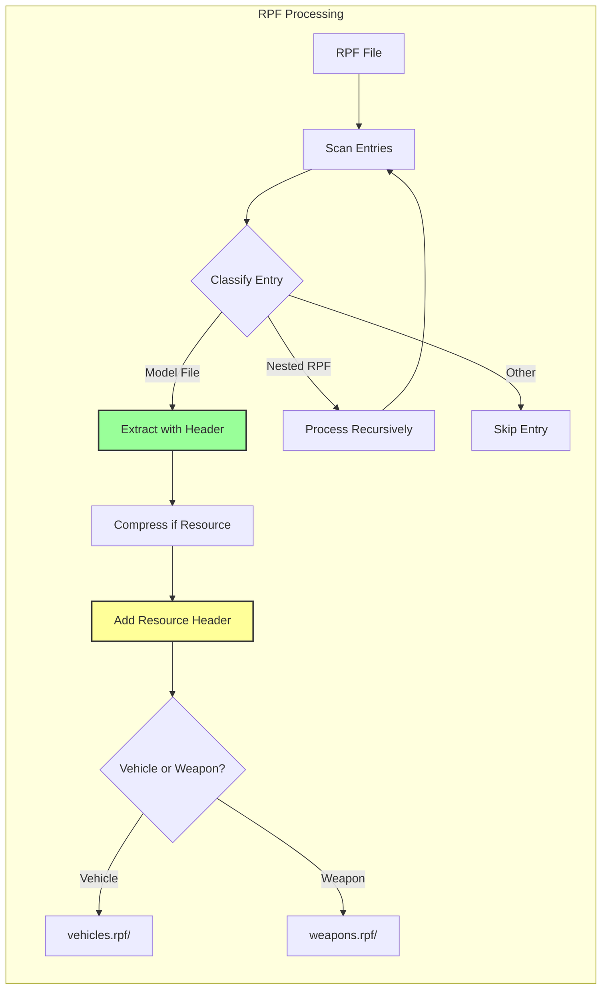
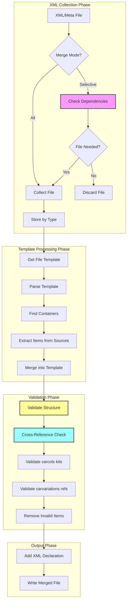
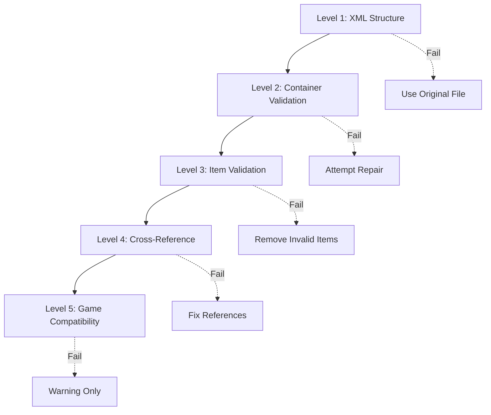
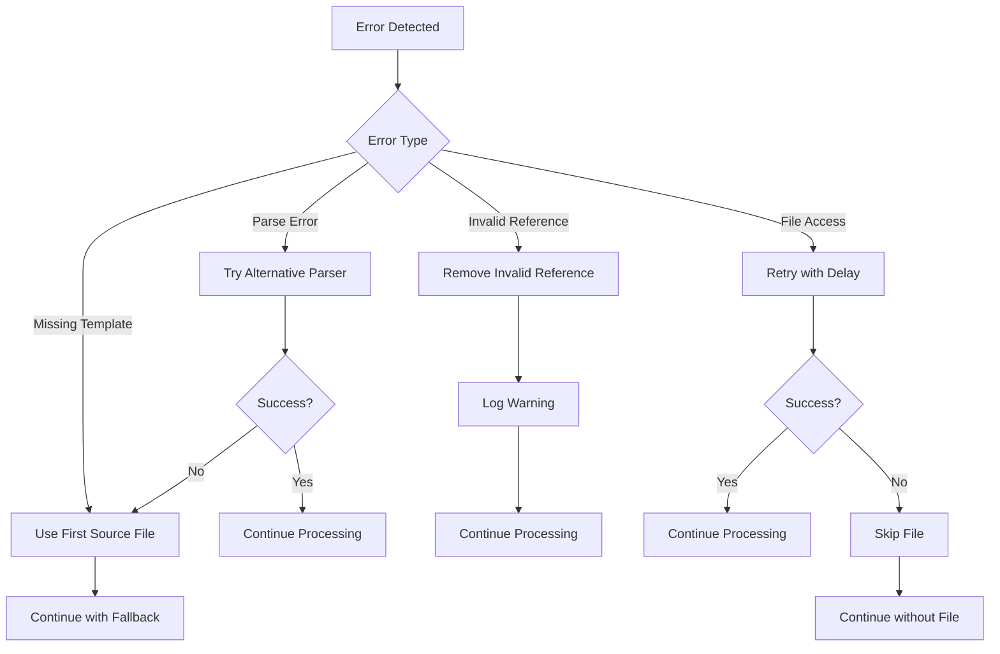

# CodeWalker.DLCMerger - Comprehensive Documentation

## Table of Contents
1. [Overview](#overview)
2. [Architecture Deep Dive](#architecture-deep-dive)
3. [XML Processing Complexity](#xml-processing-complexity)
4. [Component Detailed Analysis](#component-detailed-analysis)
5. [Data Flow and Processing Pipeline](#data-flow-and-processing-pipeline)
6. [XML Template System](#xml-template-system)
7. [Advanced Features](#advanced-features)
8. [Error Handling and Recovery](#error-handling-and-recovery)
9. [Performance Considerations](#performance-considerations)
10. [Usage Guide](#usage-guide)
11. [Troubleshooting](#troubleshooting)

## Overview

CodeWalker.DLCMerger is a sophisticated command-line utility designed to merge multiple Grand Theft Auto V DLC (Downloadable Content) packages into a single, optimized structure. The tool performs intelligent model extraction, complex XML merging with template-based validation, and generates game-compatible manifest files.

### Key Capabilities
- **Intelligent Content Merging**: Analyzes dependencies and selectively includes only required content
- **Template-Based XML Processing**: Uses validated templates to ensure GTA V compatibility
- **Cross-Reference Validation**: Ensures consistency between related XML files
- **Resource Header Preservation**: Maintains game-required headers for model files
- **Manifest Generation**: Creates proper content.xml and setup2.xml for game loading

## Architecture Deep Dive

### High-Level System Architecture



### Component Interaction Flow



## XML Processing Complexity

### The Challenge

GTA V uses a complex XML structure where different metadata files reference each other through various identifiers. The main complexity arises from:

1. **Multiple Container Types**: Each XML file type has different container structures
2. **Cross-File References**: Files reference items defined in other files
3. **Validation Requirements**: Invalid references can crash the game
4. **Merging Conflicts**: Same items may exist in multiple DLCs with different values

### XML Processing State Machine



### XML Merging Algorithm Detail

```mermaid
flowchart TD
    Start[Start XML Merge] --> LoadTemplates[Load XML Templates<br/>Dictionary<string, string>]
    
    LoadTemplates --> GroupFiles[Group Files by Type<br/>vehicles.meta, carcols.meta, etc.]
    
    GroupFiles --> ProcessType{For Each File Type}
    
    ProcessType --> GetTemplate[Get Template for Type]
    GetTemplate --> ParseTemplate[Parse Template Structure<br/>XDocument.Parse]
    
    ParseTemplate --> FindContainers[Find All Containers<br/>Root.Elements]
    
    FindContainers --> CollectItems[Collect Items from All Sources]
    
    CollectItems --> ParseSource[Parse Source File]
    ParseSource --> ExtractSourceItems[Extract Items by Container]
    ExtractSourceItems --> AddToCollection[Add to Container Collection]
    
    AddToCollection --> MoreSources{More Source Files?}
    MoreSources -->|Yes| ParseSource
    MoreSources -->|No| PopulateTemplate[Populate Template Containers]
    
    PopulateTemplate --> ValidateStructure[Validate XML Structure]
    ValidateStructure --> CrossRefValidation[Cross-Reference Validation]
    
    CrossRefValidation --> CheckCarcols[Check carcols.meta kits]
    CheckCarcols --> CheckCarvariations[Check carvariations.meta refs]
    CheckCarvariations --> RemoveInvalid[Remove Invalid Items]
    
    RemoveInvalid --> WriteOutput[Write Merged XML]
    WriteOutput --> NextType{More File Types?}
    
    NextType -->|Yes| ProcessType
    NextType -->|No| Complete[Merge Complete]
    
    style LoadTemplates fill:#ff9,stroke:#333,stroke-width:2px
    style CrossRefValidation fill:#9ff,stroke:#333,stroke-width:2px
    style ValidateStructure fill:#f9f,stroke:#333,stroke-width:2px
```



## Component Detailed Analysis

### 1. SimplifiedRpfMerger (Main Orchestrator)

**Purpose**: Coordinates the entire merging process and manages the workflow

**Key Responsibilities**:
- Input file discovery and validation
- Output directory structure creation
- Component initialization and coordination
- Phase management and logging

**Processing Phases**:
1. **Discovery Phase**: Locates all input RPF files
2. **Extraction Phase**: Extracts model files
3. **Analysis Phase**: Analyzes dependencies
4. **Merging Phase**: Merges XML/meta files
5. **Generation Phase**: Creates manifest files

### 2. ModelExtractor

**Purpose**: Extracts and categorizes model files while preserving game-required headers

**Key Features**:
- Recursive RPF processing for nested archives
- Resource header preservation for game compatibility
- Intelligent model classification (vehicle vs weapon)
- Compression handling for resource files

**Model Classification Logic**:
```
IF filename starts with "w_" OR contains "weapon" THEN
    → weapons.rpf/
ELSE IF filename ends with .yft, .ytd, .ycd THEN
    → vehicles.rpf/
END IF
```

### 3. SelectiveMerger

**Purpose**: Implements intelligent content filtering based on vehicle dependencies

**Dependency Analysis Process**:



### 4. XmlMerger

**Purpose**: Handles complex XML merging with template validation and cross-reference checking

**Core Components**:

#### Template System
- Pre-validated XML structures for each file type
- Container identification for proper item placement
- Support for multiple container types per file

#### Validation Pipeline
1. **Structural Validation**: Ensures XML conforms to GTA V schema
2. **Cross-Reference Validation**: Validates references between files
3. **Cleanup Operations**: Removes invalid or empty items

#### Special Handling Cases
- **vehicleweapons_*.meta**: Kept separate, not merged
- **vehiclelayouts_*.meta**: Normalized to single vehiclelayouts.meta
- **Kit References**: Validated between carcols.meta and carvariations.meta

## Data Flow and Processing Pipeline

### Model Extraction Flow



### XML Merging Flow



## XML Template System

### Template Structure

Each XML file type has a specific template that defines its container structure:

```xml
<!-- Example: vehicles.meta template -->
<CVehicleModelInfo__InitDataList>
    <residentTxd>vehshare</residentTxd>
    <residentAnims />
    <InitDatas>
        <!-- Vehicle items go here -->
    </InitDatas>
    <txdRelationships>
        <!-- Texture relationships go here -->
    </txdRelationships>
</CVehicleModelInfo__InitDataList>
```

### Container Mapping

| File Type | Main Container | Item Containers |
|-----------|---------------|-----------------|
| vehicles.meta | CVehicleModelInfo__InitDataList | InitDatas, txdRelationships |
| handling.meta | CHandlingDataMgr | HandlingData |
| carcols.meta | CVehicleModelInfoVarGlobal | Kits |
| carvariations.meta | CVehicleModelInfoVariation | variationData |
| vehiclelayouts.meta | CVehicleMetadataMgr | Multiple (6 containers) |

### Validation Rules

#### Cross-Reference Validation
```
carvariations.meta → carcols.meta
- Every kit name in carvariations must exist in carcols
- Empty kit references replaced with "0_default_modkit"
- Kits with empty visibleMods are removed

vehicles.meta → handling.meta
- Every handlingId must have corresponding entry
- Missing handling entries logged as warnings

vehicles.meta → vehiclelayouts.meta
- Layout references must exist
- Missing layouts use default fallback
```

## Advanced Features

### 1. Selective Merging Intelligence

The SelectiveMerger implements a sophisticated dependency tracking system:

```csharp
// Dependency Graph Example
Vehicle: "adder"
├── Model: "adder.yft"
├── Texture: "adder.ytd"
├── Handling: "ADDER"
├── Carcols Kit: "adder_modkit"
├── Carvariations: "adder_variations"
└── Weapons: null

// Results in including:
✓ adder.yft, adder.ytd
✓ handling.meta (ADDER entry)
✓ carcols.meta (adder_modkit)
✓ carvariations.meta (adder_variations)
✗ weaponarchetypes.meta (not needed)
```

### 2. Multi-Level Validation



### 3. Manifest Generation

#### content.xml Structure
```xml
<CDataFileMgr__ContentsOfDataFileXml>
    <dataFiles>
        <!-- Ordered by dependency -->
        <Item>
            <filename>dlc_merged:/data/handling.meta</filename>
            <fileType>HANDLING_FILE</fileType>
            <overlay value="false"/>
            <disabled value="true"/>
            <persistent value="false"/>
        </Item>
        <!-- More items... -->
    </dataFiles>
    <contentChangeSets>
        <Item>
            <changeSetName>merged_AUTOGEN</changeSetName>
            <filesToEnable>
                <!-- All files to enable -->
            </filesToEnable>
        </Item>
    </contentChangeSets>
</CDataFileMgr__ContentsOfDataFileXml>
```

## Error Handling and Recovery

### Error Recovery Strategies



### Common Error Scenarios

1. **Corrupted XML File**
   - Fallback: Use first valid file from sources
   - Recovery: Attempt repair with XML recovery tools

2. **Missing Dependencies**
   - Action: Log warning and continue
   - Post-process: Generate report of missing items

3. **Container Mismatch**
   - Action: Use template structure
   - Recovery: Map items to correct containers

4. **Circular References**
   - Detection: Build dependency graph
   - Resolution: Break cycle at weakest link

## Performance Considerations

### Memory Management
- **Streaming**: Large files processed in chunks
- **Lazy Loading**: XML files loaded only when needed
- **Resource Pooling**: Reuse XML parsers and writers

### Optimization Strategies
1. **Parallel Processing**: Where safe (model extraction)
2. **Caching**: Template structures cached
3. **Early Filtering**: Skip files early in selective mode
4. **Batch Operations**: Group file I/O operations

### Performance Metrics
- Average merge time: 30-60 seconds for 5 DLCs
- Memory usage: ~200-500MB depending on DLC size
- Disk I/O: Optimized with sequential writes

## Usage Guide

### Basic Usage
```bash
CodeWalker.DLCMerger.exe <output_folder> <rpf1> <rpf2> ... [options]
```

### Options
- `--merge-all`: Include all content, not just vehicles
- `--force`: Overwrite existing output directory
- `--verbose`: Detailed logging output

### Examples

#### Merge Vehicle-Only Content
```bash
CodeWalker.DLCMerger.exe dlc_merged dlc1.rpf dlc2.rpf dlc3.rpf
```

#### Merge All Content
```bash
CodeWalker.DLCMerger.exe dlc_complete dlc1.rpf dlc2.rpf --merge-all
```

#### Merge Directory of RPFs
```bash
CodeWalker.DLCMerger.exe dlc_output ./dlc_folder/ --force
```

### Output Structure
```
dlc_merged/
├── dlc.rpf/
│   ├── content.xml          # Manifest file
│   ├── setup2.xml          # Setup file
│   ├── data/               # Merged XML files
│   │   ├── vehicles.meta
│   │   ├── handling.meta
│   │   ├── carcols.meta
│   │   ├── carvariations.meta
│   │   └── ...
│   ├── vehicles.rpf/       # Vehicle models
│   │   ├── adder.yft
│   │   ├── adder.ytd
│   │   └── ...
│   └── weapons.rpf/        # Weapon models
│       ├── w_ar_carbine.ydr
│       └── ...
```

## Troubleshooting

### Common Issues

#### 1. "Template not found for X.meta"
**Cause**: Unknown XML file type
**Solution**: File will use first source as-is

#### 2. "Invalid kit reference in carvariations"
**Cause**: Kit defined in carvariations but not in carcols
**Solution**: Automatically fixed by replacing with default kit

#### 3. "Failed to extract model file"
**Cause**: Corrupted or encrypted model
**Solution**: File skipped, check source RPF integrity

#### 4. "Output directory exists"
**Cause**: Directory already exists from previous run
**Solution**: Use --force flag or delete manually

### Debug Mode

Enable verbose logging for detailed diagnostics:
```bash
set CODEWALKER_DEBUG=1
CodeWalker.DLCMerger.exe ... --verbose
```

### Validation Checks

Run post-merge validation:
1. Check all XML files are valid
2. Verify cross-references
3. Ensure model files have headers
4. Validate manifest files

### Support

For issues or questions:
- Check log output for specific errors
- Verify source RPF files are valid
- Ensure sufficient disk space
- Report bugs with full log output