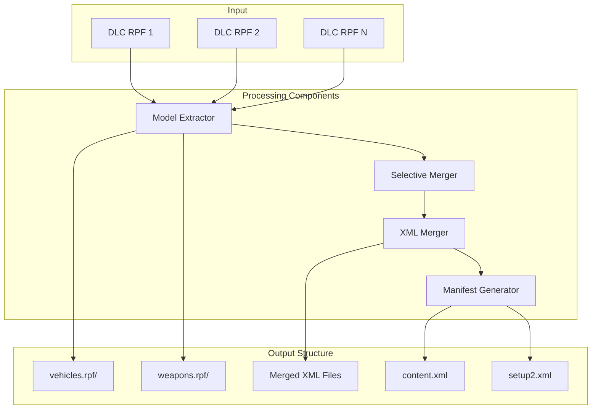
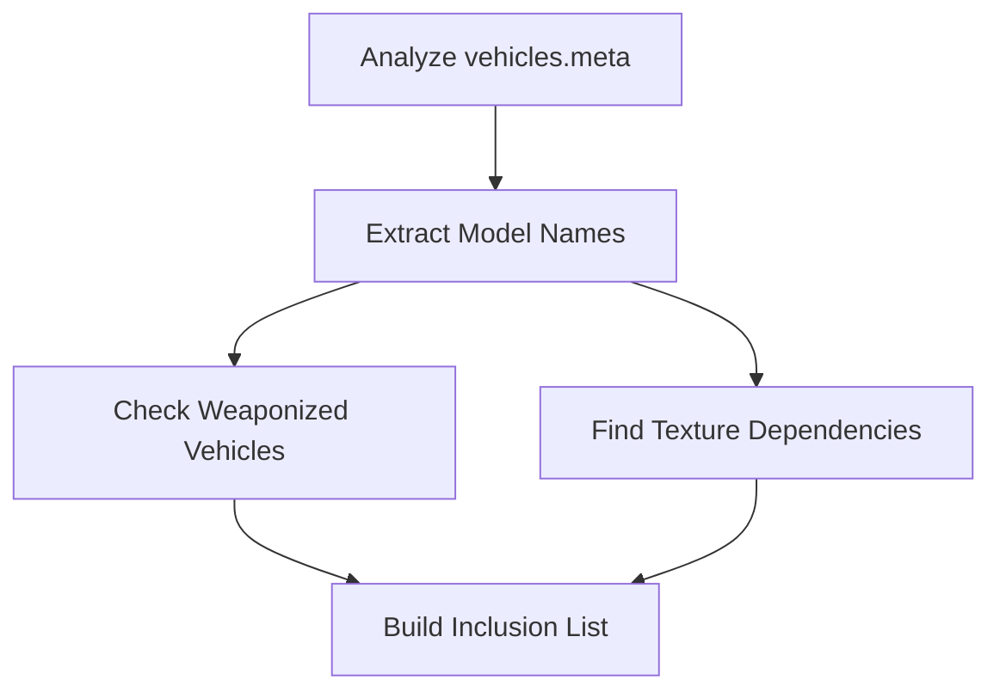

# CodeWalker.DLCMerger Documentation

## Overview

CodeWalker.DLCMerger is a command-line tool designed to merge multiple GTA V DLC (Downloadable Content) packages into a single, organized structure. It intelligently handles model extraction, XML merging, and manifest generation while maintaining full compatibility with GTA V.

## Architecture



## Core Components

### 1. SimplifiedRpfMerger

The main orchestrator that coordinates the merging process:

```csharp
public class SimplifiedRpfMerger
{
    public async Task MergeRpfs(List<string> inputRpfs, string outputFolder, bool mergeAll)
    {
        // 1. Extract models from all RPFs
        // 2. Apply selective filtering (if not mergeAll)
        // 3. Merge XML/meta files
        // 4. Generate manifests
    }
}
```

**Process Flow:**
1. Processes each input RPF file
2. Extracts to organized directory structure
3. Handles nested RPFs recursively
4. Coordinates other components

### 2. ModelExtractor

Extracts and categorizes model files from RPF archives:

```csharp
public class ModelExtractor
{
    // Categorizes models into:
    // - Vehicle models (.yft, .ytd)
    // - Weapon models (.ydr)
    // - Related resources (.ycd)
    
    public async Task ExtractModelsFromRpf(string rpfPath, string outputFolder)
    {
        // Extract with resource headers preserved
        // Organize into vehicles.rpf/ and weapons.rpf/
    }
}
```

**Key Features:**
- Preserves resource headers for game compatibility
- Handles nested RPF archives
- Categorizes by model type
- Maintains original directory structure

### 3. SelectiveMerger

Intelligently filters content when not in "merge all" mode:

```csharp
public class SelectiveMerger
{
    // Analyzes vehicles.meta to determine dependencies
    // Builds inclusion list based on detected vehicles
    // Handles special cases (weaponized vehicles, explosions)
}
```

**Selection Logic:**


### 4. XmlMerger

Handles the complex task of merging XML/meta files:

```csharp
public class XmlMerger
{
    private Dictionary<string, XmlTemplate> templates;
    
    public void MergeXmlFiles(string dlcFolder)
    {
        // Group files by type
        // Apply template-based merging
        // Validate cross-references
        // Clean up output
    }
}
```

**Template System:**
- Uses exact GTA V container structures
- Validated against reference files
- Supports multiple containers per file

## XML Template Structure

### Example: vehicles.meta Template

```xml
<CVehicleModelInfoVarGlobal>
  <txdRelationships>
    <!-- Item container -->
  </txdRelationships>
  <parentTxdRelationships>
    <!-- Item container -->
  </parentTxdRelationships>
  <CVehicleModelInfoVarGlobal>
    <!-- Main vehicle definitions -->
  </CVehicleModelInfoVarGlobal>
</CVehicleModelInfoVarGlobal>
```

### Container Discovery Process

1. **Parse Template**: Load XML structure
2. **Find Containers**: Identify valid item containers
3. **Collect Items**: Gather from all source files
4. **Populate**: Add items to appropriate containers
5. **Validate**: Clean invalid references

## Merging Strategies

### Essential Files (Always Included)
- `vehicles.meta`
- `carvariations.meta`
- `carcols.meta`
- `handling.meta`
- `vehiclelayouts.meta`

### Conditional Inclusion
Based on detected vehicles:
- Weapon archetypes (for weaponized vehicles)
- Explosion effects
- Audio configurations
- Content flags

### Skipped Files (Vehicle Mode)
- Ped-related files
- Scenario files
- Map data
- Unrelated content

## Manifest Generation

### content.xml Structure
```xml
<CDataFileMgr__ContentsOfDataFileXml>
  <disabledFiles />
  <includedXmlFiles />
  <includedDataFiles />
  <dataFiles>
    <Item>
      <filename>dlc_vehiclepack:/data/carcols.meta</filename>
      <fileType>CARCOLS_FILE</fileType>
      <overlay value="true" />
      <disabled value="true" />
      <persistent value="true" />
    </Item>
    <!-- More items... -->
  </dataFiles>
  <contentChangeSets />
  <patchFiles />
</CDataFileMgr__ContentsOfDataFileXml>
```

### setup2.xml Structure
```xml
<SSetupData>
  <deviceName>dlc_vehiclepack</deviceName>
  <datFile>content.xml</datFile>
  <timeStamp>07/07/2077 07:07:07</timeStamp>
  <nameHash>vehiclepack</nameHash>
  <contentChangeSets />
  <contentChangeSetGroups />
  <executionConditions />
</SSetupData>
```

## File Type Handling

### Model Files
- **YFT**: Fragment (vehicle models)
- **YTD**: Texture Dictionary
- **YDR**: Drawable (weapon models)
- **YCD**: Clip Dictionary (animations)

### Metadata Files
- **vehicles.meta**: Vehicle definitions
- **carvariations.meta**: Vehicle variations
- **carcols.meta**: Vehicle colors/mods
- **handling.meta**: Vehicle physics
- **vehiclelayouts.meta**: Seating arrangements

## Usage

### Command Line
```bash
CodeWalker.DLCMerger.exe <output_folder> <rpf1> <rpf2> ... [--merge-all]
```

### Options
- `--merge-all`: Include all content, not just vehicles
- Default: Selective vehicle-only merging

## Validation and Quality Assurance

### Cross-Reference Validation
- Ensures kit names in carvariations exist in carcols
- Validates model references in vehicles.meta
- Checks weapon archetype dependencies

### XML Cleanup
- Removes empty containers
- Strips unnecessary whitespace
- Validates against GTA V requirements

### Common Issues Handled
1. **Duplicate Entries**: Last occurrence wins
2. **Invalid References**: Cleaned during validation
3. **Container Mismatches**: Corrected using templates
4. **File Conflicts**: Resolved by merging

## Technical Considerations

### Memory Management
- Streams large files to avoid memory issues
- Processes files sequentially
- Cleans up temporary data

### Performance
- Async/await for I/O operations
- Parallel processing where safe
- Efficient XML parsing

### Compatibility
- Targets .NET 8.0
- Preserves GTA V data formats
- Maintains resource headers