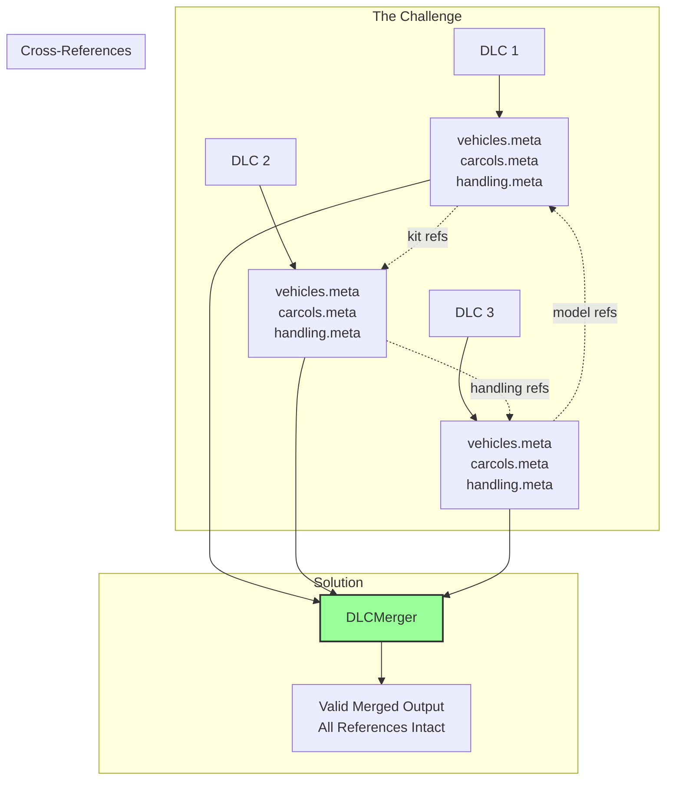

# CodeWalker.DLCMerger Documentation Index

This index provides an overview of all DLCMerger documentation with a focus on the complexity of XML processing in GTA V.

## Documentation Structure

### 1. [README.md](/CodeWalker.DLCMerger/README.md)
**Updated** - The main README file with:
- Quick start guide and usage instructions
- Explanation of XML processing complexity
- Architecture overview with Mermaid diagrams
- Troubleshooting guide
- Technical details about model handling and selective merging

### 2. [Comprehensive Documentation](dlcmerger_comprehensive_documentation.md)
**New** - Deep technical documentation covering:
- Complete architecture analysis with detailed diagrams
- XML processing complexity explained in depth
- Component-by-component breakdown
- Data flow and processing pipeline
- Advanced features and error handling
- Performance considerations

### 3. [XML Structure and Data Flow Documentation](dlcmerger_xml_dataflow_documentation.md)
**New** - Focused technical reference for XML handling:
- Template system detailed explanation
- Complete template structures for all file types
- Container discovery algorithm
- Cross-reference validation rules
- Error handling and recovery strategies

### 4. [Original Documentation](dlcmerger_documentation.md)
**Original** - Initial documentation covering:
- Basic architecture
- Core components overview
- Usage examples
- File type handling

## Why XML Processing is Complex

The DLCMerger handles one of the most challenging aspects of GTA V modding: merging interconnected XML files that reference each other across multiple files. Here's a visual representation of the complexity:

## Key Features Documented

### 1. Template-Based Merging
- Ensures GTA V compatibility
- Validates structure before output
- Handles different container types

### 2. Cross-Reference Validation
- Validates kit references between carcols and carvariations
- Ensures handling IDs exist
- Fixes invalid references automatically

### 3. Intelligent Deduplication
- Last occurrence wins for duplicates
- Smart handling of empty items
- Cleanup of invalid entries

### 4. Error Recovery
- Graceful handling of malformed XML
- Fallback strategies for missing templates
- Comprehensive logging for debugging

## Quick Links

- **For Users**: Start with the [README.md](/CodeWalker.DLCMerger/README.md)
- **For Developers**: Read the [Comprehensive Documentation](dlcmerger_comprehensive_documentation.md)
- **For XML Details**: See [XML Structure and Data Flow](dlcmerger_xml_dataflow_documentation.md)
- **For History**: Reference the [Original Documentation](dlcmerger_documentation.md)

## Summary

The DLCMerger solves a complex problem in GTA V modding by intelligently merging DLC packages while maintaining the intricate web of XML cross-references. The documentation provides both high-level understanding and deep technical details for users and developers alike.