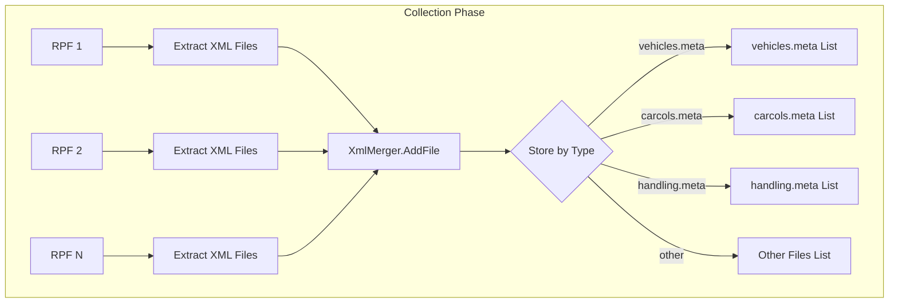
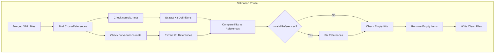
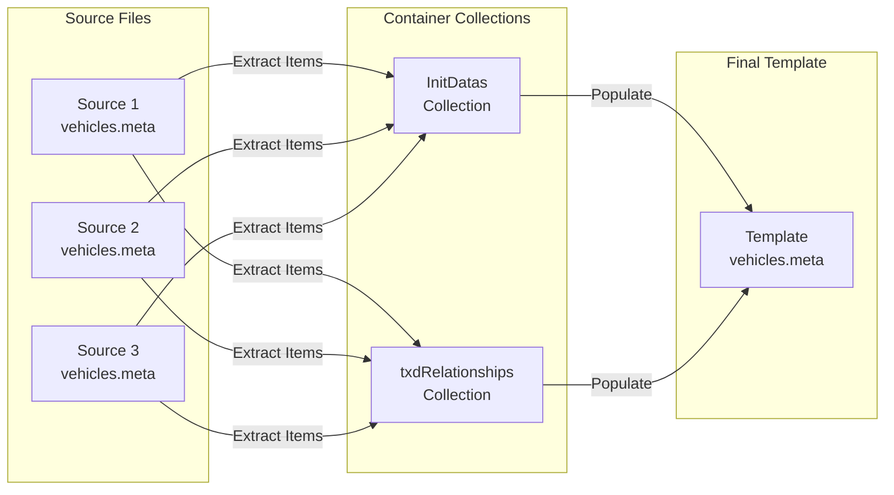
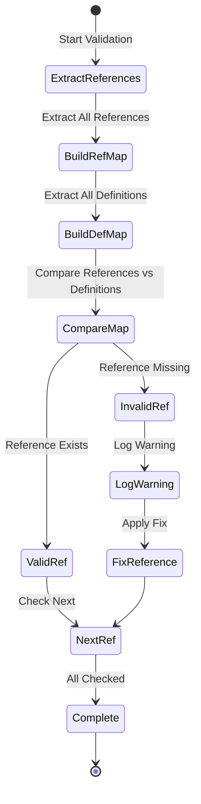
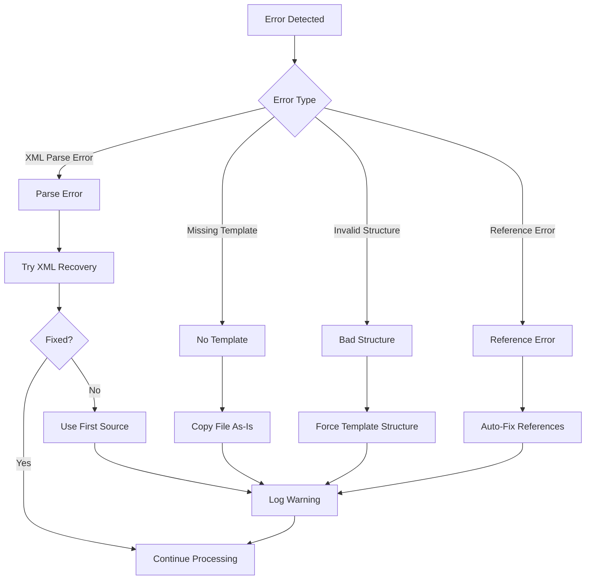

# DLCMerger XML Structure and Data Flow Documentation

## Table of Contents
1. [XML Template System Overview](#xml-template-system-overview)
2. [Template Structures](#template-structures)
3. [Data Flow Analysis](#data-flow-analysis)
4. [Container Discovery Algorithm](#container-discovery-algorithm)
5. [Cross-Reference Validation](#cross-reference-validation)
6. [Error Handling and Recovery](#error-handling-and-recovery)

## XML Template System Overview

The DLCMerger uses a template-based approach to ensure merged XML files maintain the exact structure required by GTA V. Each template is validated against the game's expected format.

### Why Templates?

1. **Structure Guarantee**: Ensures output matches GTA V's expected format exactly
2. **Container Identification**: Automatically finds where items should be placed
3. **Validation Framework**: Provides structure for validation rules
4. **Error Prevention**: Prevents malformed XML that could crash the game

## Template Structures

### vehicles.meta Template

```xml
<CVehicleModelInfo__InitDataList>
    <residentTxd>vehshare</residentTxd>
    <residentAnims />
    <InitDatas>
        <!-- Container for vehicle definitions -->
    </InitDatas>
    <txdRelationships>
        <!-- Container for texture relationships -->
    </txdRelationships>
</CVehicleModelInfo__InitDataList>
```

**Container Analysis:**
- `InitDatas`: Main container for vehicle `<Item>` elements
- `txdRelationships`: Contains texture dependency mappings
- Root must be `CVehicleModelInfo__InitDataList`

### handling.meta Template

```xml
<CHandlingDataMgr>
    <HandlingData>
        <!-- Container for handling entries -->
    </HandlingData>
</CHandlingDataMgr>
```

**Container Analysis:**
- `HandlingData`: Single container for all handling `<Item>` elements
- Each item defines physics properties for a vehicle
- Root must be `CHandlingDataMgr`

### carcols.meta Template

```xml
<CVehicleModelInfoVarGlobal>
    <Kits>
        <!-- Container for modification kits -->
    </Kits>
    <Lights />
</CVehicleModelInfoVarGlobal>
```

**Container Analysis:**
- `Kits`: Contains vehicle modification kit definitions
- `Lights`: Required element (can be empty)
- Root must be `CVehicleModelInfoVarGlobal` (not `CVehicleModColours`)

### carvariations.meta Template

```xml
<CVehicleModelInfoVariation>
    <variationData>
        <!-- Container for vehicle variations -->
    </variationData>
</CVehicleModelInfoVariation>
```

**Container Analysis:**
- `variationData`: Contains vehicle color and kit variations
- References kits defined in carcols.meta
- Root must be `CVehicleModelInfoVariation`

### vehiclelayouts.meta Template

```xml
<CVehicleMetadataMgr>
    <VehicleLayoutInfos>
        <!-- Container for layout definitions -->
    </VehicleLayoutInfos>
    <VehicleEntryPointInfos>
        <!-- Container for entry points -->
    </VehicleEntryPointInfos>
    <VehicleExtraPointsInfos>
        <!-- Container for extra points -->
    </VehicleExtraPointsInfos>
    <VehicleEntryPointAnimInfos>
        <!-- Container for entry animations -->
    </VehicleEntryPointAnimInfos>
    <VehicleSeatInfos>
        <!-- Container for seat definitions -->
    </VehicleSeatInfos>
    <VehicleSeatAnimInfos>
        <!-- Container for seat animations -->
    </VehicleSeatAnimInfos>
</CVehicleMetadataMgr>
```

**Container Analysis:**
- Multiple specialized containers for different layout aspects
- Each container holds specific types of layout data
- All containers are at the same level under root

## Data Flow Analysis

### Phase 1: Collection



### Phase 2: Template Processing

```mermaid
flowchart TD
    subgraph "Template Processing"
        FileList[File List by Type] --> GetTemplate[Get Template]
        GetTemplate --> ParseTemplate[Parse Template XML]
        ParseTemplate --> FindContainers[Find All Containers]
        
        FindContainers --> InitContainers[Initialize Empty Containers]
        
        InitContainers --> ProcessSources[Process Each Source]
        ProcessSources --> ParseSource[Parse Source XML]
        ParseSource --> ExtractItems[Extract Items by Container]
        
        ExtractItems --> AddItems[Add to Container Collection]
        AddItems --> MoreSources{More Sources?}
        MoreSources -->|Yes| ProcessSources
        MoreSources -->|No| PopulateTemplate[Populate Template]
        
        PopulateTemplate --> FinalXML[Final Merged XML]
    end
```



### Phase 3: Validation and Cleanup



## Container Discovery Algorithm

### Algorithm Details

```csharp
// Step 1: Parse template document
XDocument templateDoc = XDocument.Parse(templateXml);

// Step 2: Find all direct children of root
Dictionary<string, XElement> containers = new();
foreach (var element in templateDoc.Root.Elements())
{
    containers[element.Name.LocalName] = element;
}

// Step 3: For each source file, extract items by container
foreach (var sourceFile in sourceFiles)
{
    XDocument sourceDoc = XDocument.Parse(sourceFile);
    
    // Find matching containers in source
    foreach (var (containerName, container) in containers)
    {
        var sourceContainer = sourceDoc.Root.Element(containerName);
        if (sourceContainer != null)
        {
            // Extract all Item elements
            var items = sourceContainer.Elements("Item");
            // Add to collection for this container
        }
    }
}
```

### Container Mapping



## Cross-Reference Validation

### Validation Rules

1. **Kit References (carvariations → carcols)**
   ```xml
   <!-- carvariations.meta -->
   <kits>
       <Item>adder_modkit</Item> <!-- Must exist in carcols.meta -->
   </kits>
   
   <!-- carcols.meta -->
   <Kits>
       <Item>
           <kitName>adder_modkit</kitName> <!-- Definition -->
           <visibleMods>...</visibleMods>
       </Item>
   </Kits>
   ```

2. **Handling References (vehicles → handling)**
   ```xml
   <!-- vehicles.meta -->
   <handlingId>ADDER</handlingId> <!-- Must exist in handling.meta -->
   
   <!-- handling.meta -->
   <Item type="CHandlingData">
       <handlingName>ADDER</handlingName> <!-- Definition -->
   </Item>
   ```

3. **Layout References (vehicles → vehiclelayouts)**
   ```xml
   <!-- vehicles.meta -->
   <layout>LAYOUT_STD_HIGHEND</layout> <!-- Must exist in vehiclelayouts.meta -->
   
   <!-- vehiclelayouts.meta -->
   <Item>
       <layout>LAYOUT_STD_HIGHEND</layout> <!-- Definition -->
   </Item>
   ```

### Validation Process



### Fix Strategies

1. **Missing Kit Reference**
   - Replace with `0_default_modkit`
   - Log warning with details

2. **Empty Kit Definition**
   - Remove kit from carcols.meta
   - Update references to default

3. **Missing Handling ID**
   - Log error (cannot auto-fix)
   - Keep reference (game will use default)

## Error Handling and Recovery

### Error Types and Recovery



### Recovery Examples

1. **Malformed XML**
   ```xml
   <!-- Input (malformed) -->
   <CVehicleModelInfo__InitDataList>
       <InitDatas>
           <Item>...</Item>
           <Item>...</  <!-- Unclosed tag -->
   </InitDatas>
   
   <!-- Recovery: Use first valid source file -->
   ```

2. **Wrong Container Structure**
   ```xml
   <!-- Input (wrong structure) -->
   <CVehicleModelInfo__InitDataList>
       <Item>...</Item>  <!-- Items at wrong level -->
       <Item>...</Item>
   </CVehicleModelInfo__InitDataList>
   
   <!-- Recovery: Force template structure -->
   <CVehicleModelInfo__InitDataList>
       <InitDatas>
           <Item>...</Item>  <!-- Moved to correct container -->
           <Item>...</Item>
       </InitDatas>
   </CVehicleModelInfo__InitDataList>
   ```

3. **Missing Container**
   ```xml
   <!-- Input (missing container) -->
   <CVehicleModelInfoVarGlobal>
       <Kits>...</Kits>
       <!-- Missing <Lights /> -->
   </CVehicleModelInfoVarGlobal>
   
   <!-- Recovery: Add from template -->
   <CVehicleModelInfoVarGlobal>
       <Kits>...</Kits>
       <Lights />  <!-- Added -->
   </CVehicleModelInfoVarGlobal>
   ```

## Summary

The XML processing system in DLCMerger is designed to handle the complexity of GTA V's interconnected metadata files through:

1. **Template-Based Structure**: Ensures output matches game expectations
2. **Smart Container Discovery**: Automatically identifies where to place items
3. **Cross-Reference Validation**: Maintains referential integrity
4. **Graceful Error Recovery**: Handles malformed or invalid input
5. **Comprehensive Logging**: Provides visibility into the merge process

This approach ensures that merged DLC packages maintain compatibility with GTA V while combining content from multiple sources intelligently.