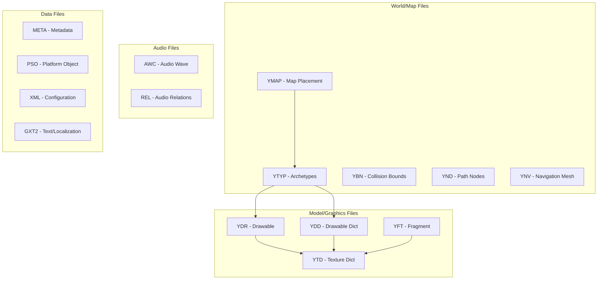
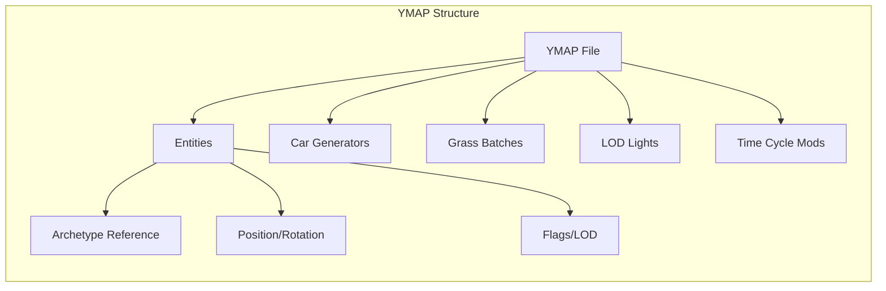
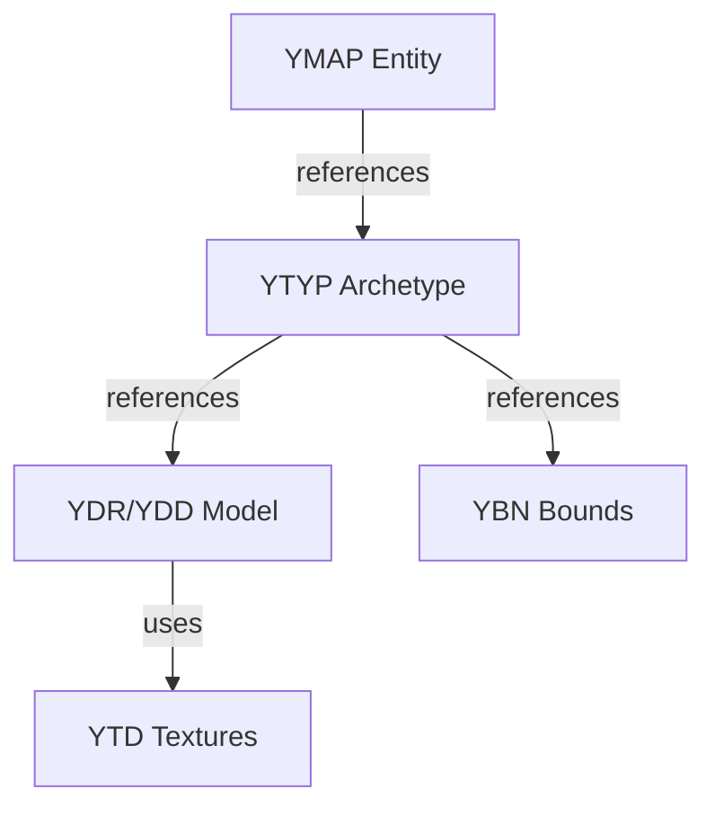
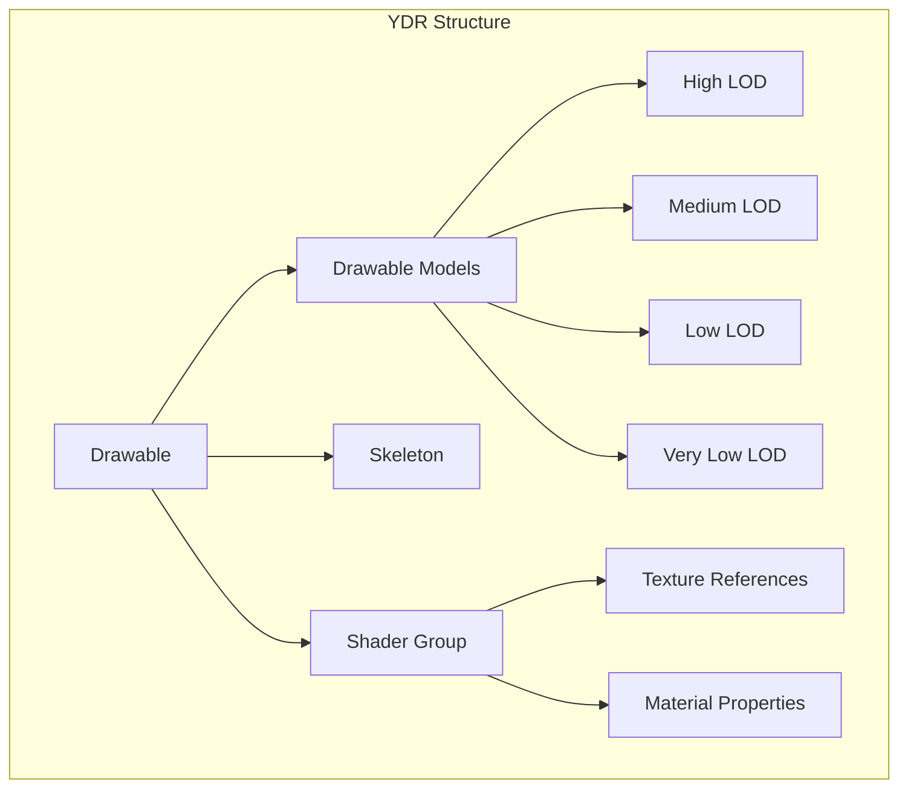
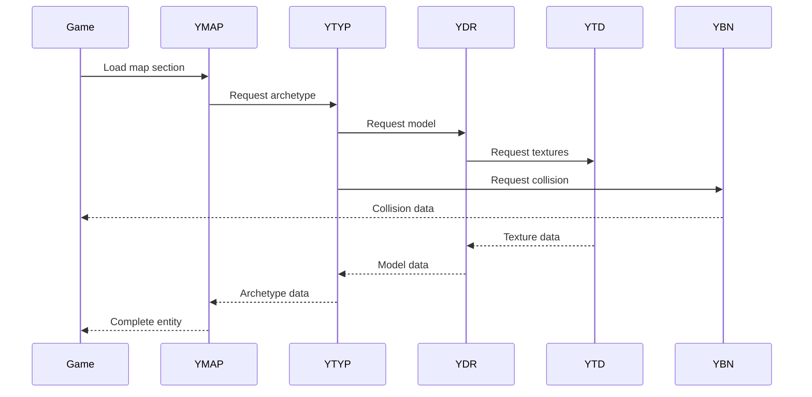

# GTA V File Types Documentation

## Overview

This document provides detailed information about the various file types used in GTA V and how CodeWalker handles them. The file types are organized into categories based on their primary function in the game engine.

## File Type Categories



## Map/World Files

### YMAP Files (Map Placement)

**Purpose**: Defines where objects are placed in the game world.

**Key Components**:
```csharp
public class YmapFile : GameFile, PackedFile
{
    public CMapData CMapData { get; set; }
    public YmapEntityDef[] AllEntities { get; set; }
    public YmapCarGen[] CarGenerators { get; set; }
    public YmapGrassInstanceBatch[] GrassInstanceBatches { get; set; }
    public YmapDistantLODLights DistantLODLights { get; set; }
    public YmapTimeCycleModifier[] TimeCycleModifiers { get; set; }
}
```

**Structure Diagram**:


**Usage**:
- Places buildings, props, vehicles, and other objects
- Defines spawn points for vehicles
- Controls environmental lighting and weather modifiers
- Manages grass and vegetation instances

### YTYP Files (Archetype Definitions)

**Purpose**: Defines templates for objects that can be placed in the world.

**Key Components**:
```csharp
public class YtypFile : GameFile, PackedFile
{
    public CMapTypes CMapTypes { get; set; }
    public Archetype[] AllArchetypes { get; set; }
    public CCompositeEntityType[] CompositeEntityTypes { get; set; }
}
```

**Archetype Types**:
- **CBaseArchetypeDef**: Basic object archetype
- **CTimeArchetypeDef**: Time-based visibility
- **CMloArchetypeDef**: Multi-Level Object (interiors)
- **CCompositeEntityType**: Composite objects

**Relationships**:


### YBN Files (Collision Bounds)

**Purpose**: Stores physics collision data for objects.

**Bound Types**:
- **Box**: Simple box collision
- **Sphere**: Spherical collision
- **Cylinder**: Cylindrical collision
- **Composite**: Complex multi-shape collision
- **BVH**: Bounding Volume Hierarchy for complex meshes
- **Geometry**: Triangle mesh collision

**Structure**:
```csharp
public class YbnFile : GameFile, PackedFile
{
    public Bounds Bounds { get; set; }
}

public abstract class Bounds : ResourceFileBase
{
    public BoundType Type { get; set; }
    public Vector3 BoxMin { get; set; }
    public Vector3 BoxMax { get; set; }
    public Matrix Transform { get; set; }
}
```

### YND Files (Path Nodes)

**Purpose**: Vehicle and pedestrian pathfinding network.

**Key Features**:
- Grid-based organization (32x32 cells)
- Nodes connected by links
- Junction definitions for intersections
- Lane information and traffic rules

**Structure**:
```csharp
public class YndFile : GameFile, PackedFile
{
    public NodeDictionary NodeDictionary { get; set; }
    public YndNode[] Nodes { get; set; }
    public YndLink[] Links { get; set; }
    public YndJunction[] Junctions { get; set; }
}
```

**Node Grid System**:
```
Area ID = (Y * 32) + X
Each cell covers a specific world region
Nodes linked within and between cells
```

### YNV Files (Navigation Mesh)

**Purpose**: Detailed AI navigation mesh for pedestrians.

**Components**:
- **Vertices**: Navigation mesh points
- **Edges**: Connections between vertices
- **Polygons**: Walkable surfaces
- **Portals**: Connections between nav areas

**Structure**:
```csharp
public class YnvFile : GameFile, PackedFile
{
    public NavMesh Nav { get; set; }
    public NavMeshList[] Vertices { get; set; }
    public NavMeshEdge[] Edges { get; set; }
    public NavMeshPoly[] Polys { get; set; }
}
```

## Model/Graphics Files

### YDR Files (Drawable)

**Purpose**: Single 3D model with all rendering data.

**Components**:


**Usage Examples**:
- Vehicle models
- Character models
- Prop models
- Building models

### YDD Files (Drawable Dictionary)

**Purpose**: Collection of related drawable models.

**Key Features**:
- Hash-based model lookup
- Shared resources between models
- Used for variations (ped components, etc.)

**Structure**:
```csharp
public class YddFile : GameFile, PackedFile
{
    public DrawableDictionary DrawableDict { get; set; }
    public Dictionary<uint, Drawable> Drawables { get; set; }
}
```

### YFT Files (Fragment)

**Purpose**: Physics-enabled, breakable models.

**Special Features**:
- Breakable parts hierarchy
- Physics constraints
- Cloth simulation data
- Damage modeling

**Common Uses**:
- Glass windows/doors
- Fences and barriers
- Destructible props
- Cloth/fabric objects

### YTD Files (Texture Dictionary)

**Purpose**: Container for texture assets.

**Texture Properties**:
- Various formats (DXT1, DXT5, BC7, etc.)
- Mipmap chains
- Usage flags (diffuse, normal, specular)

**Structure**:
```csharp
public class YtdFile : GameFile, PackedFile
{
    public TextureDictionary TextureDict { get; set; }
    public Dictionary<uint, Texture> Textures { get; set; }
}
```

## Audio Files

### AWC Files (Audio Wave Container)

**Purpose**: Compressed audio data storage.

**Features**:
- Multiple audio streams
- Various compression formats
- Metadata for audio properties

### REL Files (Audio Relationships)

**Purpose**: Audio configuration and relationships.

**Contains**:
- Sound definitions
- Audio emitter configurations
- Environmental audio zones
- Radio station data

## Data Files

### META Files

**Purpose**: Structured metadata in binary format.

**Uses**:
- Vehicle handling data
- Weapon configurations
- Ped variations
- Game configuration

### PSO Files

**Purpose**: Platform-Specific Object format.

**Features**:
- Compact binary format
- Schema-based structure
- Platform optimizations

### GXT2 Files

**Purpose**: Game text and localization.

**Structure**:
- Hash-based text lookup
- Multiple language support
- UI text and subtitles

## File Loading and Relationships



## Performance Considerations

1. **Streaming**: Files are loaded based on player position
2. **LOD System**: Multiple detail levels for efficient rendering
3. **Dictionaries**: Shared resources reduce memory usage
4. **Spatial Partitioning**: Grid-based organization for fast lookups
5. **Caching**: Recently used files kept in memory