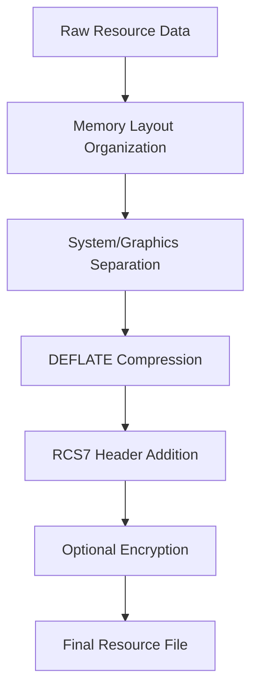

# GTACrypto Documentation

## Overview

GTACrypto is the cryptographic and compression layer used by Grand Theft Auto V for securing and compressing game resources. It provides encryption, hashing, and compression functionality for various file formats including RPF archives, RCS7 resources, and game assets.

## Core Components

### 1. Compression Algorithms

#### DEFLATE Compression
The primary compression algorithm used throughout GTA V's resource system:

```csharp
public static class GTACrypto
{
    // Standard DEFLATE compression using System.IO.Compression
    public static byte[] Compress(byte[] data)
    {
        using (MemoryStream ms = new MemoryStream())
        {
            using (DeflateStream ds = new DeflateStream(ms, CompressionMode.Compress, true))
            {
                ds.Write(data, 0, data.Length);
            }
            return ms.ToArray();
        }
    }

    // Standard DEFLATE decompression
    public static byte[] Decompress(byte[] data)
    {
        using (MemoryStream input = new MemoryStream(data))
        using (DeflateStream ds = new DeflateStream(input, CompressionMode.Decompress))
        using (MemoryStream output = new MemoryStream())
        {
            ds.CopyTo(output);
            return output.ToArray();
        }
    }
}
```

#### Compression Ratios
- **Typical compression**: 40-60% size reduction
- **Text/XML data**: Up to 80% compression
- **Binary model data**: 30-50% compression
- **Already compressed data**: Minimal additional compression

### 2. Resource Encryption

#### RCS7 Resource Format
Resources are stored with the RCS7 (RSC7) header format:

```
+--------+--------+--------+--------+
| Magic  | 'R'    | 'S'    | 'C'    | 0x00-0x03: 0x37435352 ('RSC7')
| '7'    | Version         |         | 0x04-0x07: Version number
+--------+--------+--------+--------+
| System Flags                      | 0x08-0x0B: System memory flags
+--------+--------+--------+--------+
| Graphics Flags                    | 0x0C-0x0F: Graphics memory flags
+--------+--------+--------+--------+
```

#### Resource Processing Pipeline


### 3. Hash Functions

#### Jenkins One-At-A-Time Hash
Used extensively for string hashing in GTA V:

```csharp
public static uint GetHash(string text)
{
    if (string.IsNullOrEmpty(text)) return 0;
    
    uint hash = 0;
    foreach (char c in text.ToLowerInvariant())
    {
        hash += (byte)c;
        hash += (hash << 10);
        hash ^= (hash >> 6);
    }
    hash += (hash << 3);
    hash ^= (hash >> 11);
    hash += (hash << 15);
    
    return hash;
}
```

#### Hash Usage
- **File names**: All file paths are hashed for lookup
- **String dictionaries**: Game text and identifiers
- **Resource references**: Cross-file references use hashes
- **Performance**: O(n) complexity, very fast for short strings

### 4. RPF Archive Encryption

#### RPF7 Format
RPF (RAGE Package File) archives can be encrypted:

```csharp
public class RPFEncryption
{
    // XOR-based encryption for RPF entries
    public static byte[] DecryptData(byte[] data, uint key)
    {
        byte[] result = new byte[data.Length];
        for (int i = 0; i < data.Length; i++)
        {
            result[i] = (byte)(data[i] ^ (key & 0xFF));
            key = RotateKey(key);
        }
        return result;
    }
    
    private static uint RotateKey(uint key)
    {
        // Key rotation algorithm
        return (key >> 1) | ((key & 1) << 31);
    }
}
```

#### Encryption Levels
1. **No encryption**: Most development/modding files
2. **Basic XOR**: Simple obfuscation for some resources
3. **AES encryption**: Critical game assets (executable code, scripts)
4. **Custom algorithms**: Proprietary encryption for sensitive data

### 5. Memory Optimization

#### Page-Based Memory System
GTACrypto works with GTA V's page-based memory allocation:

```csharp
public struct PageFlags
{
    public uint SystemFlags;
    public uint GraphicsFlags;
    
    // Calculate memory requirements from flags
    public int GetSystemSize()
    {
        int baseShift = (int)(SystemFlags & 0xF);
        int baseSize = 0x2000 << baseShift;
        
        int totalSize = 0;
        // Add sizes for each tier...
        
        return totalSize;
    }
}
```

#### Memory Tiers
- **Tier 0**: Large blocks (up to 127 pages)
- **Tier 1**: Medium blocks (up to 63 pages)
- **Tier 2**: Small blocks (up to 15 pages)
- **Tier 3**: Tiny blocks (up to 3 pages)
- **Tier 4**: Single page blocks

### 6. Integration with Resource System

#### ResourceBuilder Integration
```csharp
public static class ResourceBuilder
{
    public static byte[] Build(ResourceFileBase fileBase, int version, bool compress = true)
    {
        // 1. Organize resource data
        var blocks = OrganizeBlocks(fileBase);
        
        // 2. Assign memory positions
        var pageFlags = AssignMemoryPages(blocks);
        
        // 3. Write to streams
        var data = WriteResourceData(blocks);
        
        // 4. Apply compression if requested
        if (compress)
        {
            data = GTACrypto.Compress(data);
        }
        
        // 5. Add RCS7 header
        return AddResourceHeader(data, pageFlags, version);
    }
}
```

### 7. Security Considerations

#### Anti-Tampering
- **Checksum validation**: Files include checksums for integrity
- **Hash verification**: Resource references validated via hashes
- **Encryption layers**: Multiple encryption methods for different asset types

#### Performance vs Security Trade-offs
- **Compression first**: Always compress before encryption
- **Selective encryption**: Only critical assets fully encrypted
- **Fast decompression**: Optimized for game loading performance

### 8. Common Use Cases

#### Loading Compressed Resources
```csharp
// Automatic decompression when loading
public void LoadResource(byte[] compressedData)
{
    // Check for RCS7 header
    if (IsRCS7Resource(compressedData))
    {
        var header = ParseRCS7Header(compressedData);
        var compressed = StripHeader(compressedData);
        var decompressed = GTACrypto.Decompress(compressed);
        
        // Process decompressed data...
    }
}
```

#### Saving Compressed Resources
```csharp
// Automatic compression when saving
public byte[] SaveResource(ResourceData data)
{
    // Build resource structure
    var rawData = BuildResourceData(data);
    
    // Compress
    var compressed = GTACrypto.Compress(rawData);
    
    // Add header
    return AddRCS7Header(compressed, data.Version);
}
```

### 9. Version Compatibility

#### Supported Versions
- **Version 162**: Standard GTA V PC format
- **Version 171**: Gen9 format (RDR2/Enhanced edition)
- **Version 505**: Special format for certain resources

#### Version Detection
```csharp
public static int DetectVersion(byte[] data)
{
    if (data.Length < 8) return -1;
    
    uint magic = BitConverter.ToUInt32(data, 0);
    if (magic == 0x37435352) // 'RSC7'
    {
        return BitConverter.ToInt32(data, 4);
    }
    
    return -1;
}
```

### 10. Best Practices

#### Compression Guidelines
1. **Always compress large resources**: Reduces file size and load times
2. **Batch operations**: Compress multiple small files together
3. **Cache decompressed data**: Avoid repeated decompression
4. **Monitor memory usage**: Decompression requires temporary memory

#### Security Guidelines
1. **Don't rely on encryption alone**: It's primarily for obfuscation
2. **Validate all inputs**: Check headers and sizes before processing
3. **Handle errors gracefully**: Corruption can occur in compressed data
4. **Test with both versions**: Ensure compatibility with base game and enhanced edition

## API Reference

### Core Functions
```csharp
// Compression
byte[] Compress(byte[] data)
byte[] Decompress(byte[] data)

// Hashing
uint GetHash(string text)
uint GetHashKey(string text)

// Resource Headers
byte[] AddResourceHeader(byte[] data, PageFlags flags, int version)
ResourceHeader ParseResourceHeader(byte[] data)
byte[] StripResourceHeader(byte[] data)

// Encryption (when applicable)
byte[] Encrypt(byte[] data, uint key)
byte[] Decrypt(byte[] data, uint key)
```

### Helper Classes
```csharp
// Resource file entry information
public class RpfResourceFileEntry
{
    public uint SystemFlags { get; set; }
    public uint GraphicsFlags { get; set; }
    public int Version { get; set; }
}

// Page allocation flags
public struct PageFlags
{
    public uint SystemFlags;
    public uint GraphicsFlags;
}
```

## Summary

GTACrypto provides the essential cryptographic and compression infrastructure for GTA V's resource system. It handles:

1. **Efficient compression** using DEFLATE algorithm
2. **Resource organization** with RCS7 headers
3. **Fast hashing** for file lookups and references  
4. **Optional encryption** for sensitive resources
5. **Memory optimization** through page-based allocation
6. **Version compatibility** across game editions

The system is designed for performance first, with security as a secondary concern, reflecting the needs of a real-time game engine that must load and process resources quickly.