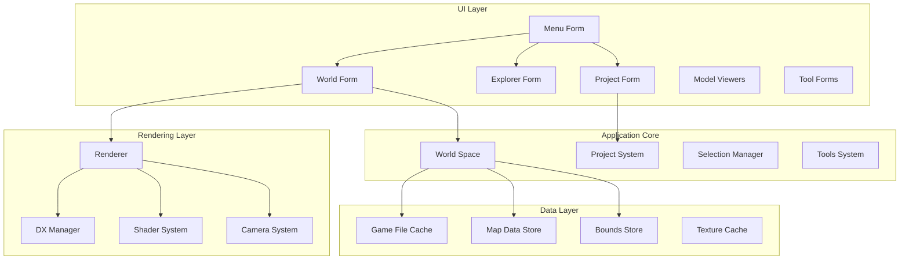
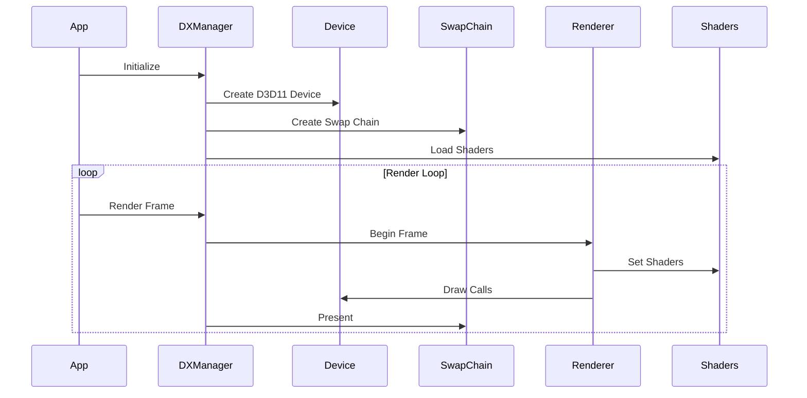
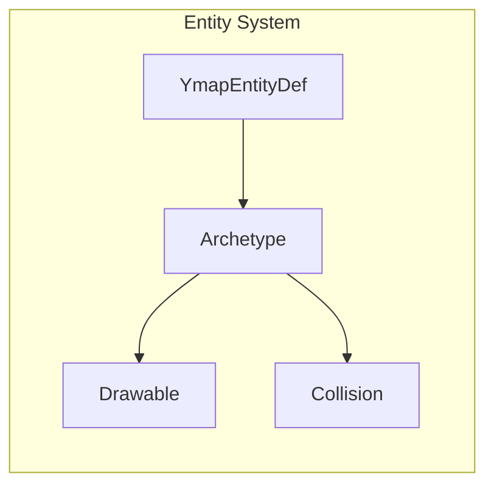

# CodeWalker Main Application Documentation

## Overview

The main CodeWalker application is a comprehensive tool for viewing and editing GTA V game files. It provides a 3D world viewer, various file editors, and project management capabilities, all built on a Windows Forms interface with DirectX 11 rendering.

## Application Architecture



## Main Forms

### MenuForm
- Simple launcher menu
- Opens other specialized forms
- Theme selection (Blue, Light, Dark)

### WorldForm
```csharp
public partial class WorldForm : Form, DXForm
{
    // Main 3D world viewer
    private Renderer Renderer;
    private Space Space;
    private Camera Camera;
    private Input Input;
}
```

**Key Features:**
- 3D world navigation
- Entity selection and editing
- Multiple render modes
- Time and weather control
- Project integration

### ExploreForm
- RPF archive browser
- File extraction and replacement
- Search functionality
- File preview capabilities

### ProjectForm
- Project management interface
- Multi-file editing support
- File dependency tracking
- Save/load project files

## Rendering System

### DirectX Architecture



### Renderer Class

**Core Responsibilities:**
- Scene management
- LOD system
- Shader management
- Lighting and shadows
- Weather effects

**Rendering Modes:**
```csharp
public enum WorldRenderMode
{
    Default,
    SingleTexture,
    VertexNormals,
    VertexTangents,
    VertexColour,
    TextureCoord,
    TextureSampler
}
```

### Shader System

**Shader Types:**
- Basic: Standard rendering
- Deferred: Deferred rendering pipeline
- PostProcess: Post-processing effects
- Shadow: Shadow mapping
- Water: Water rendering
- Cloud: Volumetric clouds
- Sky: Sky rendering

**Shader Management:**
```csharp
public class ShaderManager
{
    Dictionary<ShaderType, BaseShader> Shaders;
    ComputeShader[] ComputeShaders;
    
    public void SetShader(DeviceContext context, ShaderType type);
    public void SetConstants(DeviceContext context, ShaderConstants constants);
}
```

## World Space System

### Space Class

Manages the game world with spatial organization:

```csharp
public class Space
{
    private MapDataStore MapDataStore;
    private BoundsStore BoundsStore;
    private GameFileCache GameFileCache;
    
    public void Update(float elapsed);
    public void UpdateEntity(YmapEntityDef entity);
    public void BuildYmaps();
}
```

### Entity Management



### Map Data Management

**MapDataStore:**
- Caches loaded map data
- Manages entity visibility
- Handles LOD transitions
- Spatial queries

**BoundsStore:**
- Collision data management
- Physics bounds caching
- Spatial partitioning

## Project System

### Project Structure

```csharp
public class ProjectFile
{
    public List<string> YmapFiles { get; set; }
    public List<string> YtypFiles { get; set; }
    public List<string> YbnFiles { get; set; }
    public List<string> YndFiles { get; set; }
    public List<string> YnvFiles { get; set; }
    public List<string> ScenarioFiles { get; set; }
    public List<string> AudioRelFiles { get; set; }
    
    public bool HasChanged { get; set; }
}
```

### Project Features

**File Management:**
- Add/remove files from project
- Track modifications
- Handle dependencies
- Batch operations

**Editing Capabilities:**
- Entity placement and editing
- Archetype creation/modification
- Collision editing
- Path node editing
- Navigation mesh editing

## Tools and Utilities

### File Type Editors

**Entity Editor (Ymap):**
- Place/move/rotate entities
- Edit entity properties
- Car generator management
- LOD light editing

**Archetype Editor (Ytyp):**
- Create/edit archetypes
- MLO interior editing
- Time-based archetype configuration

**Collision Editor (Ybn):**
- Visual collision editing
- Material property editing
- Bound type conversion

### Utility Tools

**Jenkins Hash Generator:**
```csharp
public static uint GenHash(string text, JenkHashInputEncoding encoding)
{
    // Generate hash values for game strings
}
```

**Binary Search Tool:**
- Search for patterns in files
- Hex editor functionality
- Data analysis

**Extraction Tools:**
- Extract textures
- Extract shaders
- Extract scripts
- Batch extraction

## Camera and Controls

### Camera System

```csharp
public class Camera
{
    public Vector3 Position { get; set; }
    public Vector3 Rotation { get; set; }
    public float FieldOfView { get; set; }
    public float NearClip { get; set; }
    public float FarClip { get; set; }
    
    public Matrix ViewMatrix { get; }
    public Matrix ProjectionMatrix { get; }
}
```

### Input Handling

**Control Modes:**
- Free camera
- Orbit camera
- Vehicle camera
- First person

**Input Actions:**
- WASD movement
- Mouse look
- Entity selection
- Tool operations

## Performance Features

### LOD System
- Distance-based LOD switching
- HD/LOD/SLOD transitions
- Configurable LOD distances

### Culling
- Frustum culling
- Occlusion culling
- Distance culling

### Resource Management
- Texture streaming
- Model caching
- Memory limits

## Configuration

### Settings Storage
```csharp
public class Settings
{
    public string GTAFolder { get; set; }
    public bool ShowStatusBar { get; set; }
    public int AntiAlias { get; set; }
    public float LODRange { get; set; }
    // ... many more settings
}
```

### User Preferences
- Window layout
- Render settings
- Performance options
- Key bindings