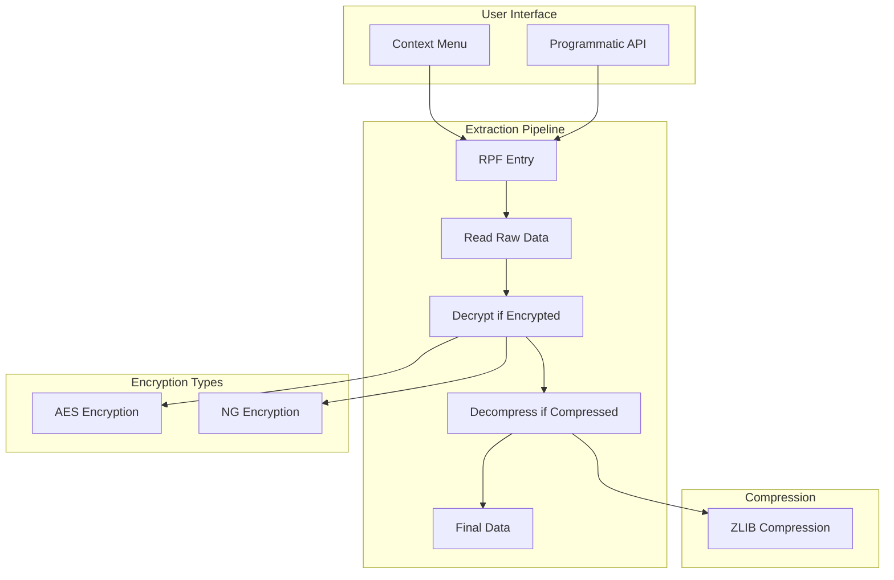

# RPF Extraction System Documentation

## Overview

The RPF (RAGE Package Format) extraction system is a core feature of CodeWalker that allows users to extract files from GTA V's encrypted and compressed archives. This document details the extraction algorithms, API usage, and implementation details.

## Extraction Architecture



## Core Extraction Algorithm

### 1. Entry Point Methods

#### ExtractFile Method (Main API)
```csharp
public byte[] ExtractFile(RpfFileEntry entry)
{
    using (BinaryReader br = new BinaryReader(File.OpenRead(GetPhysicalFilePath())))
    {
        if (entry is RpfBinaryFileEntry)
        {
            return ExtractFileBinary(entry as RpfBinaryFileEntry, br);
        }
        else if (entry is RpfResourceFileEntry)
        {
            return ExtractFileResource(entry as RpfResourceFileEntry, br);
        }
        return null;
    }
}
```

### 2. Binary File Extraction Pipeline

```csharp
public byte[] ExtractFileBinary(RpfBinaryFileEntry entry, BinaryReader br)
{
    // Step 1: Calculate position and read raw data
    long offset = StartPos + ((long)entry.FileOffset * 512);
    uint totlen = entry.FileSize + entry.FileUncompressedSize;
    byte[] tbytes = new byte[totlen];
    
    br.BaseStream.Position += offset;
    br.Read(tbytes, 0, (int)totlen);
    
    // Step 2: Decrypt if encrypted
    byte[] decr = tbytes;
    if (entry.IsEncrypted)
    {
        if (IsAESEncrypted)
        {
            decr = GTACrypto.DecryptAES(tbytes);
        }
        else // NG encryption
        {
            decr = GTACrypto.DecryptNG(tbytes, entry.Name, entry.FileUncompressedSize);
        }
    }
    
    // Step 3: Decompress if compressed
    byte[] defl = decr;
    if (entry.FileSize > 0) // FileSize > 0 indicates compression
    {
        defl = DecompressBytes(decr);
    }
    
    return defl;
}
```

### 3. Resource File Extraction

Resource files (models, textures) have a different extraction process:

```csharp
public byte[] ExtractFileResource(RpfResourceFileEntry entry, BinaryReader br)
{
    br.BaseStream.Position = StartPos + ((long)entry.FileOffset * 512);
    
    // Read raw resource data
    byte[] tbytes = new byte[entry.FileSize];
    br.Read(tbytes, 0, (int)entry.FileSize);
    
    // Decrypt if needed
    byte[] decr = entry.IsEncrypted ? 
        (IsAESEncrypted ? GTACrypto.DecryptAES(tbytes) : 
         GTACrypto.DecryptNG(tbytes, entry.Name, entry.FileSize)) : 
        tbytes;
    
    // Decompress resource
    byte[] data = ResourceBuilder.Decompress(decr, entry.FileUncompressedSize);
    return data;
}
```

## Key Algorithms

### 1. Compression Detection

```csharp
// A file is compressed if FileSize > 0
// FileSize = compressed size
// FileUncompressedSize = original size
bool isCompressed = entry.FileSize > 0;
```

### 2. Decompression Algorithm

```csharp
public static byte[] DecompressBytes(byte[] bytes)
{
    using (MemoryStream ms = new MemoryStream(bytes))
    {
        using (DeflateStream ds = new DeflateStream(ms, CompressionMode.Decompress))
        {
            using (MemoryStream outstr = new MemoryStream())
            {
                ds.CopyTo(outstr);
                return outstr.ToArray();
            }
        }
    }
}
```

### 3. Encryption Types

#### AES Encryption
- Used in newer versions of GTA V
- Standard AES decryption with game-specific key

#### NG Encryption
- Legacy encryption method
- Uses file name and size as part of the key
- More common in older game files

## API Usage Examples

### 1. Basic File Extraction

```csharp
// Get the RPF file
RpfFile rpf = new RpfFile("path/to/archive.rpf");
rpf.ScanStructure();

// Find a specific file
RpfFileEntry entry = rpf.FindFile("vehicle.yft");

// Extract the file
byte[] data = rpf.ExtractFile(entry);

// Save to disk
File.WriteAllBytes("output/vehicle.yft", data);
```

### 2. Batch Extraction

```csharp
// Extract all files from an RPF
public void ExtractAllFiles(RpfFile rpf, string outputFolder)
{
    foreach (RpfEntry entry in rpf.AllEntries)
    {
        if (entry is RpfFileEntry fileEntry)
        {
            byte[] data = rpf.ExtractFile(fileEntry);
            string outputPath = Path.Combine(outputFolder, fileEntry.Path);
            
            // Create directory if needed
            Directory.CreateDirectory(Path.GetDirectoryName(outputPath));
            
            // Write file
            File.WriteAllBytes(outputPath, data);
        }
    }
}
```

### 3. Using GameFileCache

```csharp
// Using the high-level GameFileCache API
GameFileCache cache = new GameFileCache();
cache.Init();

// Extract a YDR file
YdrFile ydr = cache.GetYdr("vehicle.ydr");
byte[] ydrData = ydr.Save(); // Gets the raw file data

// Extract from specific RPF
RpfFileEntry entry = cache.GetEntry("x64a.rpf/levels/gta5/vehicles.rpf/vehicle.yft");
byte[] data = entry.File.ExtractFile(entry);
```

### 4. Extract Without Decompression (Raw RPF Data)

To extract files in their compressed/encrypted state as stored in the RPF:

```csharp
public byte[] ExtractRawCompressed(RpfBinaryFileEntry entry, BinaryReader br)
{
    // Calculate position
    long offset = StartPos + ((long)entry.FileOffset * 512);
    uint length = entry.FileSize > 0 ? entry.FileSize : entry.FileUncompressedSize;
    
    // Read raw data only
    byte[] rawData = new byte[length];
    br.BaseStream.Position = offset;
    br.Read(rawData, 0, (int)length);
    
    // Return without decryption or decompression
    return rawData;
}
```

## Integration with UI

### Context Menu Extraction

The ExploreForm provides several extraction options:

```csharp
// Single file extraction
private void ExtractUncompressed()
{
    var file = GetSelectedFile();
    byte[] data = GetFileData(file);
    
    if (SaveFileDialog.ShowDialog() == DialogResult.OK)
    {
        File.WriteAllBytes(SaveFileDialog.FileName, data);
    }
}

// Multiple file extraction
private void ExtractMultiple(List<MainListItem> files)
{
    string outputFolder = SelectFolder();
    
    foreach (var file in files)
    {
        byte[] data = GetFileData(file);
        string outputPath = Path.Combine(outputFolder, file.Name);
        File.WriteAllBytes(outputPath, data);
    }
}
```

## Important Notes

### 1. Memory Considerations
- Large files are loaded entirely into memory
- Consider streaming for files > 100MB
- Resource files can be particularly large

### 2. Performance Tips
- Cache RPF file handles when extracting multiple files
- Use parallel extraction for batch operations
- Pre-scan RPF structure before extraction

### 3. Error Handling
```csharp
try
{
    byte[] data = rpf.ExtractFile(entry);
    // Process data
}
catch (InvalidOperationException ex)
{
    // Handle encryption/compression errors
}
catch (IOException ex)
{
    // Handle file access errors
}
```

## Common Use Cases

### 1. Modding Workflow
```csharp
// Extract, modify, and re-import
byte[] original = rpf.ExtractFile(entry);
byte[] modified = ModifyFile(original);
rpf.ReplaceFile(entry, modified);
```

### 2. File Analysis
```csharp
// Extract and analyze file structure
byte[] data = rpf.ExtractFile(entry);
var fileType = GetFileType(data);
var fileInfo = AnalyzeFile(data, fileType);
```

### 3. Backup Operations
```csharp
// Backup entire RPF contents
public void BackupRPF(string rpfPath, string backupFolder)
{
    var rpf = new RpfFile(rpfPath);
    rpf.ScanStructure();
    
    foreach (var entry in rpf.AllEntries.OfType<RpfFileEntry>())
    {
        var data = rpf.ExtractFile(entry);
        var backupPath = Path.Combine(backupFolder, entry.Path);
        Directory.CreateDirectory(Path.GetDirectoryName(backupPath));
        File.WriteAllBytes(backupPath, data);
    }
}
```

## Summary

The RPF extraction system is a critical component that:
1. Handles encrypted and compressed game archives
2. Provides transparent decryption and decompression
3. Supports both binary and resource file types
4. Offers flexible APIs for various use cases

Understanding this system is essential for working with GTA V game files and building modding tools.