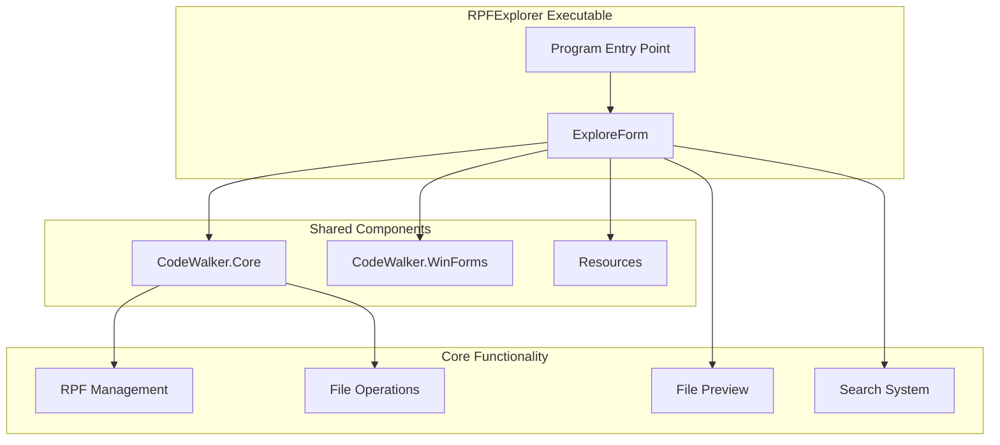

# CodeWalker.RPFExplorer Documentation

## Overview

CodeWalker.RPFExplorer is a standalone executable that provides dedicated access to RPF (RAGE Package Format) archive exploration functionality. It offers the same powerful RPF browsing and manipulation capabilities as the main CodeWalker application but in a lightweight, focused package.

## Purpose and Design Philosophy

The RPFExplorer serves users who:
- Primarily work with RPF archives and game assets
- Need quick access to file extraction and browsing
- Want a lighter alternative to the full CodeWalker suite
- Require multiple concurrent RPF browsing sessions

## Architecture



## Key Features

### 1. RPF Archive Management
- Browse RPF archive contents hierarchically
- Support for nested RPF files
- Real-time file system navigation
- File extraction and replacement
- Batch operations support

### 2. File Operations
- **Extract**: Single files or entire directories
- **Import**: Replace existing files or add new ones
- **Delete**: Remove files from archives
- **Search**: Find files by name or content
- **Copy Path**: Quick path copying for reference

### 3. File Preview Capabilities
- **Text Files**: View and edit text-based formats
- **Images**: Preview textures and images
- **Models**: Basic information display
- **Audio**: File information and properties
- **Hex View**: Binary file examination

### 4. Search and Navigation
- Name-based search across archives
- Filter by file type
- Quick navigation to results
- Bookmarking frequently accessed locations

## User Interface

The RPFExplorer uses the same `ExploreForm` as the main application:

```
┌─────────────────────────────────────────┐
│ File  Edit  View  Tools                 │
├─────────────────────────────────────────┤
│ [Toolbar: Back, Forward, Up, Search]    │
├─────────┬───────────────────────────────┤
│ Tree    │ File List                     │
│ View    │ ┌─────┬──────┬──────┬──────┐│
│         │ │Name │Size  │Type  │Attr  ││
│ ▼ RPF   │ ├─────┼──────┼──────┼──────┤│
│   ▼ x64 │ │file1│1.2MB │YDR   │      ││
│     ▶ a │ │file2│856KB │YTD   │      ││
│     ▶ b │ └─────┴──────┴──────┴──────┘│
├─────────┴───────────────────────────────┤
│ Status: Ready                           │
└─────────────────────────────────────────┘
```

## Differences from Integrated Explorer

| Feature | RPFExplorer | Main CodeWalker Explorer |
|---------|-------------|-------------------------|
| Launch Time | Faster | Slower (loads full app) |
| Memory Usage | ~100-200MB | ~500MB+ |
| Process Independence | Yes | No |
| Taskbar Entry | Separate | Shared |
| Icon | Custom RPF icon | Main CW icon |
| Multiple Instances | Easy | Requires multiple CW |

## Command Line Usage

```bash
# Direct launch
"CodeWalker RPF Explorer.exe"

# Open specific RPF (if supported)
"CodeWalker RPF Explorer.exe" "path/to/file.rpf"
```

## Integration with Main CodeWalker

### Windows Jump List
The main CodeWalker application registers RPFExplorer as a jump task:
```csharp
JumpTask.Title = "RPF Explorer"
JumpTask.ApplicationPath = "CodeWalker RPF Explorer.exe"
```

### Shared Codebase
Both applications share:
- `ExploreForm` implementation
- `CodeWalker.Core` library
- `CodeWalker.WinForms` controls
- File handling logic

## Technical Implementation

### Entry Point
```csharp
[STAThread]
static void Main()
{
    Application.EnableVisualStyles();
    Application.SetCompatibleTextRenderingDefault(false);
    
    // Direct launch into ExploreForm
    Application.Run(new ExploreForm());
}
```

### Resource Efficiency
- No world renderer initialization
- No project system loading
- Minimal form creation
- Focused memory allocation

## Use Cases

### Primary Use Cases
1. **Asset Extraction**: Modders extracting textures, models, or sounds
2. **Archive Inspection**: Checking RPF contents without full editing
3. **Batch Operations**: Extracting multiple files for external processing
4. **Quick Browsing**: Fast access to check file presence or properties

### Workflow Examples

**Texture Modder Workflow:**
1. Launch RPFExplorer
2. Navigate to x64/textures.rpf
3. Search for specific texture
4. Extract and modify externally
5. Import back into RPF

**Content Verification:**
1. Open RPFExplorer
2. Load DLC RPF
3. Verify all expected files present
4. Check file sizes and properties
5. Export file list for documentation

## Performance Considerations

### Startup Performance
- **Time**: ~1-2 seconds vs ~3-5 seconds for main CodeWalker
- **Memory**: Initial ~100MB vs ~300MB+
- **CPU**: Minimal initialization overhead

### Runtime Performance
- Identical file operations speed
- Same caching mechanisms
- Equivalent search performance
- Shared optimization strategies

## Future Considerations

Potential enhancements specific to standalone version:
- Command-line RPF operations
- Batch processing scripts
- File association handling
- Portable mode support
- RPF comparison tools

## Summary

CodeWalker.RPFExplorer provides a streamlined, efficient way to work with GTA V's RPF archives. By packaging the explorer functionality as a standalone application, it offers faster access and lower resource usage while maintaining all the powerful features of the integrated explorer. It's an essential tool for modders and researchers who frequently work with game assets.