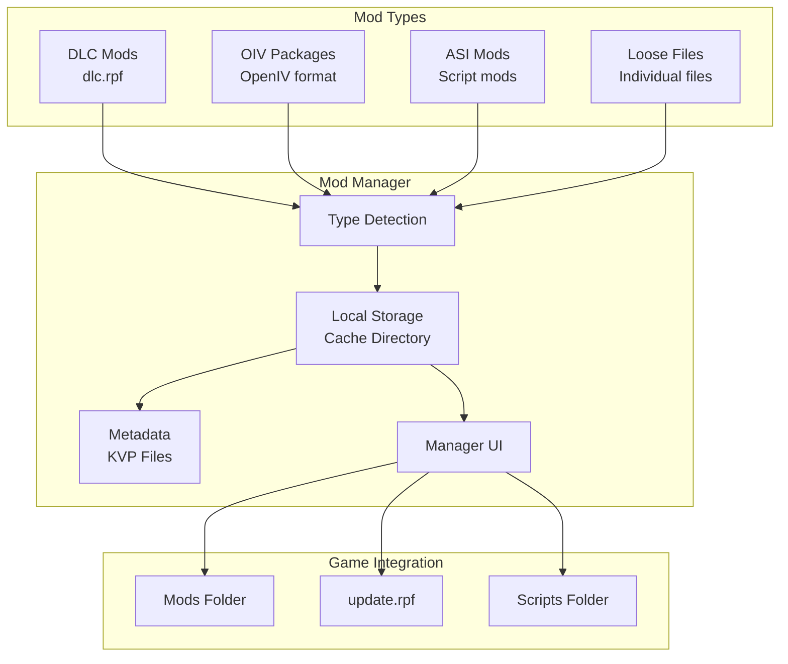
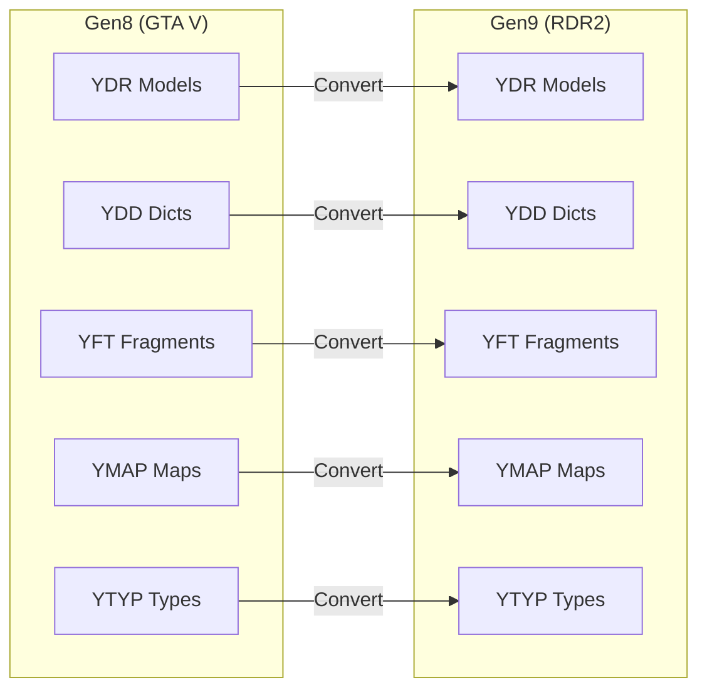
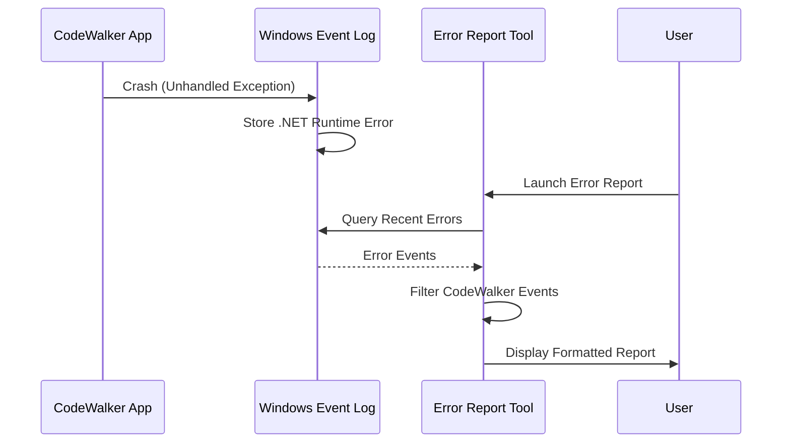
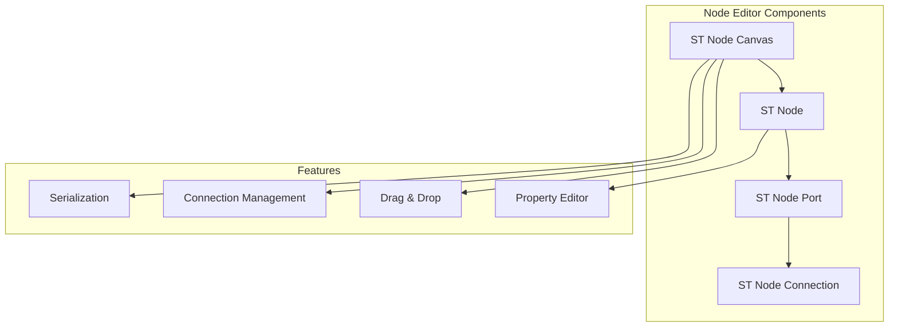
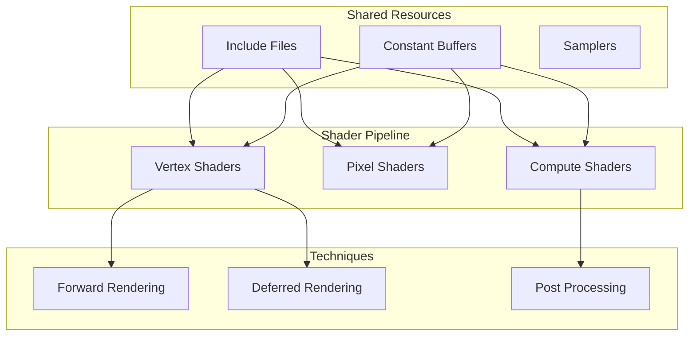

# Specialized Tools Documentation

## Overview

This document covers the remaining specialized tools and utilities in the CodeWalker suite that provide supporting functionality for mod management, asset conversion, error reporting, and shared UI components.

## CodeWalker.ModManager

### Purpose
A comprehensive mod management tool for organizing and installing GTA V and RDR2 modifications. Provides a safe and organized way to manage game modifications without directly modifying game files.

### Architecture



### Key Components

#### Mod Class
```csharp
public class Mod
{
    public string Name { get; set; }
    public string GameDirectoryPath { get; set; }
    public string CacheDirectoryPath { get; set; }
    public string FilePath { get; set; }
    public ModType Type { get; set; }
    public ModStatus Status { get; set; }
    
    public enum ModType
    {
        DLC,
        OIV,
        ASI,
        LooseFile,
        Unknown
    }
}
```

#### Features
- **Auto-Detection**: Automatically detects mod type based on file structure
- **Safe Storage**: Mods stored in local cache before installation
- **OIV Support**: Extracts and installs OpenIV packages
- **Load Order**: Manage mod loading priority
- **Status Tracking**: Track installation state (Pending/Ready)
- **Logging**: Detailed logs of all operations

### Installation Process

1. **Type Detection**
   ```csharp
   // Detect mod type from file extension
   if (filename.EndsWith(".oiv")) return ModType.OIV;
   if (filename.EndsWith("dlc.rpf")) return ModType.DLC;
   if (filename.EndsWith(".asi")) return ModType.ASI;
   ```

2. **Cache Storage**
   - Copy mod files to local cache directory
   - Extract OIV packages if needed
   - Maintain original file structure

3. **Metadata Storage**
   - Save mod information in KVP files
   - Track installation status
   - Store configuration options

## CodeWalker.Gen9Converter

### Purpose
Converts game assets between Gen8 (GTA V) and Gen9 (Red Dead Redemption 2) formats, enabling asset sharing between games.

### Supported Conversions



### Conversion Process

#### File Processing
```csharp
public async Task ConvertFileAsync(string filePath)
{
    var fileInfo = new FileInfo(filePath);
    var ext = fileInfo.Extension.ToLower();
    
    switch (ext)
    {
        case ".ydr":
        case ".ydd":
        case ".yft":
            await ConvertDrawableAsync(filePath);
            break;
        case ".ymap":
            await ConvertYmapAsync(filePath);
            break;
        case ".ytyp":
            await ConvertYtypAsync(filePath);
            break;
    }
}
```

#### Features
- **Batch Processing**: Convert entire directories
- **RPF Support**: Process files within RPF archives
- **Progress Tracking**: Real-time conversion progress
- **Error Handling**: Graceful handling of conversion failures
- **Logging**: Detailed conversion logs

### Technical Details
- Updates resource version numbers
- Modifies data structures for compatibility
- Preserves original functionality
- Handles endianness differences

## CodeWalker.ErrorReport

### Purpose
Captures and displays crash information from Windows Event Log for all CodeWalker applications, helping with debugging and troubleshooting.

### Architecture



### Features

#### Event Log Parsing
```csharp
private void LoadEvents()
{
    var query = new EventLogQuery("Application", 
        PathType.LogName, 
        "*[System/EventID=1026]");
        
    using var reader = new EventLogReader(query);
    EventRecord eventRecord;
    
    while ((eventRecord = reader.ReadEvent()) != null)
    {
        if (IsCodeWalkerEvent(eventRecord))
        {
            ProcessEvent(eventRecord);
        }
    }
}
```

#### Supported Applications
- CodeWalker.exe
- CodeWalker RPF Explorer.exe
- CodeWalker Ped Viewer.exe  
- CodeWalker Vehicle Viewer.exe

#### Output Options
- **View**: Display in application
- **Save**: Export to text file
- **Copy**: Copy to clipboard (with Markdown formatting)

## CodeWalker.WinForms

### Purpose
Provides enhanced Windows Forms controls and utilities shared across all CodeWalker applications.

### Key Components

#### 1. Enhanced Controls
```csharp
// Fixed/enhanced versions of standard controls
public class TreeViewFix : TreeView
{
    // Fixes selection issues
    // Adds double-buffering
    // Improves scrolling
}

public class PropertyGridFix : PropertyGrid
{
    // Adds theme support
    // Fixes rendering issues
}
```

#### 2. STNodeEditor
A complete node-based visual editor system:



Features:
- Visual node-based editing
- Custom node types
- Connection validation
- Property editing
- Save/load functionality

#### 3. Utilities
```csharp
public static class FormUtils
{
    // ListView enhancements
    public static void SetSortIcon(ListView list, int column, SortOrder order);
    
    // TextBox utilities
    public static void SetTabStopWidth(TextBox textBox, int width);
    
    // Dialog enhancements
    public static DialogResult ShowFolderBrowser(FolderBrowserDialog dialog);
    
    // Theme support
    public static void SetTheme(Control control, FormTheme theme);
}
```

#### 4. Specialized Controls
- **QuaternionBox**: Edit quaternion rotations
- **HexLineBox**: Hex editor line display
- **FastColoredTextBox**: Syntax highlighting editor

### Dark Theme Support
```csharp
public class FormTheme
{
    public static FormTheme Dark = new FormTheme
    {
        BackColor = Color.FromArgb(28, 28, 28),
        ForeColor = Color.White,
        ControlBackColor = Color.FromArgb(45, 45, 48),
        // ... more theme properties
    };
}
```

## CodeWalker.Shaders

### Purpose
Complete DirectX 11 shader pipeline for rendering GTA V content with support for various rendering techniques and effects.

### Shader Categories

#### 1. Basic Rendering
- **BasicVS/PS**: Standard vertex/pixel shaders
- **DeferredVS/PS**: Deferred rendering pipeline
- Multiple vertex formats (PNCT, PBBNCCT, etc.)

#### 2. Terrain System
```hlsl
// TerrainVS_PNCCT.hlsl
struct TerrainVertex
{
    float3 Position : POSITION;
    float3 Normal : NORMAL;
    float4 Colour : COLOR0;
    float2 TexCoord : TEXCOORD0;
};

// Multi-texture blending
// LOD support
// Normal mapping
```

#### 3. Water Rendering
- Surface shaders
- Reflection/refraction
- Wave animation
- Foam effects

#### 4. Sky and Atmosphere
- Skydome rendering
- Sun/moon shaders
- Cloud layers
- Atmospheric scattering

#### 5. Post-Processing
```hlsl
// Compute shaders for:
- Bloom extraction and blur
- Screen-space ambient occlusion (SSAO)
- Tone mapping and exposure
- Luminance adaptation
- Depth of field
```

#### 6. Shadow Mapping
- Cascaded shadow maps
- Soft shadows
- Static and skinned mesh shadows

### Shader Architecture



### Common Features
- Shared include files for consistency
- Multiple rendering paths
- Optimized for performance
- Support for various vertex formats

## Summary

These specialized tools complete the CodeWalker ecosystem:
- **ModManager**: Safe mod installation and management
- **Gen9Converter**: Cross-game asset compatibility
- **ErrorReport**: Debugging assistance
- **WinForms**: Shared UI infrastructure
- **Shaders**: Complete rendering pipeline

Together, they provide the supporting infrastructure that makes CodeWalker a comprehensive modding platform for GTA V and RDR2.