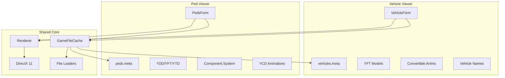

# CodeWalker Vehicle and Ped Viewers Documentation

## Overview

CodeWalker.Vehicles and CodeWalker.Peds are specialized standalone viewers designed for inspecting and customizing GTA V vehicle and pedestrian models respectively. These tools provide focused interfaces optimized for their specific model types while leveraging the core CodeWalker infrastructure.

## Architecture Comparison



## CodeWalker.Vehicles (Vehicle Viewer)

### Purpose
A streamlined tool for viewing and inspecting GTA V vehicles with support for:
- All game vehicles including DLC
- High-detail model variants
- Convertible roof animations
- Vehicle metadata display

### Key Components

#### VehicleForm Class
```csharp
public partial class VehicleForm : Form
{
    GameFileCache GameFileCache;
    Renderer Renderer;
    
    bool LoadVehicles = true;
    bool LoadPeds = false;
    bool LoadArchetypes = false;
}
```

#### Vehicle Loading Process
1. **Initialization**
   - Load vehicles.meta files
   - Build vehicle dictionary
   - Populate selection dropdown

2. **Model Loading**
   ```csharp
   // Load base model
   var yft = GameFileCache.GetYft(vehicleName);
   
   // Optional high-detail model
   if (EnableHighDetail)
       var yftHi = GameFileCache.GetYft(vehicleName + "_hi");
   ```

3. **Metadata Integration**
   - Vehicle make/model names from GXT2
   - Convertible roof animation references
   - Model relationship data

### Features

#### Model Display Options
- **Standard/High Detail Toggle**: Switch between LODs
- **Grid Display**: Size reference grid
- **Texture Samplers**: Different rendering modes
- **Camera Controls**: Full 3D navigation

#### Vehicle Information
- Display name (e.g., "Adder")
- Make name (e.g., "Truffade")
- Model name (internal identifier)
- Animation availability status

#### Convertible Animation
```csharp
if (convRoofDict != null && convRoofClip != null)
{
    // Play roof open/close animation
    ConvRoofAnims.Play(convRoofClip);
}
```

## CodeWalker.Peds (Ped Viewer)

### Purpose
A specialized tool for viewing and customizing pedestrian models with support for:
- Component-based customization
- Texture variations
- Animation playback
- Cloth physics

### Key Components

#### PedsForm Class
```csharp
public partial class PedsForm : Form
{
    GameFileCache GameFileCache;
    Renderer Renderer;
    
    bool LoadPeds = true;
    bool LoadVehicles = false;
    bool LoadArchetypes = false;
}
```

#### Component System
12 customizable slots:
```
0: head    - Head models
1: berd    - Beards/facial hair
2: hair    - Hair styles
3: uppr    - Upper body/torsos
4: lowr    - Lower body/legs
5: hand    - Hands/gloves
6: feet    - Feet/shoes
7: teef    - Teeth
8: accs    - Accessories
9: task    - Task-specific items
10: decl   - Decals
11: jbib   - Additional clothing
```

#### Ped Loading Process
1. **Base Model Loading**
   ```csharp
   var ydd = GameFileCache.GetYdd(pedName);  // Drawables
   var ytd = GameFileCache.GetYtd(pedName);  // Textures
   var yft = GameFileCache.GetYft(pedName);  // Skeleton
   ```

2. **Additional Systems**
   ```csharp
   var yld = GameFileCache.GetYld(pedName);  // Cloth
   var ycd = GameFileCache.GetYcd(clipDict); // Animations
   var yed = GameFileCache.GetYed(exprDict); // Expressions
   ```

3. **Variation Loading**
   ```csharp
   var ymt = GameFileCache.GetYmt(pedName); // Variations
   ```

### Features

#### Component Customization
- **Component Selection**: Dropdown for each slot
- **Texture Variations**: Multiple textures per component
- **Live Preview**: Real-time model updates

#### Animation System
- **Clip Dictionary Loading**: Browse available animations
- **Playback Controls**: Play/pause/stop
- **Root Motion Toggle**: Enable/disable movement
- **Time Scrubbing**: Manual animation control

#### Additional Features
- **Expression System**: Facial animations
- **Cloth Physics**: Dynamic cloth simulation
- **Texture Browser**: Hierarchical texture view
- **Stats Display**: Model information panel

## Metadata File Integration

### vehicles.meta Structure
```xml
<Item>
  <modelName>adder</modelName>
  <gameName>ADDER</gameName>
  <vehicleMakeName>TRUFFADE</vehicleMakeName>
  <animConvRoofDictName>...</animConvRoofDictName>
  <animConvRoofName>...</animConvRoofName>
</Item>
```

### peds.meta Structure
```xml
<Item>
  <Name>a_m_y_hipster_01</Name>
  <ClipDictionaryName>move_m@hipster@a</ClipDictionaryName>
  <ExpressionDictionaryName>expr_set_ambient_male</ExpressionDictionaryName>
  <Pedtype>CIVMALE</Pedtype>
</Item>
```

## Performance Optimizations

### Selective Loading
```csharp
// Vehicle Viewer
LoadVehicles = true;
LoadPeds = false;
LoadArchetypes = false;

// Ped Viewer
LoadPeds = true;
LoadVehicles = false;
LoadArchetypes = false;
```

### Benefits
- **Reduced Memory Usage**: Only loads relevant data
- **Faster Startup**: Skips unnecessary file processing
- **Focused Cache**: Optimized for specific model type

## Use Cases

### Vehicle Viewer Use Cases
1. **Vehicle Modding**: Preview custom vehicle models
2. **Variant Inspection**: Check different vehicle configurations
3. **Animation Testing**: Verify convertible animations
4. **Quality Assurance**: Validate vehicle appearance

### Ped Viewer Use Cases
1. **Character Creation**: Design custom ped variations
2. **Clothing Mods**: Test clothing combinations
3. **Animation Testing**: Preview movement sets
4. **Component Development**: Create new ped parts

## Comparison with Main Model Viewer

| Feature | Vehicle/Ped Viewers | Main Model Viewer |
|---------|-------------------|-------------------|
| Purpose | Specialized viewing | General purpose |
| UI Complexity | Simplified | Comprehensive |
| Loading Time | Faster | Slower |
| Memory Usage | Lower | Higher |
| Model Types | Specific | All types |
| Customization | Model-specific | Generic |
| Animation Support | Built-in | Limited |

## Technical Implementation

### Shared Infrastructure
Both viewers share:
- Core rendering system
- File loading mechanisms
- Camera controls
- DirectX implementation

### Unique Features
**Vehicle Viewer**:
- Convertible animation system
- Vehicle metadata display
- High-detail model support

**Ped Viewer**:
- Component management system
- Animation playback engine
- Cloth physics integration
- Expression system

## Summary

The Vehicle and Ped viewers represent specialized tools within the CodeWalker ecosystem, providing focused interfaces for their respective model types. By leveraging the core infrastructure while maintaining simplified interfaces, they offer efficient workflows for users working specifically with vehicles or pedestrians without the overhead of the full application.