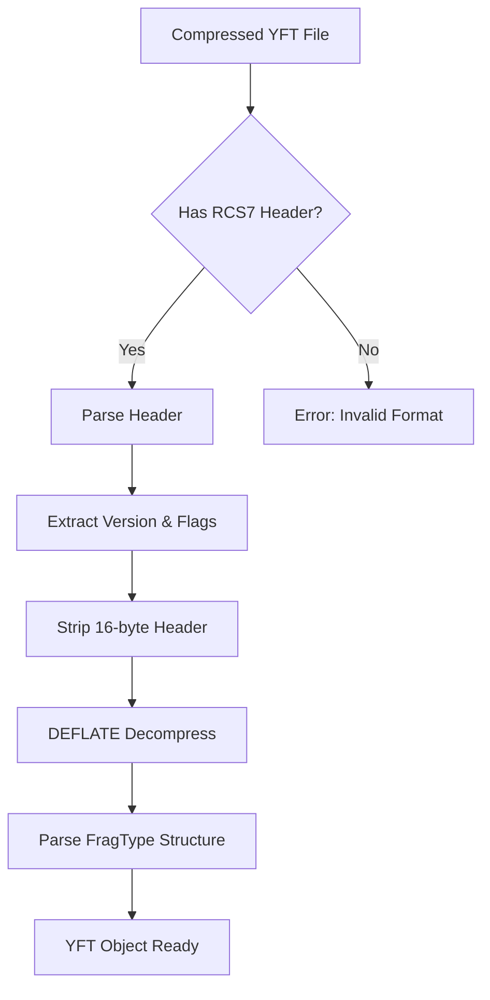
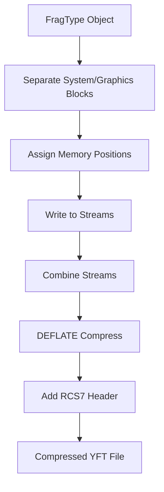

# YFT File Compression and Conversion Documentation

## Overview

YFT (Fragment) files in GTA V contain breakable/physics-enabled models with complex data structures. These files use the RCS7 (RSC7) header format and DEFLATE compression. This document explains the compression/decompression process and conversion capabilities between compressed, uncompressed, and XML formats.

## YFT File Format

### File Structure
YFT files contain `FragType` data which includes:
- **Fragment Drawable**: 3D model data with LODs
- **Physics Data**: Collision, constraints, and breakable parts
- **Cloth Simulation**: Dynamic cloth physics
- **Glass Windows**: Breakable glass definitions
- **Vehicle Data**: Special vehicle fragment properties

### Version Support
- **Version 162**: Standard GTA V format
- **Version 171**: Gen9 format (Red Dead Redemption 2)

## RCS7 Header Format

The RCS7 header is a 16-byte structure that precedes compressed resource data:

```
+--------+--------+--------+--------+
| Magic  | 'R'    | 'S'    | 'C'    | 0x00-0x03: 0x37435352 ('RSC7')
| '7'    | Version         |         | 0x04-0x07: Version (162 or 171)
+--------+--------+--------+--------+
| System Flags                      | 0x08-0x0B: System page flags
+--------+--------+--------+--------+
| Graphics Flags                    | 0x0C-0x0F: Graphics page flags
+--------+--------+--------+--------+
```

### Page Flags Format
The page flags encode memory allocation information:
- **Base Size Shift** (bits 0-3): Base page size = 0x2000 << shift
- **Page Counts**: Number of pages for each size tier
  - Tier 0 (bits 17-23): Up to 127 pages
  - Tier 1 (bits 11-16): Up to 63 pages
  - Tier 2 (bits 7-10): Up to 15 pages
  - Tier 3 (bits 5-6): Up to 3 pages
  - Tier 4 (bit 4): Up to 1 page

## Decompression Process

### Step-by-Step Decompression



### Code Implementation

```csharp
// Loading a compressed YFT file
public void Load(byte[] data)
{
    // LoadResourceFile handles header detection and decompression
    RpfFile.LoadResourceFile(this, data, (uint)GetVersion(RpfManager.IsGen9));
    Loaded = true;
}

// Inside LoadResourceFile
public static void LoadResourceFile<T>(T file, byte[] data, uint ver) where T : class, PackedFile
{
    // Create resource entry from header
    RpfResourceFileEntry resentry = CreateResourceFileEntry(ref data, ver);
    
    // Decompress the data (header already stripped)
    data = ResourceBuilder.Decompress(data);
    
    // Load the decompressed data
    file.Load(data, resentry);
}

// Header parsing
public static RpfResourceFileEntry CreateResourceFileEntry(ref byte[] data, uint ver)
{
    var resentry = new RpfResourceFileEntry();
    
    uint rsc7 = BitConverter.ToUInt32(data, 0);
    if (rsc7 == 0x37435352) // RSC7 header present
    {
        int version = BitConverter.ToInt32(data, 4);
        resentry.SystemFlags = BitConverter.ToUInt32(data, 8);
        resentry.GraphicsFlags = BitConverter.ToUInt32(data, 12);
        
        // Strip header from data
        byte[] newdata = new byte[data.Length - 16];
        Buffer.BlockCopy(data, 16, newdata, 0, newdata.Length);
        data = newdata;
    }
    
    return resentry;
}
```

## Compression Process

### Building Compressed YFT



### Code Implementation

```csharp
// Saving YFT to compressed format
public byte[] Save()
{
    var gen9 = RpfManager.IsGen9;
    if (gen9)
    {
        Fragment?.EnsureGen9();
    }
    
    // Build compressed data with header
    byte[] data = ResourceBuilder.Build(Fragment, GetVersion(gen9), true, gen9);
    return data;
}

// Inside ResourceBuilder.Build
public static byte[] Build(ResourceFileBase fileBase, int version, bool compress = true, bool gen9 = false)
{
    // 1. Get system and graphics blocks
    GetBlocks(fileBase, out systemBlocks, out graphicBlocks);
    
    // 2. Assign positions with page allocation
    AssignPositions2(systemBlocks, 0x50000000, out systemPageFlags, 128, gen9);
    AssignPositions2(graphicBlocks, 0x60000000, out graphicsPageFlags, 128 - systemPageFlags.Count, gen9);
    
    // 3. Write blocks to streams
    var systemStream = new MemoryStream();
    var graphicsStream = new MemoryStream();
    var resourceWriter = new ResourceDataWriter(systemStream, graphicsStream);
    
    // Write all blocks...
    
    // 4. Combine streams
    var tdata = new byte[sysDataSize + gfxDataSize];
    Buffer.BlockCopy(sysData, 0, tdata, 0, sysDataSize);
    Buffer.BlockCopy(gfxData, 0, tdata, sysDataSize, gfxDataSize);
    
    // 5. Compress if requested
    var cdata = compress ? Compress(tdata) : tdata;
    
    // 6. Add RCS7 header
    var data = new byte[16 + cdata.Length];
    BitConverter.GetBytes(0x37435352).CopyTo(data, 0); // 'RSC7'
    BitConverter.GetBytes(version).CopyTo(data, 4);
    BitConverter.GetBytes(systemFlags).CopyTo(data, 8);
    BitConverter.GetBytes(graphicsFlags).CopyTo(data, 12);
    Buffer.BlockCopy(cdata, 0, data, 16, cdata.Length);
    
    return data;
}
```

## Compression Algorithms

### DEFLATE Compression
```csharp
public static byte[] Compress(byte[] data)
{
    using (MemoryStream ms = new MemoryStream())
    {
        DeflateStream ds = new DeflateStream(ms, CompressionMode.Compress, true);
        ds.Write(data, 0, data.Length);
        ds.Close();
        return ms.ToArray();
    }
}
```

### DEFLATE Decompression
```csharp
public static byte[] Decompress(byte[] data)
{
    using (MemoryStream ms = new MemoryStream(data))
    {
        DeflateStream ds = new DeflateStream(ms, CompressionMode.Decompress);
        MemoryStream outstr = new MemoryStream();
        ds.CopyTo(outstr);
        return outstr.ToArray();
    }
}
```

## XML Conversion

### YFT to XML Conversion

```csharp
// Load YFT file
YftFile yft = new YftFile();
yft.Load(compressedData); // Automatically decompresses

// Convert to XML
string xml = YftXml.GetXml(yft, outputFolder);
File.WriteAllText("fragment.yft.xml", xml);
```

### XML to YFT Conversion

```csharp
// Load XML
string xml = File.ReadAllText("fragment.yft.xml");

// Convert to YFT
YftFile yft = XmlYft.GetYft(xml, inputFolder);

// Save as compressed YFT
byte[] compressedData = yft.Save();
File.WriteAllBytes("fragment.yft", compressedData);
```

## Complete Conversion Examples

### 1. Extract and Decompress YFT

```csharp
// From RPF archive
RpfFile rpf = new RpfFile("x64a.rpf");
RpfFileEntry entry = rpf.FindFile("fragment.yft");
byte[] compressedData = rpf.ExtractFile(entry);

// Load and decompress
YftFile yft = new YftFile();
yft.Load(compressedData);
```

### 2. Compressed YFT → XML → Modified → Compressed YFT

```csharp
// Load original
YftFile original = new YftFile();
original.Load(File.ReadAllBytes("original.yft"));

// Convert to XML
string xml = YftXml.GetXml(original, "temp");

// Modify XML (example: change properties)
XmlDocument doc = new XmlDocument();
doc.LoadXml(xml);
// ... modifications ...

// Convert back to YFT
YftFile modified = XmlYft.GetYft(doc, "temp");

// Save compressed
File.WriteAllBytes("modified.yft", modified.Save());
```

### 3. Batch Conversion

```csharp
public void ConvertAllYftToXml(string inputFolder, string outputFolder)
{
    foreach (string file in Directory.GetFiles(inputFolder, "*.yft"))
    {
        // Load YFT
        YftFile yft = new YftFile();
        yft.Load(File.ReadAllBytes(file));
        
        // Convert to XML
        string xml = YftXml.GetXml(yft, outputFolder);
        
        // Save XML
        string xmlPath = Path.Combine(outputFolder, 
            Path.GetFileNameWithoutExtension(file) + ".yft.xml");
        File.WriteAllText(xmlPath, xml);
    }
}
```

## Important Considerations

### Memory Usage
- YFT files can be large, especially with complex fragments
- Decompression happens in memory
- Consider streaming for batch operations

### Version Compatibility
- Always check target game version (GTA V vs RDR2)
- Use appropriate version number when saving

### Resource References
- YFT files may reference external textures
- Ensure texture dictionaries are available
- Maintain proper file naming for references

## API Quick Reference

```csharp
// Load compressed YFT
YftFile yft = new YftFile();
yft.Load(compressedBytes);

// Save as compressed YFT
byte[] compressed = yft.Save();

// Convert to XML
string xml = YftXml.GetXml(yft, outputFolder);

// Convert from XML
YftFile fromXml = XmlYft.GetYft(xmlString, inputFolder);

// Direct compression/decompression
byte[] compressed = ResourceBuilder.Compress(uncompressedData);
byte[] uncompressed = ResourceBuilder.Decompress(compressedData);

// Add RCS7 header to uncompressed data
byte[] withHeader = ResourceBuilder.AddResourceHeader(entry, uncompressedData);
```

## Summary

The YFT compression system provides:
1. **Automatic decompression** when loading files
2. **Transparent compression** when saving
3. **Full XML conversion** support for editing
4. **Version compatibility** for GTA V and RDR2
5. **Efficient DEFLATE** compression algorithm

This enables complete control over fragment files, from extraction through modification to re-insertion into the game.